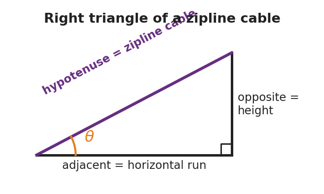

# Algebra and Trigonometry for Physics — Student Worksheet

**Unit: Math in Science — Lesson 01**
Name: _______________________  Date: __________  Period: ____

---

## Phenomenon

A zipline cable runs from a tall tower down to a low platform. The installer measured only two things: the cable is **26 m long** and it leaves the top at **18° below horizontal**. The town inspector needs two numbers nobody measured — how *high* is the top tower, and how *far across the ground* does the rider travel.

**Driving question:** How can we find a height and a distance we can't reach, using only a length and an angle?

---

## Notice & Wonder

| I notice… | I wonder… |
|---|---|
|  |  |
|  |  |
|  |  |

**Turn & Talk #1:** What did the installer give us, and what is missing? Which shape could this cable make with the ground and the tower?

> _______________________________________________

---

## Initial Model

Sketch the zipline as a triangle. Label the **26 m** cable and the **18°** angle. Mark which side is the *height* of the tower and which side is the *ground run*. Write a one-sentence guess for how you might find the height.

> _______________________________________________
> My guess: ______________________________________

---

## Investigation

**Part A — Rearranging an equation.** Start from the speed formula **v = d / t**.

| I want to solve for… | What is happening to that variable now | What I do to both sides | Rearranged formula |
|---|---|---|---|
| d |  |  |  |
| t |  |  |  |

**Part B — Right-triangle trig.** Using the triangle (hypotenuse = 26 m, angle = 18°):

| I want | Which side is it (opp / adj / hyp)? | Which ratio (SOH-CAH-TOA)? | Value |
|---|---|---|---|
| height (rise) |  |  |  |
| ground run |  |  |  |

**Key question:** Why does the height use the *hypotenuse*, and which trig function uses opposite ÷ hypotenuse?

> _______________________________________________

---

## Make It Make Sense

1. Rearrange **a = (v − u) / t** to solve for **v** (the final speed).
2. A ramp's slanted top is 5.0 m long (the hypotenuse) and tilts 10° above the ground. Which side is the rise — opposite or adjacent to the 10° angle?
3. Using question 2, find the rise (height) of the ramp.

---

## Vocabulary in Action

Use each term in a sentence about today's phenomenon.

- **isolate (a variable):** _______________________________________________
- **sine:** _______________________________________________
- **right triangle:** _______________________________________________

---

## Revise Your Model

Return to your Initial Model sketch. Fill in the actual height and ground run of the zipline, with units. Then rewrite your one-sentence method using the word *sine*.

> Height = __________   Ground run = __________
> My method: _____________________________________

---

## Exit Ticket

A wheelchair ramp is 5.0 m long (the slanted hypotenuse) and rises at 10° above the ground.

(a) Rearrange **v = d / t** to solve for **t**.

(b) Which side of the ramp triangle is the rise — opposite or adjacent to the 10° angle?

(c) Find the rise (height) of the ramp. Show the ratio you used.
