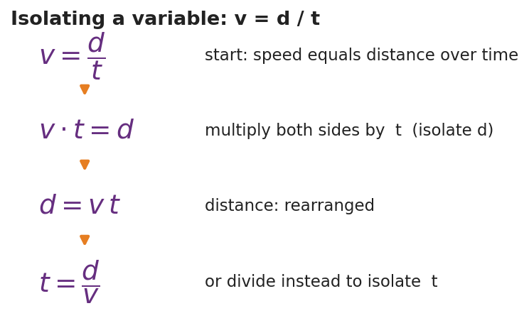

# Algebra and Trigonometry for Physics — Teacher Guide

## Cover

**Unit: Math in Science — Lesson 01: Algebra and Trigonometry for Physics**
East Meadow Schools × Valley Stream Central High School District
Strategy chips: HOCHMAN

---

## Curated Resources (from East Meadow Scope & Sequence)

### NYSSLS Standards

This is a foundational math-skills lesson with no single NYSSLS performance expectation of its own. It builds the science and engineering practice **"Using Mathematics and Computational Thinking,"** which is woven through every **HS-PS** standard in the course — students cannot reach HS-PS2-1 (Newton's Second Law), HS-PS3 (energy), or any quantitative target without first being able to rearrange a formula and resolve a vector. The crosscutting concept in focus is **Scale, Proportion, and Quantity**: a relationship like *v = d / t* expresses how one quantity changes in proportion to another, and trig lets us scale a slanted distance into its horizontal and vertical parts.

### Phenomenon

- Zipline / ramp at an angle — students see a cable strung from a high anchor to a low one and ask: how high is the top, and how far does the rider travel across the ground? <https://www.youtube.com/results?search_query=zipline+physics>
- PhET "Trig Tour" (sine/cosine on a triangle and circle): <https://phet.colorado.edu/en/simulations/trig-tour>

### Javalab / Labs

- Javalab "Vector composition and decomposition" (resolve a vector into components): <https://javalab.org/en/vector_composition_en/>
- Optional: tape an angled "zipline" string across the room and measure the rise and run directly to confirm the trig.

### Assessments

- PhET Trig Tour has a built-in self-check. The Exit Ticket below (find the height and run of an angled cable) is the formative check for this lesson.

---

## Lesson Overview

| | |
|---|---|
| **Duration** | 42 minutes (1 period) |
| **NYSSLS link** | Practice: Using Mathematics and Computational Thinking (supports all HS-PS) |
| **CCC focus** | Scale, Proportion, and Quantity — formulas express proportional relationships; trig scales a slant into components |
| **Strategy chips** | HOCHMAN (Because/But/So + kernel sentences on the rearrangement rule) |
| **Materials** | Whiteboards/markers; calculators (degree mode); a length of string + protractor (optional live zipline); printed right-triangle handout |
| **Safety** | If stringing a physical zipline, keep it low and clear walkways. No other hazards. |
| **Prior knowledge** | Middle-school algebra (solving one-step equations); the idea of a right triangle. No prior trig assumed. |

**Lesson objectives — students can:**

- **Isolate** a chosen variable in a one- or two-step physics formula (e.g., rearrange *v = d / t* into *d = v t* and *t = d / v*).
- Identify the opposite, adjacent, and hypotenuse sides of a **right triangle** relative to a given angle.
- Use **sine** (and cosine/tangent via SOH-CAH-TOA) to find the height and horizontal run of an angled cable or ramp.

---

## Phase 1 · Engage *(0 – 8 min)*

### 0–3 min · Opening Connection (SEL)

Quick whole-class check-in. Prompt: *"Think of a time you had to rearrange a plan to make it work — same pieces, different order. Share one in a sentence."* This primes the idea that rearranging an equation keeps the same relationship, just solved for a different piece.

### 3–8 min · Phenomenon hook — the angled zipline

**Teacher actions.** Show the zipline image (or the string strung across the room). The cable runs from a high anchor down to a low platform at an angle.

**Sample teacher language:**

> "Here's the only thing the installer measured: the cable is 26 meters long and it leaves the top tower at 18 degrees below horizontal. The town inspector needs two numbers the installer never measured — how high is the top tower, and how far across the ground does the rider travel. We're going to get both numbers without climbing anything."

**Anticipated student responses:**

- "Just measure it." — reframe: "The cable is up in the air; we only have the length and the angle. That's all we ever get in physics."
- "Use the Pythagorean theorem." — affirm, then push: "That needs two sides; we have one side and an angle. Trig is the tool for one-side-plus-angle."
- "Is it a triangle?" — yes; name it as a right triangle and bridge to Phase 2.

### Bridge to Phase 2

Every student leaves Phase 1 able to sketch the cable as a right triangle and label which number they were given (the slanted side, the hypotenuse) and which two they need.

---

## Phase 2 · Explore *(8 – 26 min)*

### 8–14 min · Skill A — Isolating a variable (algebra)

Put *v = d / t* on the board. Do **not** give the rearranged forms yet. Pose three race questions:

> "If a sprinter runs at *v* for time *t*, how far did she go? Solve for *d*."
> "If we know the distance and the speed, how long did it take? Solve for *t*."

Let students try on whiteboards. Circulate. The move to name is **isolate the variable**: do the same operation to both sides until the wanted variable is alone.

**Teacher facilitation language:**

> "Whatever I do to the left side I do to the right side — that keeps the equation balanced. To free *d*, what's currently happening to it? It's being divided by *t*, so I undo that by multiplying both sides by *t*."

**Anticipated student responses:**

- "*d = v / t*?" — common error; check units (m/s ÷ s gives m/s², not meters). Redirect to multiply, not divide.
- "*d = v t*." — confirm and have them state the kernel sentence aloud (see Phase 4).

### 14–26 min · Skill B — Right-triangle trig (SOH-CAH-TOA)

Hand out / project the labeled right triangle. Define **opposite**, **adjacent**, **hypotenuse** *relative to the angle*.

Run the Javalab vector tool or PhET Trig Tour so students see sine change as the angle changes. Then give them the zipline numbers (hypotenuse = 26 m, angle = 18°) and ask them to find the height (opposite) and run (adjacent).

**Teacher facilitation during Explore:**

- **What to look for** — students correctly tagging which side is opposite the 18° angle (the height) before reaching for a button on the calculator.
- **What to resist** — supplying "use sine" too early; let them test which ratio uses the hypotenuse.
- **What to redirect** — calculators in radian mode (answers will be wildly off); have them confirm sin 30° = 0.5 as a mode check.

---

## Phase 3 · Explain *(26 – 34 min)*

### 26–30 min · Turn-and-Talk + class consensus

> "Which trig ratio connects the side you want to the side you were given? Talk it through with your partner using the words *opposite* and *hypotenuse*."

Target consensus:

> "The height is the side **opposite** the angle and we were given the **hypotenuse**, so we use **sine**: sin θ = opposite / hypotenuse. The run is **adjacent**, so it uses cosine."

### 30–34 min · Vocabulary introduction (≤ 3 terms)

**Sample teacher language:**

> "Three words make today portable to every future lesson. To **isolate** a variable means to get it alone on one side of the equation. A **right triangle** is any triangle with one 90° corner — every ramp, cable, and resolved vector becomes one. And **sine** is the ratio of the side opposite an angle to the hypotenuse — sin θ = opp / hyp."

### Discussion prompts to deploy here

- "We solved *v = d / t* for *d*. If a problem instead gives you *d* and *v*, which form do you grab, and why?"
  - *Sample student response:* "*t = d / v*, because *t* is the unknown and I isolate it by dividing."
- "On the zipline, why is the height the *opposite* side and the ground-run the *adjacent* side?"
  - *Sample student response:* "Opposite is across from the angle; adjacent is the one touching the angle along the ground."

---

## Phase 4 · Elaborate *(34 – 39 min)*

### 34–37 min · HOCHMAN Because/But/So + kernel sentence

Have students compress today's rule into a kernel sentence and then expand it.

> *"Write a kernel sentence: 'Sine relates two sides.' Now expand it with Because / But / So:
> Sine relates the opposite side to the hypotenuse **because** ___,
> **but** ___,
> **so** ___."*

Target: "…**because** that ratio stays fixed for a given angle, **but** it does not involve the adjacent side, **so** I use cosine when I need the run instead."

### 37–39 min · Return to the phenomenon

> "Give the inspector both numbers in one sentence each, with units."

Target: height ≈ 26 × sin 18° ≈ 8.0 m; run ≈ 26 × cos 18° ≈ 24.7 m.

---

## Phase 5 · Evaluate *(39 – 42 min)*

### 39–42 min · Exit Ticket + Closing Reflection

> *"A wheelchair ramp is 5.0 m long (the slanted hypotenuse) and rises at 10° above the ground.
> (a) Rearrange *v = d / t* to solve for *t*.
> (b) Which side of the ramp triangle is the rise — opposite or adjacent to the 10° angle?
> (c) Find the rise (height) of the ramp."*

Expected: (a) *t = d / v*; (b) opposite; (c) height = 5.0 × sin 10° ≈ 0.87 m. See `Answer_Key.docx`.

**Closing Reflection (SEL, 30 seconds):**

> "Which felt harder today — rearranging the equation or choosing the trig ratio? Name one thing that made the harder one click."

---

## Common Misconceptions

- **Misconception:** "To solve *v = d / t* for *d*, divide by *t*." → **Correction:** *d* is already divided by *t*; undo division by **multiplying** both sides by *t*, giving *d = v t*. Unit-check it: (m/s)(s) = m.
- **Misconception:** "Opposite and adjacent are fixed sides of the triangle." → **Correction:** They are defined *relative to the chosen angle*; the same leg can be opposite for one angle and adjacent for another.
- **Misconception:** "sin, cos, and tan are interchangeable." → **Correction:** Pick the ratio that uses the two sides you have/want — SOH-CAH-TOA tells you exactly which.
- **Misconception (silent killer):** calculator left in radians. → **Correction:** confirm sin 30° = 0.5 before trusting any answer.

---

## Access & Differentiation

- **ELL/ENL supports:** Sentence frame: *"To isolate ___, I ___ both sides by ___."* Pair each trig word with a gesture (sine = hand sweeping up the *opposite* rise). Provide a SOH-CAH-TOA reference card with a picture, not just letters.
- **IEP/SPED supports:** Provide the right triangle pre-drawn and pre-labeled so students focus only on choosing the ratio. Offer a two-column "operation / result" organizer for the rearrangement so each algebra step has its own line. Allow a formula card with *d = v t* and *t = d / v* already shown for the trig portion.
- **Extensions:** Ask students to derive the *third* unknown — the angle itself — from two measured sides using the inverse sine (sin⁻¹), and to verify their zipline answers with the Pythagorean theorem (8.0² + 24.7² ≈ 26²).

---

## Strategy Spotlight

**HOCHMAN (sentence-level literacy).** Today's chip is the Because/But/So expansion plus the kernel sentence in Phase 4. The goal is precision, not volume: students compress the trig rule into a single kernel sentence ("Sine relates two sides"), then stretch it with the three conjunctions so they have to articulate the *limits* of the rule (when sine does **not** apply). Keep it to one tight paragraph; collect a few aloud and reward the most precise, not the longest.

---

## NYSSLS Observation Checklist Crosswalk

| # | Checklist item | Where it appears in this lesson |
|---|---|---|
| 1 | Local/relatable phenomenon | Phase 1 — angled zipline; Phase 5 — wheelchair ramp |
| 2 | Turn and Talk (2–3×) | Phase 3 (which ratio?), Phase 4 (Because/But/So share) |
| 3 | Students develop questions/models/procedures | Phase 2 — sketch the triangle, choose the ratio, derive the rearrangement |
| 4 | CCC defined and used | Lesson Overview · *Scale, Proportion, and Quantity*, applied in Phase 2 |
| 5 | ENL — ≤ 3 vocab, second half | Phase 3 — vocabulary at 30–34 min (isolate / right triangle / sine) |
| 6 | Revisit phenomenon with evidence | Phase 4 — give the inspector the height and run |
| 7 | ENL/SPED supports | Access & Differentiation block |
| 8 | Assessment check | Phase 5 — Exit Ticket (ramp rise + rearrangement) |

---

## Companion Materials

- `Student_Worksheet.docx` — the 5E student investigation (hand out at start of Phase 2)
- `Student_Notes.docx` — guided note-guide for the rearrangement steps and the trig worked example
- `Answer_Key.docx` — answers to "Make It Make Sense" prompts and the Exit Ticket

---

## Key Vocabulary (max 3)

- **isolate (a variable)** — to use inverse operations on both sides of an equation until the wanted variable stands alone (e.g., *v = d / t* → *d = v t*)
- **sine** — the trig ratio of the side opposite an angle to the hypotenuse: sin θ = opposite / hypotenuse
- **right triangle** — a triangle with one 90° angle; its longest side (opposite the right angle) is the hypotenuse
