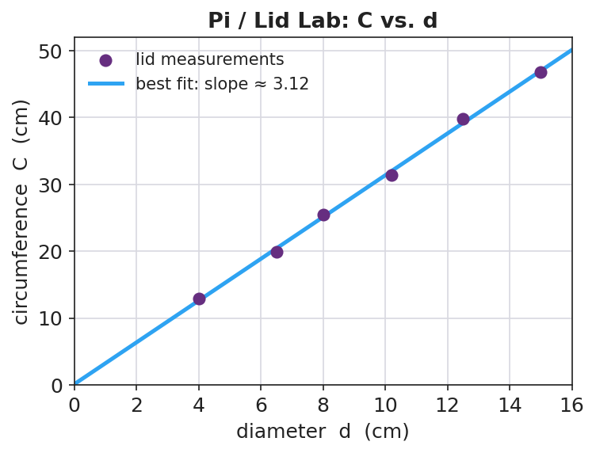
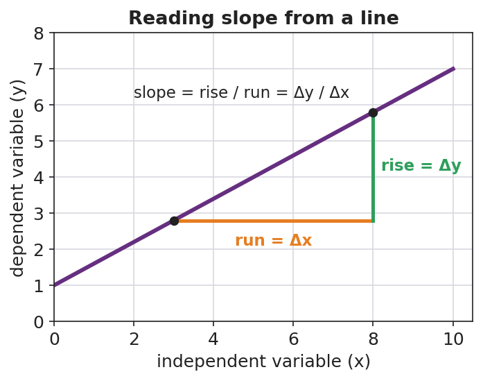

# Graphing and Interpreting Data — Teacher Guide

## Cover

**Unit: Math in Science — Lesson 02: Graphing and Interpreting Data**
East Meadow Schools × Valley Stream Central High School District
Strategy chips: ACTIVE LEARNING

---

## Curated Resources (from East Meadow Scope & Sequence)

### NYSSLS Standards

This is a foundational math-skills lesson with no single NYSSLS performance expectation of its own. It develops the science and engineering practice **"Using Mathematics and Computational Thinking"** (and "Analyzing and Interpreting Data"), which every quantitative **HS-PS** standard depends on — a slope is how students will later read acceleration off a velocity graph (HS-PS2) or a spring constant off a force graph (HS-PS3). The crosscutting concept in focus is **Patterns**: a straight line through data reveals a proportional relationship, and its slope is the constant that names that pattern.

### Phenomenon

- "Pi / Lid Lab" — students measure the circumference and diameter of many round lids; plotted together, the points fall on a line whose slope is π.
- Slow Reveal Graphs — reveal a graph piece by piece to build interpretation skills: <https://slowrevealgraphs.com/>

### Javalab / Labs

- **Graphing Pi / Lid Lab** (this lesson's investigation): collect circumference vs. diameter for 5–6 round objects; plot and find the slope.
- **Slow Reveal Graphs** routine as the Engage warm-up: <https://slowrevealgraphs.com/>
- Desmos or graph paper for the line of best fit.

### Assessments

- Slow Reveal Graphs includes discussion checks. The Exit Ticket below (read a slope and name the relationship) is the formative check for this lesson.

---

## Lesson Overview

| | |
|---|---|
| **Duration** | 42 minutes (1 period) |
| **NYSSLS link** | Practices: Using Mathematics & Computational Thinking; Analyzing & Interpreting Data (supports all HS-PS) |
| **CCC focus** | Patterns — a straight-line graph reveals a proportional relationship; the slope names it |
| **Strategy chips** | ACTIVE LEARNING (hands-on lid measurement + Slow Reveal discourse) |
| **Materials** | 5–6 round lids/cans per group; string or flexible tape measures; rulers; graph paper or Desmos; whiteboards |
| **Safety** | No hazards. Remind students not to roll cans off the desks. |
| **Prior knowledge** | Plotting an (x, y) point; the idea of "per" (miles per hour). No formal slope formula assumed. |

**Lesson objectives — students can:**

- Identify the **independent variable** and **dependent variable** in an investigation and place each on the correct axis.
- Draw a **line of best fit** through scattered data and explain why it is not connect-the-dots.
- Calculate the **slope** (rise / run) of the best-fit line and interpret it as the constant of a proportional relationship.

---

## Phase 1 · Engage *(0 – 8 min)*

### 0–3 min · Opening Connection (SEL)

Quick check-in. Prompt: *"Name a time a picture (a chart, a map, a meme) explained something faster than words could."* This frames a graph as a fast-reading tool, not a chore.

### 3–8 min · Phenomenon hook — Slow Reveal + the lid question

**Teacher actions.** Run one Slow Reveal Graphs slide (reveal axes first, then points, then the line). Then hold up two round lids of very different sizes.

**Sample teacher language:**

> "Here's a wild claim: if I measure the distance around any of these lids and the distance across it, those two numbers are *locked together* by the same multiplier — every lid, big or small. Same multiplier. We're going to catch that multiplier on a graph."

**Anticipated student responses:**

- "Bigger lid, bigger everything." — affirm; that's a *pattern*, and we'll make it exact.
- "The multiplier is pi!" — great early guess; have them prove it from data, not memory.
- "How do you measure around a circle?" — wrap string, then straighten it — a measurement procedure they design.

### Bridge to Phase 2

Every student leaves Phase 1 with a prediction in one sentence: "As the diameter goes up, the circumference will ___, and the graph will look like ___."

---

## Phase 2 · Explore *(8 – 26 min)*

### 8–12 min · Set the variables (whole class)

Together, decide what we change and what we measure. We *choose* which lids to grab (diameter), and the circumference *responds*. Name the roles now so the graph is set up correctly.

**Teacher facilitation language:**

> "Which number are we choosing, and which one just comes along for the ride? The one we choose goes on the bottom axis."

### 12–26 min · Investigation — the Pi / Lid Lab (groups of 3–4)

Each group measures diameter (ruler) and circumference (string then ruler) for 5–6 lids, records a data table, and plots all points on one graph. Then they draw a single straight **line of best fit** — close to as many points as possible, NOT dot-to-dot — and compute its slope from a slope triangle.

**Teacher facilitation during Explore:**

- **What to look for** — best-fit lines that pass *through the cloud*, with roughly equal points above and below, and that pass near the origin.
- **What to resist** — handing out the slope formula before they've drawn the triangle; let the rise/run come from their own line.
- **What to redirect** — groups connecting dots zig-zag style ("that's not a measured law, that's tracing your errors"); groups forcing the line through the first point only.

---

## Phase 3 · Explain *(26 – 34 min)*

### 26–30 min · Turn-and-Talk + class consensus

Post several groups' slopes on the board (they will cluster near 3.1–3.2).

> "Compare your slope to your neighbors'. Why did everyone — with different lids — land near the same number?"

Target consensus:

> "The graph is a straight line through the origin, so circumference is *proportional* to diameter. The slope is the constant multiplier, and it's about 3.14 — that's π."

### 30–34 min · Vocabulary introduction (≤ 3 terms)

**Sample teacher language:**

> "Three words make every future graph readable. The **independent variable** is the one we choose — it goes on the x-axis (here, diameter). The **dependent variable** responds — it goes on the y-axis (circumference). And the **slope** is rise over run: how much y changes for each step in x. When the line is straight through the origin, that slope *is* the proportionality constant — for us, π."

### Discussion prompts to deploy here

- "If you'd plotted circumference on the x-axis instead, what would the slope have been?"
  - *Sample student response:* "About 1/π ≈ 0.32, because the axes are swapped — slope is y-over-x."
- "Why is a best-fit line more trustworthy than connecting the dots?"
  - *Sample student response:* "It averages out our measurement errors instead of treating each wobble as real."

---

## Phase 4 · Elaborate *(34 – 39 min)*

### 34–37 min · Active Learning — predict from the line

> *"Without measuring, use your best-fit line to predict the circumference of a lid 20 cm across. Mark it on the graph and read it off. Then check: 20 × your slope. Do they match?"*

This makes the line a *tool*, not a decoration — interpolation/extrapolation.

### 37–39 min · Return to the phenomenon

> "State the locked-together rule in one sentence with the word *slope*."

Target: "Circumference = slope × diameter, and the slope is π ≈ 3.14, so C = πd — the same multiplier for every lid."

---

## Phase 5 · Evaluate *(39 – 42 min)*

### 39–42 min · Exit Ticket + Closing Reflection

> *"A class plots a stretched spring's length (cm) versus the mass hung on it (g). The line is straight and rises from 12 cm at 0 g.
> (a) Which is the independent variable and which is the dependent variable?
> (b) The line rises 8 cm over a run of 200 g. What is the slope, with units?
> (c) What does that slope tell you in plain words?"*

Expected: (a) mass = independent (x), length = dependent (y); (b) slope = 8 cm / 200 g = 0.04 cm/g; (c) the spring stretches 0.04 cm for every extra gram. See `Answer_Key.docx`.

**Closing Reflection (SEL, 30 seconds):**

> "Whose idea in your group changed how you drew or read the line today? Name them."

---

## Common Misconceptions

- **Misconception:** "Connect the dots to show the relationship." → **Correction:** A best-fit line averages out measurement error; connect-the-dots treats every wobble as a real effect.
- **Misconception:** "The independent variable goes wherever there's room." → **Correction:** Independent (what you choose) goes on the x-axis; dependent (what responds) on the y-axis — always.
- **Misconception:** "Slope is just 'how steep,' no units." → **Correction:** Slope is rise/run *with units* (e.g., cm per gram) and it carries the physical meaning of the relationship.
- **Misconception:** "A steeper line means a bigger y-value." → **Correction:** Steepness is the *rate of change*, not the size of any single value.

---

## Access & Differentiation

- **ELL/ENL supports:** Sentence frame: *"When the ___ goes up by ___, the ___ goes up by ___."* Color-code the axes (x = "I choose," y = "it responds"). Provide a labeled slope-triangle card. Pre-teach "per" as "for each."
- **IEP/SPED supports:** Provide a pre-labeled grid with axis titles and a scale already chosen, so students plot only. Offer a partially drawn best-fit line and have them compute the slope from a marked triangle. Reduce to 4 lids if measuring is slow.
- **Extensions:** Ask students to find the *y-intercept* of the spring graph and explain its physical meaning (the unstretched length), then write the full equation *y = mx + b* for their data.

---

## Strategy Spotlight

**ACTIVE LEARNING.** Today's chip pairs a hands-on measurement lab with a Slow Reveal discourse routine. Students *generate* the data that produces π rather than being told the value — the proportional pattern emerges from their own messy points, which is exactly why the best-fit line conversation lands. Keep groups small (3–4) so everyone measures, and require every group to post a slope so the class can see the pattern converge. The Slow Reveal warm-up trains the interpretation move (axes → points → line) you want them to use on their own graph.

---

## NYSSLS Observation Checklist Crosswalk

| # | Checklist item | Where it appears in this lesson |
|---|---|---|
| 1 | Local/relatable phenomenon | Phase 1 — round lids; Phase 5 — stretched spring |
| 2 | Turn and Talk (2–3×) | Phase 3 (why same slope?), Phase 4 (predict from the line) |
| 3 | Students develop questions/models/procedures | Phase 2 — design the measuring method, plot, draw best fit |
| 4 | CCC defined and used | Lesson Overview · *Patterns*, applied in Phase 3 consensus |
| 5 | ENL — ≤ 3 vocab, second half | Phase 3 — vocabulary at 30–34 min (independent / dependent / slope) |
| 6 | Revisit phenomenon with evidence | Phase 4 — state C = πd from the measured slope |
| 7 | ENL/SPED supports | Access & Differentiation block |
| 8 | Assessment check | Phase 5 — Exit Ticket (spring slope + interpretation) |

---

## Companion Materials

- `Student_Worksheet.docx` — the 5E student investigation with the lid data table (hand out at start of Phase 2)
- `Student_Notes.docx` — guided note-guide for variables, best fit, and the slope worked example
- `Answer_Key.docx` — answers to "Make It Make Sense" prompts and the Exit Ticket

---

## Key Vocabulary (max 3)

- **independent variable** — the quantity you choose or change; it goes on the x-axis (here, the lid's diameter)
- **dependent variable** — the quantity that responds and is measured; it goes on the y-axis (here, the circumference)
- **slope** — the rise divided by the run of a line (Δy / Δx); for a line through the origin it is the proportionality constant
