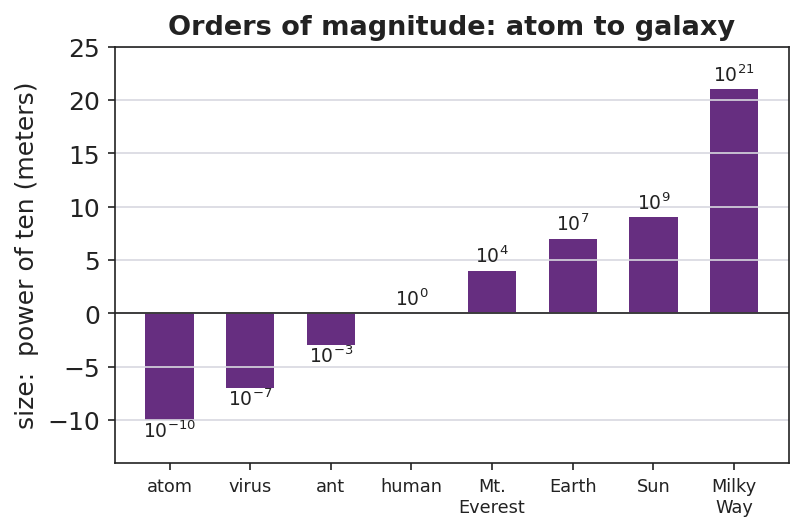
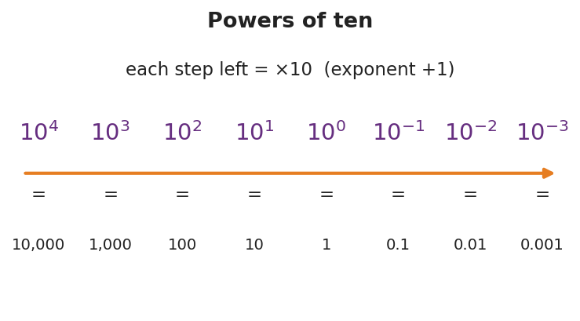

# Scientific Notation and Fermi Estimates — Teacher Guide

## Cover

**Unit: Math in Science — Lesson 03: Scientific Notation and Fermi Estimates**
East Meadow Schools × Valley Stream Central High School District
Strategy chips: BTC

---

## Curated Resources (from East Meadow Scope & Sequence)

### NYSSLS Standards

This is a foundational math-skills lesson with no single NYSSLS performance expectation of its own. It develops the science and engineering practice **"Using Mathematics and Computational Thinking,"** which underpins every **HS-PS** standard — students will write charge in coulombs (HS-PS3), wavelengths in meters (HS-PS4), and astronomical distances (HS-ESS1) in scientific notation, and they will sanity-check answers by order of magnitude. The crosscutting concept in focus is **Scale, Proportion, and Quantity**: scientific notation is the language for comparing sizes that span dozens of powers of ten, from an atom to a galaxy.

### Phenomenon

- "Scale of the Universe" interactive — zoom from quarks to the observable universe: <https://htwins.net/scale2/>
- Fermi question: *"How many basketballs would fill the gym?"* — a quantity nobody could ever count directly, estimated to the nearest power of ten.

### Javalab / Labs

- **Fermi estimation station** (this lesson's investigation): groups estimate "how many basketballs fill the gym" using only reasonable round numbers.
- "Scale of the Universe" as the Engage zoom: <https://htwins.net/scale2/>
- Powers of Ten classic film (Eames) as an optional extension: <https://www.youtube.com/watch?v=0fKBhvDjuy0>

### Assessments

- The Exit Ticket below (convert to scientific notation + a one-step Fermi estimate) is the formative check for this lesson.

---

## Lesson Overview

| | |
|---|---|
| **Duration** | 42 minutes (1 period) |
| **NYSSLS link** | Practice: Using Mathematics and Computational Thinking (supports all HS-PS) |
| **CCC focus** | Scale, Proportion, and Quantity — comparing sizes across many powers of ten |
| **Strategy chips** | BTC (random groups + vertical non-permanent surfaces on a thin-sliced task) |
| **Materials** | Whiteboards / windows / vertical surfaces + markers; visibly random grouping cards; a basketball + the room dimensions; calculators |
| **Safety** | No hazards. |
| **Prior knowledge** | Place value; multiplying by 10; exponents as repeated multiplication. |

**Lesson objectives — students can:**

- Write a large or small number in **scientific notation** (a number from 1–10 times a power of ten) and convert back to standard form.
- Use the **exponent** to count how many places the decimal moves and to compare two numbers' sizes.
- Make an **order-of-magnitude** (Fermi) estimate of a quantity that cannot be counted directly, and express it as a power of ten.

---

## Phase 1 · Engage *(0 – 8 min)*

### 0–3 min · Opening Connection (SEL)

Quick check-in. Prompt: *"Name something so big or so small you can't really picture it (a national debt, a virus, the number of stars)."* This legitimizes the discomfort of huge/tiny numbers — the exact problem scientific notation solves.

### 3–8 min · Phenomenon hook — Scale of the Universe + the gym question

**Teacher actions.** Project "Scale of the Universe" and zoom from an atom out to a galaxy. Then point around the room: *"How many basketballs would fill this gym?"*

**Sample teacher language:**

> "Watch the *exponent* in the corner as I zoom — it jumps from negative ten to positive twenty. Nobody could write all those zeros and stay sane. Now: how many basketballs fill this gym? You will never count them — but by the end of class you'll name the right power of ten, and you'll defend it."

**Anticipated student responses:**

- "A million? A billion?" — capture the guesses; we'll see whose power of ten survives.
- "That's impossible to know." — reframe: "We don't need exact; we need the right *order of magnitude* — the right power of ten."
- "Just measure the gym and divide." — yes — name that as the Fermi strategy.

### Bridge to Phase 2

Every student leaves Phase 1 able to state the goal in one sentence: "Find the *power of ten* for the number of basketballs, not the exact count."

---

## Phase 2 · Explore *(8 – 26 min)*

### 8–14 min · Skill — scientific notation (BTC thin-slice at the boards)

Visibly random groups, markers, vertical surfaces. Feed a *thin-sliced* sequence (each step a small notch harder), one at a time:

1. Write 3,000 as ___ × 10^? → 3 × 10³
2. Write 47,000. Write 0.006. Write 250,000.
3. Convert back: 5.2 × 10⁴ = ? ; 8 × 10⁻³ = ?
4. Which is bigger: 9 × 10⁵ or 2 × 10⁶? (compare exponents first)

**Teacher facilitation language (BTC):**

> "I'm not answering 'is this right?' — convince your group at the board. When you've got it, signal and I'll feed the next slice."

### 14–26 min · Investigation — the Fermi gym estimate

Same boards. Groups estimate **how many basketballs fill the gym** using only round numbers: gym ≈ L × W × H; basketball ≈ a 0.24 m sphere (round its volume to ~10⁻² m³). Divide, then round the answer to a single power of ten and write it in scientific notation.

**Teacher facilitation during Explore:**

- **What to look for** — groups rounding aggressively (24 cm → 0.25 m → volume ~0.01 m³) instead of chasing decimals.
- **What to resist** — demanding the "real" answer; the win is a defensible power of ten.
- **What to redirect** — groups adding/subtracting exponents wrong; have them write each factor in scientific notation first, then combine.

---

## Phase 3 · Explain *(26 – 34 min)*

### 26–30 min · Turn-and-Talk + class consensus

Post each group's power of ten (they'll cluster around 10⁴–10⁵).

> "Compare your exponent to the next group's. You don't have to match exactly — but you should be within about one power of ten. Why is that 'close enough' in physics?"

Target consensus:

> "Exact counts are impossible, but the *order of magnitude* — the power of ten — tells us if an answer is reasonable. Tens of thousands of basketballs, not hundreds and not billions."

### 30–34 min · Vocabulary introduction (≤ 3 terms)

**Sample teacher language:**

> "Three words run the rest of physics. **Scientific notation** writes any number as a value from 1 to 10 times a power of ten. The **exponent** is that power — it counts how many places the decimal moved, and it's how we compare sizes fast. And the **order of magnitude** is just the power of ten itself — the level a quantity lives on, like 10⁴ for our basketballs."

### Discussion prompts to deploy here

- "9 × 10⁵ vs. 2 × 10⁶ — which is bigger and how do you know at a glance?"
  - *Sample student response:* "2 × 10⁶, because its exponent is bigger — one whole order of magnitude up."
- "Why write 0.000006 as 6 × 10⁻⁶ instead of leaving it?"
  - *Sample student response:* "Fewer zeros to miscount, and the −6 instantly tells me how small it is."

---

## Phase 4 · Elaborate *(34 – 39 min)*

### 34–37 min · A second Fermi slice

> *"Estimate how many heartbeats you've had in your whole life. Round everything; give the answer as one power of ten in scientific notation."*

Target reasoning: ~70 beats/min × ~5×10⁵ min/yr × ~15 yr ≈ 5×10⁸ → order of magnitude 10⁸–10⁹.

### 37–39 min · Return to the phenomenon

> "State the gym answer in scientific notation and name its order of magnitude in one sentence."

Target: "About 3 × 10⁴ basketballs — order of magnitude 10⁴ — tens of thousands, because the gym's volume is roughly ten thousand times a basketball's."

---

## Phase 5 · Evaluate *(39 – 42 min)*

### 39–42 min · Exit Ticket + Closing Reflection

> *"(a) Write 84,000 and 0.00072 in scientific notation.
> (b) Which is larger: 4 × 10⁷ or 9 × 10⁶? How do you know?
> (c) Fermi: about how many grains of rice fill a coffee mug? Give your answer as a single power of ten and one sentence of reasoning."*

Expected: (a) 8.4 × 10⁴ and 7.2 × 10⁻⁴; (b) 4 × 10⁷ (bigger exponent); (c) ~10⁴ grains (mug ≈ 300 mL, a grain ≈ 0.02 mL → ~15,000 ≈ 10⁴), reasoning accepted if within one order. See `Answer_Key.docx`.

**Closing Reflection (SEL, 30 seconds):**

> "Fermi estimates feel uncomfortable because there's no single 'right' answer. Name one way being okay with 'close enough' could help you outside physics class."

---

## Common Misconceptions

- **Misconception:** "Scientific notation can start with any number, like 30 × 10²." → **Correction:** The leading number must be from 1 up to (not including) 10; 30 × 10² = 3 × 10³.
- **Misconception:** "A negative exponent means the number is negative." → **Correction:** A negative exponent means *small* (between 0 and 1), not negative; 6 × 10⁻³ = 0.006, still positive.
- **Misconception:** "10⁶ is twice 10³ because 6 is twice 3." → **Correction:** Each step up is ×10; 10⁶ is a *thousand* times 10³ (three orders of magnitude bigger).
- **Misconception:** "A Fermi estimate is wrong if it isn't exact." → **Correction:** The goal is the right order of magnitude; being within one power of ten is a success.

---

## Access & Differentiation

- **ELL/ENL supports:** Sentence frame: *"The number ___ equals ___ × 10 to the ___, so its order of magnitude is ___."* Provide the powers-of-ten chart as a reference. Pair "order of magnitude" with the zoom gesture from the Scale of the Universe demo.
- **IEP/SPED supports:** Provide a decimal-place counting strip (arrows showing the decimal hop) for conversions. Give the Fermi task with the round numbers pre-listed so students only divide and round the exponent. Allow calculator for the arithmetic.
- **Extensions:** Have students multiply two numbers in scientific notation (e.g., (3 × 10⁴)(2 × 10⁵)) by multiplying the leading numbers and *adding* the exponents, then estimate the mass of all the air in the room.

---

## Strategy Spotlight

**BTC (Building Thinking Classrooms).** Today uses the three core BTC moves: visibly random groups, vertical non-permanent surfaces (whiteboards/windows), and a thin-sliced task fed one slice at a time. The thin-slicing matters most here — scientific notation fails quietly when students skip a difficulty notch, so each prompt rises just one step (whole thousands → arbitrary numbers → small numbers → comparisons). Refuse to be the answer key ("convince your group"); release the next slice only when a group signals understanding. The Fermi estimate is the rich task the slicing builds toward — open enough that no two boards look identical, bounded enough that all land within an order of magnitude.

---

## NYSSLS Observation Checklist Crosswalk

| # | Checklist item | Where it appears in this lesson |
|---|---|---|
| 1 | Local/relatable phenomenon | Phase 1 — basketballs in the gym; Phase 4 — lifetime heartbeats |
| 2 | Turn and Talk (2–3×) | Phase 3 (compare exponents), Phase 4 (heartbeat estimate share) |
| 3 | Students develop questions/models/procedures | Phase 2 — design the Fermi division and round to a power of ten |
| 4 | CCC defined and used | Lesson Overview · *Scale, Proportion, and Quantity*, applied in Phase 3 |
| 5 | ENL — ≤ 3 vocab, second half | Phase 3 — vocabulary at 30–34 min (scientific notation / order of magnitude / exponent) |
| 6 | Revisit phenomenon with evidence | Phase 4 — state the gym answer in scientific notation |
| 7 | ENL/SPED supports | Access & Differentiation block |
| 8 | Assessment check | Phase 5 — Exit Ticket (conversion + comparison + Fermi) |

---

## Companion Materials

- `Student_Worksheet.docx` — the 5E student investigation with the Fermi gym task (hand out at start of Phase 2)
- `Student_Notes.docx` — guided note-guide for notation rules and the Fermi worked example
- `Answer_Key.docx` — answers to "Make It Make Sense" prompts and the Exit Ticket

---

## Key Vocabulary (max 3)

- **scientific notation** — a way to write any number as a value from 1 to 10 multiplied by a power of ten (e.g., 8.4 × 10⁴)
- **order of magnitude** — the power of ten a quantity is closest to; the "level" of its size (e.g., 10⁴ basketballs)
- **exponent** — the power that ten is raised to; it counts how many places the decimal moves and lets you compare sizes
