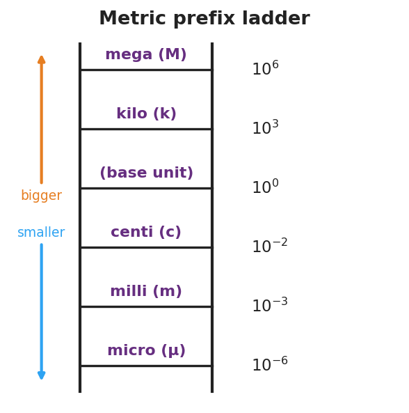
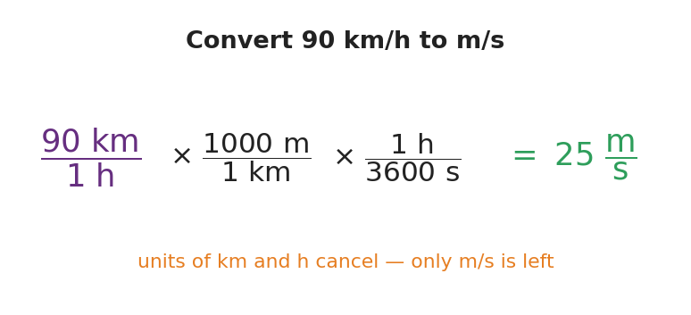

# Units, Prefixes, and Dimensional Analysis — Student Notes

**Unit: Math in Science — Lesson 04**
Name: _______________________  Date: __________  Period: ____

---

## Learning Targets

By the end of today's 42 minutes I can:

- Name the SI units for length, mass, and time and what each measures.
- Convert with a metric prefix (k, c, m, μ, M) by moving the decimal.
- Use dimensional analysis (factor-label) to convert a compound unit and check that units cancel.

---

## Key Vocabulary

- **SI unit** — _______________________________________________
- **metric prefix** — _______________________________________________
- **dimensional analysis** — _______________________________________________

---

## Guided Notes

**SI base units:** length → __________ (m); mass → __________ (kg); time → __________ (s).

**Prefix ladder** (each rung is a power of ten):

- kilo (k) = 10^___ ; centi (c) = 10^___ ; milli (m) = 10^___ ; micro (μ) = 10^___ ; mega (M) = 10^___ .
- A *bigger* unit needs __________ of them: 1500 m = __________ km.

**Factor-label rule:** multiply by a ratio that equals __________ (because the top and bottom are the same amount). Write the unwanted unit on the __________ so it __________ . The units of your answer prove it is right.

---

## Worked Example

**Problem.** Convert 90 km/h to m/s.

**Solution.**
1. Start with 90 km/h. I need to change km → m and h → s.
2. Multiply by (1000 m / 1 km) so __________ cancels, leaving meters on top.
3. Multiply by (1 h / 3600 s) so __________ cancels, leaving seconds on the bottom.
4. 90 × 1000 ÷ 3600 = __________ m/s. The leftover units are exactly __________, so it's correct.

---

## Summary

Finish the sentence (Because / But / So):

> I can change a quantity's units without changing the amount
> because __________________________________________,
> but __________________________________________,
> so __________________________________________.
