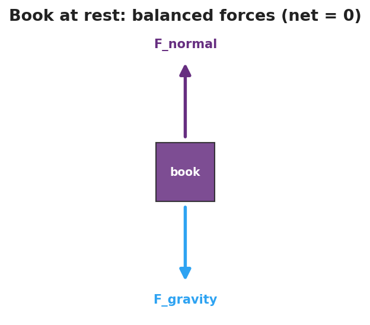
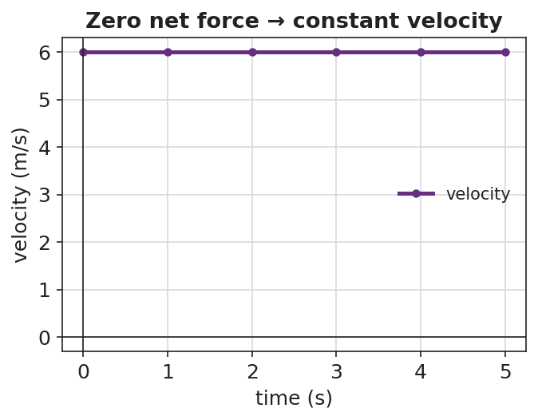

# Newton's First Law and Inertia — Student Notes

**Unit: Forces — Lesson 01**
Name: _______________________  Date: __________  Period: ____

---

## Learning Targets

By the end of today's 42 minutes I can:

- State Newton's First Law in my own words.
- Explain a real situation using **inertia** and **balanced forces**.
- Predict whether motion will change, given balanced or unbalanced forces.

---

## Key Vocabulary

- **inertia** — _______________________________________________
- **net force** — _______________________________________________
- **balanced forces** — _______________________________________________

---

## Guided Notes

**Big idea (Newton's First Law):** An object keeps its velocity — staying at rest, or moving at a __________ speed in a __________ line — unless a __________ force acts on it.

- "Velocity" includes **zero** velocity → an object at rest stays at __________.
- **Inertia** depends on __________: more mass → __________ inertia → harder to change its motion.
- If forces are **balanced**, net force = __________, and motion does __________ change.
- If forces are **unbalanced**, net force ≠ 0, and motion __________ change (this is Lesson 02).

**Force diagram — book on a table (fill the arrows):**

- Down: __________ (gravity)
- Up: __________ (table pushing up, the *normal* force)
- Net force = __________ → the book stays __________.

When the net force is zero, velocity does not change. A moving object simply keeps its velocity — a flat line on a velocity–time graph:

---

## Worked Example

**Problem.** A 1,200 kg car and a 60 kg shopping cart are both at rest. Which is harder to push into motion, and why?

**Solution.**
1. Both are at rest, so both currently have __________ net force.
2. To start moving, each needs an __________ force.
3. The __________ has more mass → more __________ → it needs a much larger force to get the same change in motion. The **car** is far harder to start.

---

## Summary

Finish the sentence (Because / But / So):

> An object at rest tends to stay at rest
> because __________________________________________,
> but __________________________________________,
> so __________________________________________.
