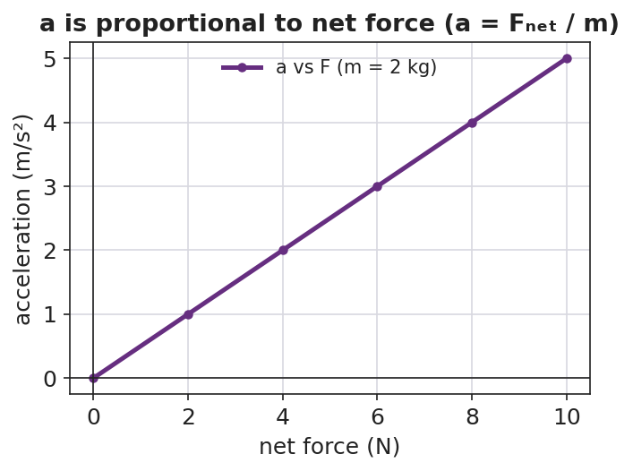

# Newton's Second Law and Net Force — Student Notes

**Unit: Forces — Lesson 02**
Name: _______________________  Date: __________  Period: ____

---

## Learning Targets

By the end of today's 42 minutes I can:

- State Newton's Second Law in words and as the equation **F_net = m·a**.
- Predict how acceleration changes when the **net force** or the **mass** changes.
- Solve for F_net, m, or a given the other two, using units of **newtons**.

---

## Key Vocabulary

- **net force** — _______________________________________________
- **acceleration** — _______________________________________________
- **newton** — _______________________________________________

---

## Guided Notes

**Big idea (Newton's Second Law):** The **net force** on an object equals its mass times its __________: **F_net = m·a**. On the 2025 Reference Table this is written **a = F_net / __________**.

- Acceleration is **directly proportional** to net force: more net force → __________ acceleration (same mass).
- Acceleration is **inversely proportional** to mass: more mass → __________ acceleration (same net force).
- The unit of force is the **newton (N)**. One newton = 1 __________ · m/s² — the force that gives a 1 kg mass an acceleration of 1 m/s².
- Connection to Lesson 01: if the net force is **zero**, then a = __________, and the motion does not change.

**Cause and Effect:** the net force is the __________ (cause); the acceleration is the __________ (effect).

Because acceleration is directly proportional to net force, a graph of acceleration vs. net force is a straight line through the origin:

---

## Worked Example

**Problem.** A net force of 15 N acts on a 3 kg cart. Find the cart's acceleration.

**Solution.**
1. Write the equation: **a = F_net / m**.
2. Substitute the values: a = 15 N / 3 kg.
3. Solve: a = **5 m/s²**.
4. Check the units: N / kg = (kg·m/s²) / kg = m/s². ✓

*Try it:* If the net force stays 15 N but the mass doubles to 6 kg, the new acceleration is __________ m/s². (It should be *half* of the answer above.)

---

## Summary

Finish the sentence (Because / But / So):

> A heavier object accelerates less than a lighter one under the same push
> because __________________________________________,
> but __________________________________________,
> so __________________________________________.
