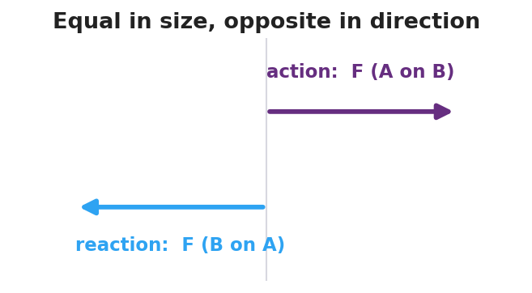

# Newton's Third Law (Action and Reaction) — Student Notes

**Unit: Forces — Lesson 03**
Name: _______________________  Date: __________  Period: ____

---

## Learning Targets

By the end of today's 42 minutes I can:

- State Newton's Third Law in my own words.
- Identify both members of an **action–reaction pair** and the two objects each force acts on.
- Explain why an action–reaction pair does **not** cancel.

---

## Key Vocabulary

- **action–reaction pair** — _______________________________________________
- **force pair** — _______________________________________________
- **interaction** — _______________________________________________

---

## Guided Notes

**Big idea (Newton's Third Law):** For every action force there is an equal-in-__________ , opposite-in-__________ reaction force.

- A force is always one half of an **interaction** between __________ objects.
- The two forces in a **force pair** are equal in __________ and opposite in __________.
- The two forces act on __________ (same / different) objects.
- Because they act on different objects, an action–reaction pair does **NOT** __________.

**Force pair — student pushes off a wall (fill the arrows):**

- Action: the student pushes the wall __________.
- Reaction: the wall pushes the student __________.
- These two forces act on __________ different objects: the __________ and the __________.

**Same forces, different motion:** If two people push off with equal forces, the one with __________ mass speeds up __________ (recall Lesson 02: a = F/m).

The two forces in a pair are vectors of the **same length** pointing in **opposite directions**:

---

## Worked Example

**Problem.** A swimmer pushes backward on the water with a force of 200 N and glides forward. Identify the action–reaction pair and explain why the swimmer moves forward.

**Solution.**
1. **Action:** the swimmer pushes the water __________ with 200 N.
2. **Reaction:** the water pushes the swimmer __________ with __________ N (equal and opposite).
3. The two forces act on __________ different objects — the water and the swimmer.
4. The forward push acts on the __________, so the swimmer accelerates forward. The forces do **not** cancel because they are on __________ objects.

---

## Summary

Finish the sentence (Because / But / So):

> When the swimmer pushes the water backward, the water pushes the swimmer forward
> because __________________________________________,
> but __________________________________________,
> so __________________________________________.
