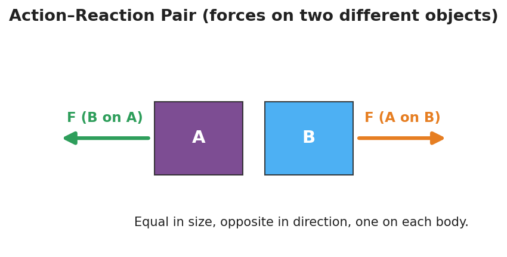

# Newton's Third Law (Action and Reaction) — Teacher Guide

## Cover

**Unit: Forces — Lesson 03: Newton's Third Law (Action and Reaction)**
East Meadow Schools × Valley Stream Central High School District
Strategy chips: ACTIVE LEARNING

---

## Curated Resources (from East Meadow Scope & Sequence)

### NYSSLS Standards

The Scope & Sequence row "3rd Law — Action/Reaction" names **no single performance expectation**; instead it *supports* **HS-PS2-1** and **HS-PS2-2** by establishing the foundational idea that **forces always come in pairs**. Before students can quantify net force (HS-PS2-1) or reason about momentum transfer in collisions (HS-PS2-2), they must accept that a force is one side of an **interaction** between two objects — never something one object "has" alone. This lesson builds that base.

### Phenomenon

- Newton's Third Law demo short (rolling-chair / push-off): <https://youtube.com/shorts/FMWxvYpGRBI>
- Backup options if no screen: a **balloon rocket** strung on fishing line across the room, or **two students on rolling chairs** pushing apart.

### Javalab / Labs

- Balloon rocket on fishing line (low-cost build); rolling-chair push-off; or a **force-pair card sort** (action card ↔ reaction card matching) used as the Phase 2 station task.

### Assessments

- The **Exit Ticket below serves as the formative check** for this lesson. No separate quiz; look for the action–reaction language students produce in the force-pair hunt and on the exit ticket.

---

## Lesson Overview

| | |
|---|---|
| **Duration** | 42 minutes (1 period) |
| **NYSSLS link** | Supports HS-PS2-1 and HS-PS2-2 (forces come in pairs) |
| **CCC focus** | Systems and System Models — every force acts *between two objects* in a system; you cannot draw one without naming both. |
| **Strategy chips** | ACTIVE LEARNING |
| **Materials** | Balloons; fishing line + straws + tape (balloon rocket); 2 rolling chairs; force-pair card-sort sets (one per pair); whiteboards/markers; a screen for the short. |
| **Safety** | Spotters for rolling-chair push-off on a clear, flat floor; no racing. Keep balloon line clear of faces. |
| **Prior knowledge** | Lesson 01 (inertia, net force) and Lesson 02 (unbalanced forces cause acceleration); forces as vectors (size + direction). |

**Lesson objectives — students can:**

- State Newton's Third Law: for every action force there is an **equal-in-magnitude, opposite-in-direction reaction force**.
- Identify both members of an **action–reaction pair** and the **two different objects** each acts on.
- Explain why an action–reaction pair does **not** cancel (the two forces act on different objects, never on the same one).

---

## Phase 1 · Engage *(0 – 12 min)*

### 0–3 min · Opening Connection (SEL)

Quick whip-around (one sentence, pass allowed): *"Name a time you pushed on something and it pushed you back — a wall, a friend, a door."* Capture two or three; you'll call back to "it pushed me back" in Phase 3.

### 3–8 min · Phenomenon hook — the push-off

**Teacher actions.** Play the Third-Law short, or stage it live: two students of clearly different sizes sit in rolling chairs, facing, soles touching. On your count, **one** student pushes the other away. Ask the class to watch *both* students.

**Sample teacher language:**

> "Only *one* of them pushed. Watch carefully — who moves? Don't answer who you *expect*; tell me who actually rolls."

**Anticipated student responses:**

- "They both rolled apart!" — exactly the catch; only one pushed, yet both moved.
- "The lighter one rolled faster / farther." — good, hold it; we'll explain it with equal forces + different masses.
- "He pushed back too." — capture this; sharpen "he pushed back" into "the *floor/chair/other student* pushed back."

### 8–12 min · Notice & Wonder + Turn-and-Talk #1

Two columns on the board. Then:

> "Turn to your partner: if only one person pushed, why did *both* people move? Use the word *force* in your answer."

Take 2–3 responses. Desired surfacing: *the second student pushed back without trying — there were two forces, on two people.* Leave open if no one lands it.

### Bridge to Phase 2

Each student writes a one-sentence **initial model**: "Both students moved because ______."

---

## Phase 2 · Explore *(12 – 32 min)*

### 12–16 min · Initial Model (silent / individual)

Prompt on the board:

> *"Draw the two students at the moment of the push. Draw an arrow for every push acting in the system, and label which object each arrow acts on. Predict how the two pushes compare in size."*

This surfaces the misconception early: many will draw only *one* arrow, or two arrows on the *same* person.

### 16–32 min · Active-Learning investigation — the Force-Pair Hunt (3 stations)

Students rotate in pairs through three active stations. At each, they must name **both** forces and **both** objects, then write the pair as *"A pushes B → B pushes A back, equal and opposite."*

1. **Balloon rocket** — tape an inflated balloon to a straw threaded on fishing line; release. *The balloon pushes air **backward**; the air pushes the balloon **forward**.*
2. **Rolling-chair push-off** — push a partner away (spotted). *You push partner forward; partner pushes you backward — both roll.*
3. **Force-pair card sort** — match each action card ("swimmer pushes water back") to its reaction card ("water pushes swimmer forward"); flag the two different objects on each pair.

**Teacher facilitation language:**

> "Name the two objects before you name the force. *Who* pushes *whom*?"
> "Where's the second arrow? A push always has a partner pushing back."
> "Both arrows here — are they on the *same* object or two different ones?"

### Teacher facilitation during Explore

- **What to look for** — students naming *two objects* per pair and writing both forces as equal and opposite.
- **What to resist** — don't hand them "they cancel" or "they don't cancel" yet; let the card sort and the chairs force the question of *which object* each force acts on.
- **What to redirect** — any pair drawing both arrows on one object: "If both acted on the balloon, what's pushing the *air*?"

---

## Phase 3 · Explain *(32 – 37 min)*

### 32–35 min · Turn-and-Talk #2 + class consensus

> "Across all three stations, what was always true about the *two* forces and the *two* objects?"

Target consensus:

> "Every push (or pull) is one half of an **interaction** between two objects. The two forces are equal in size and opposite in direction, and they act on **different** objects — so they never cancel on either object."

Project the diagram below to anchor the consensus: the two arrows are the **same length** (equal size), point **opposite** ways, and sit on **two different bodies** (A and B) — which is exactly why they don't cancel.

### 35–37 min · Vocabulary introduction (≤ 3 terms)

**Sample teacher language:**

> "When two objects push on each other, that's an **interaction**. The two forces it produces are a **force pair** — also called an **action–reaction pair**. Newton's Third Law says they are always equal in size and opposite in direction. The key: they act on *two different objects*, so they do not cancel."

### Discussion prompts to deploy here

- "You walk forward. Name the action–reaction pair and the two objects."
  - *Sample student response:* "My foot pushes the ground backward; the ground pushes me forward. Two objects — me and the ground."
- "A gun recoils when fired. Why?"
  - *Sample student response:* "The gun pushes the bullet forward; the bullet pushes the gun back — equal and opposite, on two different objects."

---

## Phase 4 · Elaborate *(37 – 40 min)*

### 37–39 min · Revise the model

> *"Return to your push-off drawing. Make sure you have **two** arrows, equal in length, pointing opposite ways, each labeled with the object it acts on. In one sentence, explain why they do NOT cancel."*

Target: "They act on two different people, so neither person feels a zero net force — that's why both roll."

### 39–40 min · Return to the phenomenon

> "Why did the *lighter* student roll faster if the two forces were equal? Answer in one sentence."

Target: "The forces are equal, but equal force on less mass gives more acceleration (Lesson 02) — so the lighter student speeds up more."

---

## Phase 5 · Evaluate *(40 – 42 min)*

### 40–42 min · Exit Ticket + Closing Reflection

> *"A swimmer pushes off the pool wall and glides forward.
> (a) Name the action–reaction pair. State which object each force acts on.
> (b) The two forces are equal and opposite — so why doesn't the swimmer stay still?
> (c) True or false: action and reaction forces cancel each other out. Explain."*

Expected: (a) swimmer pushes wall back / wall pushes swimmer forward — forces act on two different objects (swimmer, wall); (b) the two forces act on different objects, so the swimmer feels only the wall's forward push — not zero; (c) **False** — they act on different objects, so they cannot cancel on a single object. See `Answer_Key.docx`.

**Closing Reflection (SEL, 30 seconds):**

> "What is one idea today that pushed back on what you used to think? Who helped you make sense of it?"

---

## Common Misconceptions

- **Misconception:** "Action and reaction forces cancel, so nothing moves." → **Correction:** They act on **different objects**; forces only cancel when they act on the *same* object. Each object feels its own single force.
- **Misconception:** "The bigger / stronger object pushes harder." → **Correction:** The forces in a pair are always **equal in magnitude**, no matter the masses. Different *accelerations* come from different *masses*, not different forces.
- **Misconception:** "The action happens first, then the reaction." → **Correction:** The two forces are **simultaneous** — they are two descriptions of one interaction, not a cause followed by an effect in time.

---

## Access & Differentiation

- **ELL/ENL supports:** Sentence frame: *"___ pushes ___, so ___ pushes ___ back, equal and opposite."* Word-choice box: {action–reaction pair, force pair, interaction, equal, opposite, different objects}. Pair *interaction* with a two-hands-pushing gesture.
- **IEP/SPED supports:** Pre-printed force-pair cards with the two objects already named; students draw and label the second arrow rather than building the whole diagram. Offer the balloon rocket as a hands-on alternative to writing.
- **Extensions:** Have students explain how a rocket accelerates in the vacuum of space with nothing to "push against" — the rocket pushes exhaust gas out; the gas pushes the rocket forward (the pair needs no air).

---

## Strategy Spotlight

**ACTIVE LEARNING — the Force-Pair Hunt (Phase 2).** Rather than lecturing the law, students rotate in pairs through three hands-on stations (balloon rocket, rolling-chair push-off, force-pair card sort) and *produce* the physics themselves. The non-negotiable structure: at every station each pair must (1) name the **two objects**, (2) draw **two arrows**, and (3) write the pair as *"A pushes B → B pushes A back, equal and opposite."* Movement, manipulation, and a required written product at each stop keep every student accountable and surface the "do they cancel?" question through experience before you ever name it. Budget ~5 min per station; ring a timer for clean rotations.

---

## NYSSLS Observation Checklist Crosswalk

| # | Checklist item | Where it appears in this lesson |
|---|---|---|
| 1 | Local/relatable phenomenon | Phase 1 — rolling-chair push-off; walking/recoil/swimmer in Phases 3–5 |
| 2 | Turn and Talk (2–3×) | Phase 1 (TT#1 — why both moved), Phase 3 (TT#2 — two forces, two objects) |
| 3 | Students develop questions/models/procedures | Phase 1 (initial model), Phase 2 (force-pair hunt stations), Phase 4 (revise model) |
| 4 | CCC defined and used | Lesson Overview · *Systems and System Models*, restated in Phase 2 ("name both objects") |
| 5 | ENL — ≤ 3 vocab, second half | Phase 3 — vocabulary at 35–37 min (action–reaction pair / force pair / interaction) |
| 6 | Revisit phenomenon with evidence | Phase 4 — push-off re-labeling + lighter-student-rolls-faster |
| 7 | ENL/SPED supports | Access & Differentiation block |
| 8 | Assessment check | Phase 5 — Exit Ticket (swimmer push-off) |

---

## Companion Materials

- `Student_Worksheet.docx` — the 5E student investigation (hand out at start of Phase 2)
- `Student_Notes.docx` — guided note-guide for vocabulary and the worked example
- `Answer_Key.docx` — answers to "Make It Make Sense" prompts and the Exit Ticket

---

## Key Vocabulary (max 3)

- **action–reaction pair** — the two forces produced by one interaction; equal in magnitude and opposite in direction, acting on two different objects
- **force pair** — another name for an action–reaction pair; the two forces are always reported together
- **interaction** — the mutual push or pull between two objects; a force is one half of an interaction, never something a single object has alone
