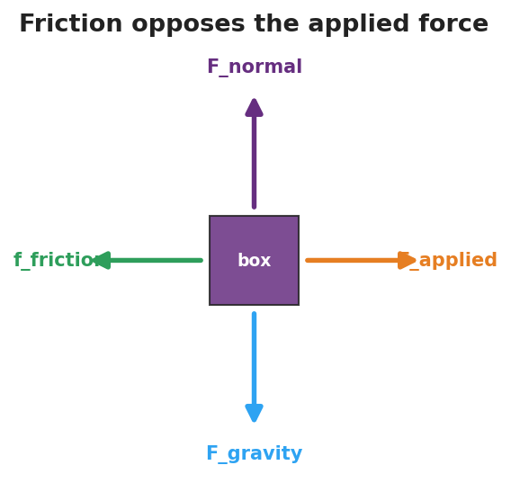

# Friction — Student Worksheet

**Unit: Forces — Lesson 04**
Name: _______________________  Date: __________  Period: ____

---

## Phenomenon

Your teacher drags the **same sneaker** at the same speed across tile, then carpet, then sandpaper — and the spring scale reads a different number every time. Then a heavy book will not slide at all… until one harder push, and it suddenly breaks loose and slides.

**Driving question:** What decides how hard friction pushes back — and why does an object suddenly "let go"?

---

## Notice & Wonder

| I notice… | I wonder… |
|---|---|
|  |  |
|  |  |
|  |  |

**Turn & Talk #1:** Why does the same sneaker need a different pull on each surface? Use the word *force*.

> _______________________________________________

---

## Initial Model

Draw the sneaker being dragged. Draw an arrow for the **pull** (spring scale) and an arrow for **whatever pushes back**. Then predict which surface needs the biggest pull, and why.

> _______________________________________________
> _______________________________________________
> My prediction: _______________________________

---

## Investigation

Work at your group's chart-paper station. Complete each level in order. The free-body diagram below shows the forces on the sneaker as you pull it — friction always points **opposite** your pull.

| Level | What I did | What happened | What it tells me |
|---|---|---|---|
| 1. Drag on 3 surfaces |  |  |  |
| 2. Add weight, one surface |  |  |  |
| 3. Just-before-sliding vs. while-sliding |  |  |  |
| 4. Pull ÷ weight ratio |  |  |  |

**Key question:** What two things make the friction force bigger or smaller?

> _______________________________________________

---

## Make It Make Sense

1. Why is it harder to *start* a desk sliding than to *keep* it sliding once it moves?
2. Two boxes sit on the same floor; one is heavier. Which needs more force to slide, and why?
3. The same sneaker reads a bigger pull on sandpaper than on tile. What about the sandpaper makes friction larger?

---

## Vocabulary in Action

Use each term in a sentence about today's phenomenon.

- **friction:** _______________________________________________
- **static friction:** _______________________________________________
- **kinetic friction:** _______________________________________________

---

## Revise Your Model

Return to your Initial Model. Label the push-back arrow **friction**. Add one sentence: when is it static, when is it kinetic, and what two things set its size? Use **Ff = μ·FN**.

> _______________________________________________
> _______________________________________________

---

## Exit Ticket

(a) You push a crate gently and it does not move. Name the force opposing your push and say whether it is static or kinetic. Explain.

(b) A 200 N crate sits on a floor with μ = 0.30 between the crate and the floor. Calculate the kinetic friction force as it slides. Show **Ff = μ·FN**.

(c) **Cause and Effect:** name one change that would make the friction force larger.
