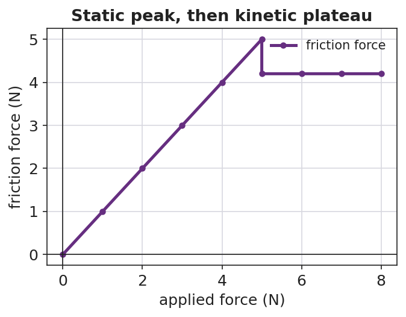

# Friction — Teacher Guide

## Cover

**Unit: Forces — Lesson 04: Friction**
East Meadow Schools × Valley Stream Central High School District
Strategy chips: BTC

---

## Curated Resources (from East Meadow Scope & Sequence)

### NYSSLS Standards

This lesson sits in **HS-PS2** (forces and motion). Friction is the anchoring force for **HS-PS2-3** — "Apply scientific and engineering ideas to design, evaluate, and refine a device that minimizes the force on a macroscopic object during a collision." Friction is the everyday way students *feel* a contact force, so it also reinforces **HS-PS2-1** (friction is one of the forces summed into the net force). The CCC focus is **Cause and Effect**: changing a surface or the normal force *causes* a measurable change in the friction force.

### Phenomenon

- Sneaker Lab — drag a sneaker across tile, carpet, and sandpaper with a spring scale; the pull needed is different every time even though the sneaker never changed.
- The "stuck book" — a heavy book will not slide no matter how gently you push, then suddenly breaks loose and slides easily once you push hard enough.

### Javalab / Labs

- oPhysics — Friction (block on a surface, vary μ and FN): <https://ophysics.com/f1.html>
- PhET — Forces and Motion: Basics (Friction tab): <https://phet.colorado.edu/sims/html/forces-and-motion-basics/latest/forces-and-motion-basics_all.html>
- Sneaker Lab — spring scale + one sneaker dragged at constant speed over three surfaces; record the scale reading (= friction force) for each.

### Assessments

- Exit ticket below serves as the formative check (one conceptual item, one numeric Ff = μ·FN item). PhET "Friction" tab gives an informal check during Explore.

---

## Lesson Overview

| | |
|---|---|
| **Duration** | 42 minutes (1 period) |
| **NYSSLS link** | HS-PS2-3 (anchor) · HS-PS2-1 (friction in Fnet) |
| **CCC focus** | Cause and Effect — changing the surfaces or the normal force *causes* a change in the friction force. |
| **Strategy chips** | BTC (Building Thinking Classrooms — random groups + VNPS thin-sliced task) |
| **Materials** | One sneaker per group; spring scales (0–10 N); tile/carpet/sandpaper samples; known masses; chart paper at standing height + markers; deck of playing cards; whiteboards. |
| **Safety** | Keep spring scales below their max rating. Tape sandpaper down so it does not slide. |
| **Prior knowledge** | Newton's First Law (balanced forces, net force); the normal force as the surface's upward push (Lesson 01/03). |

**Lesson objectives — students can:**

- Describe **friction** as a contact force that opposes relative motion (or attempted motion).
- Distinguish **static friction** (varies up to a maximum, before sliding) from **kinetic friction** (roughly constant, while sliding).
- Use **Ff = μ·FN** to explain and calculate how friction depends on the surfaces (μ) and the normal force (FN).

---

## Phase 1 · Engage *(0 – 10 min)*

### 0–3 min · Opening Connection (SEL)

Quick whip-around, one sentence each: *"Name a time something would not budge — and then suddenly gave way."* (A stuck jar lid, a desk dragged across the floor.) This plants the static-vs-kinetic "breakaway" feeling you will name in Phase 3.

### 3–7 min · Phenomenon hook — the Sneaker Lab preview + the stuck book

**Teacher actions.** Hook a spring scale to one sneaker. Drag it slowly across the tile and read the scale aloud. Move to carpet, then sandpaper, same sneaker, same constant speed — the readings climb. Then set a heavy book flat and push it sideways gently: nothing. Push harder: still nothing. Push harder still — it breaks loose and slides.

**Sample teacher language:**

> "Same sneaker, same speed — but the scale reads a different number on each surface. The sneaker didn't change. What did?"

**Anticipated student responses:**

- "Carpet is rougher, so it grabs more." — surface; the word we will sharpen is *friction*.
- "The book is too heavy to move." — capture, then complicate: "But I *did* move it — what changed right before it slid?"
- "You finally pushed hard enough." — gold; this is the static-friction maximum.

### 7–10 min · Notice & Wonder + Turn-and-Talk #1

Two columns on the board. Then:

> "Turn to your partner: why does the same sneaker need a different pull on each surface? Use the word *force*."

Take 2–3 responses. Desirable insight: *something between the surfaces pushes back against the motion, and rougher pairings push back more.* Leave it open if no one lands it.

### Bridge to Phase 2

Every student leaves Phase 1 with a one-sentence **initial model**: "The pull was different because ______."

---

## Phase 2 · Explore *(10 – 32 min)*

### 10–13 min · Initial Model (silent / individual)

Prompt on the board:

> *"Draw the sneaker being dragged. Draw an arrow for the pull (spring scale) and an arrow for whatever pushes back. Predict: which surface needs the biggest pull, and why?"*

This surfaces force intuitions before any vocabulary.

### 13–30 min · Investigation — BTC: random groups + vertical non-permanent surfaces

Form **visibly random groups of 3** (deal playing cards; same suit = same group). Each group works a chart-paper station at standing height. Hand each station the same **thin-sliced task card** (four levels, hardest last):

1. **Level 1.** Drag the sneaker at constant speed on each of the three surfaces. Record each scale reading. Rank the surfaces.
2. **Level 2.** Pile known masses on the sneaker. On *one* surface, how does the scale reading change as you add weight? Plot pull vs. weight.
3. **Level 3.** Push the sneaker *without* it moving, then just hard enough to start it sliding. Compare the "just before it moves" reading to the "while sliding" reading. Which is bigger?
4. **Level 4.** Your data shows pull ÷ weight is about the same for a given surface. Give that ratio a name and predict the pull for a weight you have not tested.

**Teacher facilitation language (walk, do not solve):**

> "What stays the same and what changes between your two surfaces?"
> "Right before it slips, is the scale still climbing or holding steady?"
> "What does pull ÷ weight tell you that the raw pull doesn't?"

As students drag the sneaker, the free-body diagram below names the forces in play: the applied pull, the friction force opposing it, and the balanced normal/gravity pair.

The Level-3 "breakaway" pattern shows up clearly when friction force is plotted against applied force — it climbs through the **static** region to a peak, then drops to a steadier **kinetic** plateau:

### Teacher facilitation during Explore

- **What to look for** — groups noticing the reading *climbs* before the book/sneaker breaks loose, then *drops and steadies* once sliding.
- **What to resist** — don't supply "μ" or "kinetic" yet; let the spring scales do the teaching.
- **What to redirect** — groups who say "heavier = more friction, always" should test it and articulate it as *more normal force, more friction* (Ff depends on FN, not mass directly).

### 30–32 min · Gallery check

Groups rotate one station clockwise. *"What's the same in their data? What's different?"* Surface the two big patterns: the **breakaway** (static peak > sliding) and the **constant ratio** (pull ÷ normal force).

---

## Phase 3 · Explain *(32 – 37 min)*

### 32–35 min · Class consensus

> "Across every station, what always pushed back on the sneaker, and what made that push bigger or smaller?"

Target consensus:

> "A contact force pushes back against the motion. It's bigger on rougher surface pairings and bigger when you press the surfaces together harder. Right before something slides, that push reaches a maximum; once it's sliding, the push is steady and a bit smaller."

### 35–37 min · Vocabulary introduction (≤ 3 terms)

**Sample teacher language:**

> "That push-back is **friction**. Before an object slides, it's **static friction** — it grows to match your push, up to a maximum. Once it slides, it's **kinetic friction** — roughly constant. Your 'pull ÷ weight' ratio is the **coefficient of friction**, μ, and the Reference Table gives us **Ff = μ·FN**: friction equals μ times the normal force."

### Discussion prompts to deploy here

- "Why is it harder to *start* sliding a desk than to *keep* it sliding?"
  - *Sample student response:* "Static friction has a bigger maximum than kinetic friction, so the first push has to beat the bigger one."
- "Two boxes on the same floor; one is heavier. Which needs more force to slide, and why?"
  - *Sample student response:* "The heavier one — more normal force, so Ff = μ·FN is larger."

---

## Phase 4 · Elaborate *(37 – 40 min)*

### 37–39 min · Revise the model

> *"Return to your sneaker drawing. Label the push-back arrow 'friction.' Add a sentence: when is it static, when is it kinetic, and what two things set its size? Use Ff = μ·FN."*

### 39–40 min · Return to the phenomenon (HS-PS2-3 thread)

> "A phone in a padded case hits the floor. In one sentence using friction and normal force, why does a grippy case help it stop without sliding off the table edge first?"

Target: a grippy case raises μ, so even a small normal force gives enough friction to keep the phone from sliding — the design *minimizes the force* the phone takes by controlling how it stops.

---

## Phase 5 · Evaluate *(40 – 42 min)*

### 40–42 min · Exit Ticket + Closing Reflection

> *"(a) A crate sits still while you push it gently and it does not move. Name the force opposing your push and say whether it is static or kinetic. Explain.
> (b) A 200 N crate sits on a floor with μ = 0.30 between the crate and the floor. Calculate the kinetic friction force on the crate as it slides. Show Ff = μ·FN.
> (c) Cause and Effect: name one change that would make the friction force larger."*

Expected: (a) static friction, because the crate is not sliding — it grows to match the push up to a maximum; (b) Ff = μ·FN = 0.30 × 200 N = **60 N**; (c) a rougher surface (larger μ) or pressing it down harder / adding weight (larger FN). See `Answer_Key.docx`.

**Closing Reflection (SEL, 30 seconds):**

> "Whose idea at your station changed how you think about friction today?"

---

## Common Misconceptions

- **Misconception:** "Friction depends on how big the contact area is." → **Correction:** For these surfaces, friction depends on μ and the normal force (Ff = μ·FN), not on contact area.
- **Misconception:** "Friction depends on speed." → **Correction:** Kinetic friction is roughly constant regardless of sliding speed at this level.
- **Misconception:** "Heavier always means more friction." → **Correction:** It's the *normal force* that matters; more weight usually means more normal force, but tilt or extra downward push can change FN independent of mass.
- **Misconception:** "Static and kinetic friction are the same." → **Correction:** Static friction varies up to a maximum (usually larger); kinetic friction is steady once sliding.

---

## Access & Differentiation

- **ELL/ENL supports:** Sentence frame: *"Friction is ___ when the object is not moving and ___ when it slides; it gets bigger when ___ or ___."* Word-choice box: {static, kinetic, rougher, normal force, opposes, μ}. Pair *friction* with a rubbing-hands gesture.
- **IEP/SPED supports:** Provide a pre-labeled force diagram (pull arrow + friction arrow) so students label "static/kinetic" rather than draw from scratch. Provide the Ff = μ·FN equation pre-printed with FN and μ boxes to fill.
- **Extensions:** Have students design a "minimize the force" pad (HS-PS2-3) and argue, using μ and FN, why their surface choice slows an object most gently.

---

## Strategy Spotlight

**Building Thinking Classrooms — random groups + vertical non-permanent surfaces (17 min)** — see Phase 2, Investigation. The full process: visibly random groups of 3 by playing-card suit; chart-paper stations at standing height; one thin-sliced task card per station with four progressively harder tasks (Level 1 → 4). Teacher circulates and asks questions but does not solve. After ~17 minutes, rotate one station clockwise: "What's the same in their data? What's different?" — surface the breakaway (static peak > kinetic) and the constant pull ÷ normal-force ratio (μ).

The strategy works because *visibly random* groups signal that anyone can think with anyone, and the *vertical non-permanent surface* keeps thinking public and erasable, so groups take risks and the next group can verify the data on the wall.

---

## NYSSLS Observation Checklist Crosswalk

| # | Checklist item | Where it appears in this lesson |
|---|---|---|
| 1 | Local/relatable phenomenon | Phase 1 — Sneaker Lab + stuck book; phone case in Phase 4 |
| 2 | Turn and Talk (2–3×) | Phase 1 (TT#1 — why different pull), Phase 2 (gallery check), Phase 3 (consensus) |
| 3 | Students develop questions/models/procedures | Phase 1 (initial model), Phase 2 (BTC thin-sliced task), Phase 4 (revise model) |
| 4 | CCC defined and used | Lesson Overview · *Cause and Effect*, restated in Phase 2 and Exit Ticket (c) |
| 5 | ENL — ≤ 3 vocab, second half | Phase 3 — vocabulary at 35–37 min (friction / static / kinetic) |
| 6 | Revisit phenomenon with evidence | Phase 4 — phone case + sneaker re-labeling with Ff = μ·FN |
| 7 | ENL/SPED supports | Access & Differentiation block |
| 8 | Assessment check | Phase 5 — Exit Ticket (crate, numeric Ff = μ·FN) |

---

## Companion Materials

- `Student_Worksheet.docx` — the 5E student investigation (hand out at start of Phase 2)
- `Student_Notes.docx` — guided note-guide for vocabulary and the worked example
- `Answer_Key.docx` — answers to "Make It Make Sense" prompts and the Exit Ticket

---

## Key Vocabulary (max 3)

- **friction** — a contact force that opposes relative motion (or attempted motion) between two surfaces; on the Reference Table, Ff = μ·FN
- **static friction** — friction on an object that is not yet sliding; it varies to match the applied force up to a maximum
- **kinetic friction** — friction on an object that is already sliding; it is roughly constant
