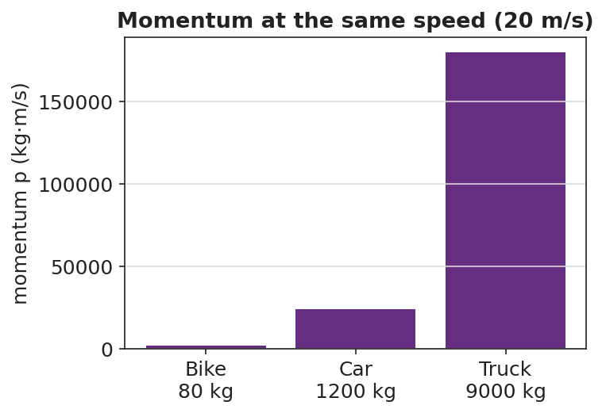

# Momentum — Student Notes

**Unit: Momentum & Impulse — Lesson 01**
Name: _______________________  Date: __________  Period: ____

---

## Learning Targets

By the end of today's 42 minutes I can:

- Calculate momentum using **p = m·v** and state its unit, **kg·m/s**.
- Explain that momentum is a **vector** that points the way the object moves.
- Predict which of two objects has more momentum when mass or velocity differs.

---

## Key Vocabulary

- **momentum** — _______________________________________________
- **mass** — _______________________________________________
- **velocity** — _______________________________________________

---

## Guided Notes

**Big idea:** Momentum measures how hard a moving object is to __________.

- Reference-table formula: **p = m · ____** .
- Symbol for momentum: __________ . Unit: __________ ( kg·m/s ).
- Momentum grows if you increase the __________ *or* the __________.
- Momentum is a **vector**: it points the same direction as the __________.

**Sign and direction.** If East is positive, an object moving West has a __________ momentum. Two objects with the same *speed* can have __________ momenta if they move in opposite directions.

**Quick proportions.**
- Double the mass → momentum is __________ as big.
- Double the velocity → momentum is __________ as big.

---

## Worked Example

**Problem.** A 1,200 kg car moves East at 20 m/s. Find its momentum.

**Solution.**
1. Write the formula: p = m · ____ .
2. Substitute: p = (1,200 kg)(____ m/s).
3. Compute: p = __________ kg·m/s.
4. Direction: __________ (same as the velocity).

---

## Summary

Finish the sentence (Because / But / So):

> A truck and a bike can move at the same speed,
> because __________________________________________,
> but __________________________________________,
> so __________________________________________.