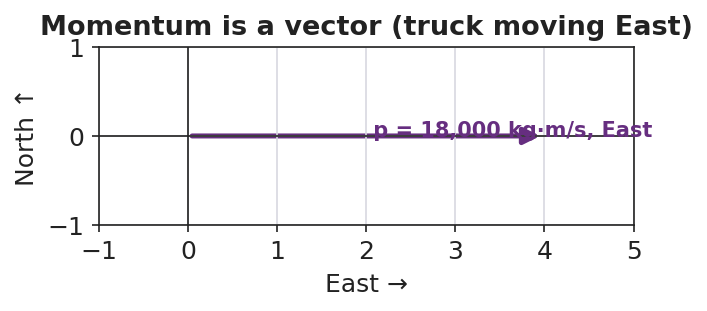

# Momentum — Teacher Guide

## Cover

**Unit: Momentum & Impulse — Lesson 01: Momentum**
East Meadow Schools × Valley Stream Central High School District
Strategy chips: RESTORATIVE CIRCLE

---

## Curated Resources (from East Meadow Scope & Sequence)

### NYSSLS Standards

This unit opener for **Momentum & Impulse** launches the strand assessed by **HS-PS2-2**:

> **HS-PS2-2.** "Use mathematical representations to support the claim that the total momentum of a system of objects is conserved when there is no net force on the system." *(Crosscutting Concept: Systems and System Models)*

Lesson 01 builds the quantity that the rest of the unit conserves: **momentum, p = m·v**. Before students can argue that a *system's* momentum is conserved (L03–L04), they must first be fluent that a single object's momentum scales with both its mass and its velocity, and that momentum is a **vector** (it has direction). The Regents Reference Table relationship introduced today is **p = m·v**, with momentum measured in **kg·m/s**.

### Phenomenon

- Newton's cradle in slow motion — one ball in, one ball out: <https://youtu.be/2UHS883_P60>
- A loaded dump truck vs. a bicycle, both rolling at the same speed — which is harder to stop? (district anchor video / teacher demo with carts of different mass)

### Javalab / Labs

- **PhET Collision Lab** — set two masses and speeds, read off momentum: <https://phet.colorado.edu/en/simulations/collision-lab>
- Javalab momentum simulation: <https://javalab.org/en/momentum_en/>

### Assessments

- Exit Ticket below (computing and comparing momentum, identifying it as a vector) is the formative check. PhET "momentum" readout serves as a live self-check during Explore.

---

## Lesson Overview

| | |
|---|---|
| **Duration** | 42 minutes (1 period) |
| **NYSSLS link** | HS-PS2-2 (introduces the conserved quantity, momentum) |
| **CCC focus** | Systems and System Models — momentum is the quantity we will track through a system; today we build it for one object. |
| **Strategy chips** | RESTORATIVE CIRCLE (unit opener) |
| **Materials** | Newton's cradle (or video); two dynamics carts of clearly different mass; a basketball and a tennis ball; whiteboards/markers; devices for PhET Collision Lab. |
| **Safety** | Roll carts on a clear, level surface; keep the cradle away from desk edges. |
| **Prior knowledge** | Kinematics — velocity as a vector (size + direction); Forces — mass and inertia. |

**Lesson objectives — students can:**

- Calculate the momentum of an object using **p = m·v** and state its unit, **kg·m/s**.
- Explain that momentum is a **vector** — it points in the direction of the velocity.
- Predict and justify which of two objects has more momentum when mass *or* velocity differs.

---

## Phase 1 · Engage *(0 – 12 min)*

### 0–3 min · Opening Connection (SEL) — Restorative Circle (unit opener)

This is the first lesson of a new unit, so open with a brief **restorative circle**. Pass a talking piece; one sentence each, no cross-talk. Prompt:

> "Tell us about one moment when something was really hard to stop once it got going — it could be a feeling, a habit, a game, anything."

This builds community and seeds the intuition that "hard to stop" depends on *how big* and *how fast* — the two ingredients of momentum you'll name in Phase 3.

### 3–8 min · Phenomenon hook — Newton's cradle + truck vs. bike

**Teacher actions.** Lift one ball of the Newton's cradle; release; one ball swings out the far side. Then pose the truck-vs-bike comparison: "A dump truck and a bike are both rolling at 20 miles per hour toward you. You can only step out of the way of one. Which do you let pass — and why?"

**Sample teacher language:**

> "Same speed for both. So what makes the truck the scarier one to be hit by? Hold that thought — we're going to put a number on it today."

**Anticipated student responses:**

- "The truck, because it's way heavier." — capture *mass*.
- "It would hurt more / it's harder to stop." — capture *hard to stop*; this is the everyday name for momentum.
- "But a bike going super fast could still hurt." — excellent; this previews that *speed* matters too.

### 8–12 min · Notice & Wonder + Turn-and-Talk #1

Capture two columns on the board. Then:

> "Turn to your partner: what *two* things seem to decide how hard something is to stop? Use the words *mass* and *speed*."

Take 2–3 responses. Desired insight: *both how much stuff is moving (mass) and how fast it moves (speed) matter.* Leave it open if nobody combines them yet.

### Bridge to Phase 2

Every student leaves Phase 1 with a one-sentence **initial model**: "Something is hard to stop when ______ and ______."

---

## Phase 2 · Explore *(12 – 32 min)*

### 12–17 min · Initial Model (silent / individual)

Prompt on the board:

> *"Rank these from easiest to hardest to stop: a tennis ball thrown gently, a tennis ball thrown hard, a bowling ball rolled gently, a bowling ball rolled hard. Write one sentence explaining the rule you used to rank them."*

This surfaces students' intuition that mass and speed *combine* before any formula.

### 17–32 min · Investigation — PhET Collision Lab

Students open **PhET Collision Lab** (or watch a guided projection). Task card:

1. Set Ball 1 to **mass 1 kg, velocity 2 m/s**. Read the momentum. Record it.
2. **Double the mass** (2 kg, still 2 m/s). What happens to momentum?
3. Go back to 1 kg, then **double the velocity** (1 kg, 4 m/s). What happens to momentum?
4. Send Ball 1 to the **left** instead of the right. What changes about the momentum value? (Sign!)

**Teacher facilitation language:**

> "When you doubled the mass, by what factor did momentum change? When you doubled the speed?"
> "What does the *negative sign* on the momentum tell you — is the ball slower, or is it going a different way?"
> "Write the rule the simulation is following before I tell you the formula."

### Teacher facilitation during Explore

- **What to look for** — students noticing momentum doubles when *either* mass or velocity doubles (proportional to both).
- **What to resist** — don't give "p = mv" until Phase 3; let the readout teach the proportionality.
- **What to redirect** — students who ignore the sign should be asked, "Could two balls have the same *speed* but different momentum? What's different?" (direction).

---

## Phase 3 · Explain *(32 – 37 min)*

### 32–35 min · Turn-and-Talk #2 + class consensus

> "Across all your trials, write the relationship between momentum, mass, and velocity as a word equation."

Target consensus:

> "Momentum equals mass times velocity. It grows if you add mass *or* add speed, and it points whichever way the object is moving."

### 35–37 min · Vocabulary introduction (≤ 3 terms)

**Sample teacher language:**

> "That 'hard-to-stop' quantity is **momentum**, symbol *p*. It equals **mass** times **velocity**: **p = m·v**, measured in **kilogram-meters per second, kg·m/s**. Because velocity is a vector, momentum is a vector too — it points the same direction the object moves."

### Discussion prompts to deploy here

- "A 1,200 kg car moves East at 20 m/s. Find its momentum and its direction."
  - *Sample student response:* "p = 1,200 × 20 = 24,000 kg·m/s, East."
- "Two objects have the same speed but different momentum. What must be different?"
  - *Sample student response:* "Their masses — more mass means more momentum at the same speed."

---

## Phase 4 · Elaborate *(37 – 40 min)*

### 37–39 min · Revise the model

> *"Return to your tennis-ball / bowling-ball ranking. Re-rank them by computing p = m·v for each (use tennis ball = 0.06 kg, bowling ball = 6 kg; gentle = 2 m/s, hard = 8 m/s). Does the math match your gut ranking?"*

### 39–40 min · Return to the phenomenon

> "Back to the truck and the bike at the same speed — in one sentence, use *p = m·v* to say why the truck is the dangerous one."

Target: "At the same velocity, the truck's far greater mass gives it far more momentum (p = m·v), so it is much harder to stop."

---

## Phase 5 · Evaluate *(40 – 42 min)*

### 40–42 min · Exit Ticket + Closing Reflection

> *"A 0.145 kg baseball is pitched West at 40 m/s.
> (a) Calculate its momentum, with units and direction.
> (b) A 0.045 kg golf ball is hit at 70 m/s. Show which ball has more momentum.
> (c) Is momentum a vector or a scalar? Give one reason."*

Expected: (a) p = 0.145 × 40 = 5.8 kg·m/s, West; (b) golf ball = 0.045 × 70 = 3.15 kg·m/s, so the baseball has more; (c) vector, because it has a direction (the same direction as the velocity). See `Answer_Key.docx`.

**Closing Reflection (SEL, 30 seconds):**

> "What is one idea today that you understand better because of something a classmate said?"

---

## Common Misconceptions

- **Misconception:** "Heavier always means more momentum." → **Correction:** Only if speeds are equal; a light, fast object can out-momentum a heavy, slow one (p = m·v).
- **Misconception:** "Momentum is the same as speed." → **Correction:** Speed ignores mass; momentum = mass × velocity and carries direction.
- **Misconception:** "Momentum has no direction." → **Correction:** Momentum is a vector; it points the way the object moves, so opposite directions get opposite signs.

---

## Access & Differentiation

- **ELL/ENL supports:** Sentence frame: *"The ___ has more momentum because its ___ (mass / velocity) is larger, so p = m·v is ___."* Word-choice box: {mass, velocity, momentum, kg·m/s, direction, vector}. Pair *momentum* with a gesture (two hands pushing forward, "hard to stop").
- **IEP/SPED supports:** Provide a pre-built p = m·v table with mass and velocity columns filled in; students compute only the product. Offer the cart demo as a hands-on alternative to the simulation.
- **Extensions:** Ask students to find a velocity at which a 0.045 kg golf ball would have the *same* momentum as a 0.145 kg baseball thrown at 40 m/s, and explain the trade-off between mass and speed.

---

## Strategy Spotlight

**RESTORATIVE CIRCLE (unit opener).** Today's opening uses a circle to launch the Momentum & Impulse unit. Use a talking piece, one-sentence responses, and equity of voice (everyone speaks or passes). The prompt — *something hard to stop once it got going* — is chosen so you can call it back in Phase 3 ("that 'hard to stop' feeling has a name and a formula: momentum, p = m·v"). Keep the circle to ~2–3 minutes; the goal is community plus a shared metaphor, not a long discussion.

---

## NYSSLS Observation Checklist Crosswalk

| # | Checklist item | Where it appears in this lesson |
|---|---|---|
| 1 | Local/relatable phenomenon | Phase 1 — Newton's cradle; truck vs. bike |
| 2 | Turn and Talk (2–3×) | Phase 1 (TT#1 — what makes something hard to stop), Phase 3 (TT#2 — write the relationship) |
| 3 | Students develop questions/models/procedures | Phase 1 (initial model), Phase 2 (PhET investigation), Phase 4 (revise model) |
| 4 | CCC defined and used | Lesson Overview · *Systems and System Models*, restated in Phase 2 |
| 5 | ENL — ≤ 3 vocab, second half | Phase 3 — vocabulary at 35–37 min (momentum / mass / velocity) |
| 6 | Revisit phenomenon with evidence | Phase 4 — re-rank with p = m·v; truck-vs-bike answer |
| 7 | ENL/SPED supports | Access & Differentiation block |
| 8 | Assessment check | Phase 5 — Exit Ticket (baseball / golf ball momentum) |

---

## Companion Materials

- `Student_Worksheet.docx` — the 5E student investigation (hand out at start of Phase 2)
- `Student_Notes.docx` — guided note-guide for vocabulary and the worked example
- `Answer_Key.docx` — answers to "Make It Make Sense" prompts and the Exit Ticket

---

## Key Vocabulary (max 3)

- **momentum** — a measure of how hard an object is to stop; p = m·v, a vector measured in kg·m/s
- **mass** — the amount of matter in an object (kg); one of the two factors that set momentum
- **velocity** — how fast and in what direction an object moves (m/s); momentum points the same way
