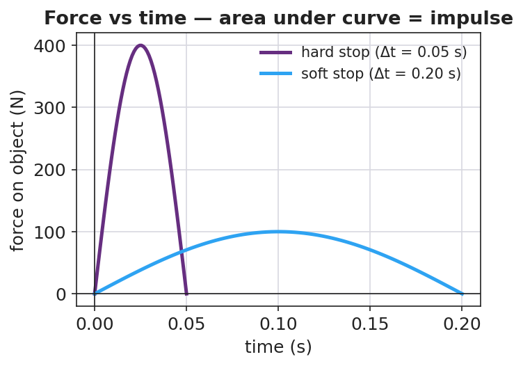

# Impulse and the Impulse–Momentum Theorem — Student Notes

**Unit: Momentum & Impulse — Lesson 02**
Name: _______________________  Date: __________  Period: ____

---

## Learning Targets

By the end of today's 42 minutes I can:

- Use **J = F·Δt = Δp** to relate force, time, and change in momentum.
- Explain why a longer contact time means a **smaller force** for the same change in momentum.
- Write a Because/But/So sentence about a safety device using impulse.

---

## Key Vocabulary

- **impulse** — _______________________________________________
- **force** — _______________________________________________
- **time interval** — _______________________________________________

---

## Guided Notes

**Big idea (impulse–momentum theorem):** The impulse on an object equals its change in __________.

- Reference-table formula: **J = F · Δt = Δ____** .
- Symbol for impulse: __________ . Unit: N·s, which is the same as __________ .
- Rearranged for force: **F = Δp / Δ____** .
- For a **fixed** change in momentum: a longer Δt gives a __________ force.

**Graph idea.** On a force-vs-time graph, the **area under the curve** equals the __________.
- A tall, narrow spike = __________ force, short time.
- A low, wide bump = __________ force, long time.
- If the two areas are equal, the __________ is equal.

**Real devices that stretch Δt:** airbag, crumple zone, bending your __________ on landing.

---

## Worked Example

**Problem.** A 0.5 kg ball moving at 8 m/s is caught and stopped. Compare the force for a glove (Δt = 0.4 s) and a bare hand (Δt = 0.05 s).

**Solution.**
1. Impulse needed: J = Δp = m·Δv = (0.5)(0 − 8) = __________ kg·m/s (magnitude 4 N·s).
2. Glove: F = Δp / Δt = 4 / 0.4 = __________ N.
3. Bare hand: F = Δp / Δt = 4 / 0.05 = __________ N.
4. Same impulse, but the glove uses __________ time, so the force is __________.

---

## Summary

Finish the sentence (Because / But / So):

> An airbag protects a driver
> because __________________________________________,
> but __________________________________________,
> so __________________________________________.