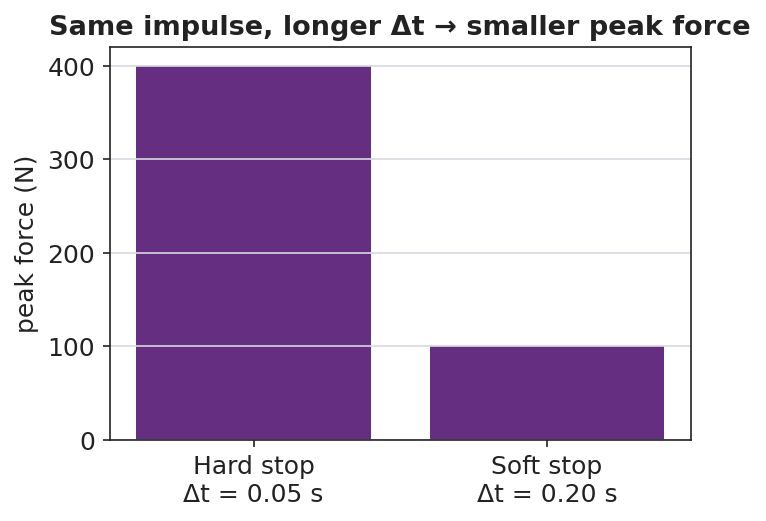

# Impulse and the Impulse–Momentum Theorem — Teacher Guide

## Cover

**Unit: Momentum & Impulse — Lesson 02: Impulse and the Impulse–Momentum Theorem**
East Meadow Schools × Valley Stream Central High School District
Strategy chips: HOCHMAN

---

## Curated Resources (from East Meadow Scope & Sequence)

### NYSSLS Standards

This lesson is the engineering hinge of the unit, assessed by **HS-PS2-3**:

> **HS-PS2-3.** "Apply scientific and engineering ideas to design, evaluate, and refine a device that minimizes the force on a macroscopic object during a collision." *(Crosscutting Concept: Cause and Effect)*

The impulse–momentum theorem, **J = F·Δt = Δp**, is the physics that makes that design possible: for a fixed change in momentum, *extending the contact time* lowers the *force*. Airbags, crumple zones, and bending your knees on landing all trade time for force. The lesson also reinforces **HS-PS2-2** by treating momentum change as the target quantity. Reference-Table relationships: **p = m·v** and **J = F·Δt = Δp**.

### Phenomenon

- Egg drop onto a pillow vs. a plate — same drop, very different outcome: <https://youtu.be/BLRfWtN3SQE>
- Slow-motion airbag deployment / crash test: <https://youtu.be/yQHDosNQGZk>
- Catching a fast ball by pulling your hands back (teacher demo).

### Javalab / Labs

- **PhET Collision Lab** (read force/time intuition by varying elasticity): <https://phet.colorado.edu/en/simulations/collision-lab>
- Javalab "impulse and momentum": <https://javalab.org/en/impulse_en/>

### Assessments

- Exit Ticket below (apply J = Δp; explain airbag in terms of Δt and force) is the formative check, scored with the Answer Key rubric.

---

## Lesson Overview

| | |
|---|---|
| **Duration** | 42 minutes (1 period) |
| **NYSSLS link** | HS-PS2-3 (design to minimize force) · HS-PS2-2 (momentum change) |
| **CCC focus** | Cause and Effect — extending contact time *causes* a smaller force for the same change in momentum. |
| **Strategy chips** | HOCHMAN (sentence-level literacy: Because/But/So + appositive on J = F·Δt = Δp) |
| **Materials** | Raw eggs, pillow + hard tray (over a tarp); a ball to catch; whiteboards; devices for PhET. |
| **Safety** | Egg drop over a covered/washable surface; wear closed-toe shoes; goggles optional. |
| **Prior knowledge** | Lesson 01 — momentum p = m·v; Forces — net force changes motion. |

**Lesson objectives — students can:**

- Define **impulse** and use **J = F·Δt = Δp** to relate force, time, and change in momentum.
- Explain why **extending the contact time reduces the force** for a fixed change in momentum.
- Write a Hochman Because/But/So sentence connecting Δt and force in a safety device.

---

## Phase 1 · Engage *(0 – 12 min)*

### 0–3 min · Opening Connection (SEL, 30 seconds)

Quick check-in (no circle today): "Thumbs up/middle/down — how ready do you feel after Lesson 01's momentum formula?" Name that today we use that momentum to explain how airbags save lives.

### 3–8 min · Phenomenon hook — the egg drop

**Teacher actions.** Drop one egg onto a hard tray (it breaks) and an identical egg from the same height onto a pillow (it survives). Both eggs hit the surface with the **same momentum** and end at rest — the same **change in momentum**.

**Sample teacher language:**

> "Same egg, same height, same speed at the bottom — so the *change in momentum* is identical. One survives. What was different about the *stop*?"

**Anticipated student responses:**

- "The pillow is soft." — push for *why* soft helps: "what does soft do to the *time* of the stop?"
- "The pillow slows it down more gently / over more time." — capture *time*; this is the key variable.
- "The hard tray stops it instantly." — capture *short time → big force*.

### 8–12 min · Notice & Wonder + Turn-and-Talk #1

Two columns on the board. Then:

> "Turn to your partner: both eggs had the same change in momentum, so what made the force on the egg so different? Use the word *time*."

Target insight: *the pillow stretches out the stopping time, so the force is smaller.*

### Bridge to Phase 2

Initial model sentence: "The pillow saves the egg because the stop took ______ time, so the force was ______."

---

## Phase 2 · Explore *(12 – 32 min)*

### 12–17 min · Initial Model (silent / individual)

Prompt on the board:

> *"Sketch two force-vs-time graphs for the same egg stopping: one on the tray, one on the pillow. Make them have the same total 'push' (area) but different shapes. Predict which has the taller spike."*

This surfaces the area-equals-impulse idea before it is named.

### 17–32 min · Investigation — catching a ball + PhET

Stations / whole-class:

1. **Catch a thrown ball two ways** — once with stiff arms (hands stay still), once by pulling your hands back as you catch. Which sting less? Why?
2. **PhET Collision Lab** — set one ball to hit a wall; compare a fast (elastic) bounce vs. a soft (inelastic) stop; relate the "harder hit" to a shorter interaction time.
3. **Read the graph** — given the force-vs-time graphs below, students shade and compare the *area* (impulse) under each.

**Teacher facilitation language:**

> "When you pulled your hands back, did you change the ball's momentum by a different amount — or just spread the stop over more time?"
> "Point to the area under each curve. If the areas are equal, what does that say about the impulse?"
> "Which graph has the dangerous spike — the tall narrow one or the low wide one?"

### Teacher facilitation during Explore

- **What to look for** — students saying the *area* (impulse) is the same but the *peak force* differs.
- **What to resist** — don't write J = F·Δt yet; let the graphs and the catch do the teaching.
- **What to redirect** — students who think the pillow "changes the momentum less" should compare end states: both eggs end at rest, so Δp is identical; only the *time* differs.

---

## Phase 3 · Explain *(32 – 37 min)*

### 32–35 min · Turn-and-Talk #2 + class consensus

> "Write a word equation linking force, the time it acts, and the change in momentum."

Target consensus:

> "Force times the time it acts equals the change in momentum. So for a fixed change in momentum, more time means less force."

### 35–37 min · Vocabulary introduction (≤ 3 terms)

**Sample teacher language:**

> "That product — **force** times the **time interval** it acts — is called **impulse**, symbol *J*. The impulse–momentum theorem says **J = F·Δt = Δp**: impulse equals the change in momentum. Rearranged, **F = Δp / Δt** — so stretching Δt shrinks the force for the same Δp. That is exactly what an airbag does."

### Discussion prompts to deploy here

- "Why do crumple zones make a car *safer* even though the car is more damaged?"
  - *Sample student response:* "The crumple stretches out the collision time, so the force on the passengers is smaller (F = Δp/Δt)."
- "A boxer 'rolls with the punch.' How does that reduce the force?"
  - *Sample student response:* "Moving with the glove extends the contact time, so the same impulse delivers less force."

---

## Phase 4 · Elaborate *(37 – 40 min)*

### 37–39 min · Hochman Because/But/So + appositive

Today's literacy move. On the board:

> *Sentence expansion.* Finish all three for the airbag:
> "An airbag protects a driver **because** ______; **but** ______; **so** ______."
> *Appositive.* Rewrite this into one sentence with an appositive naming impulse:
> "Impulse, ______, equals the change in momentum, so a longer contact time means a smaller force."

Model one aloud, then have students draft. This is the Hochman thin-slice: precise sentences about J = F·Δt = Δp.

### 39–40 min · Return to the phenomenon

> "In one Because/But/So sentence, explain why the egg on the pillow survives."

Target: "Both eggs have the same change in momentum **because** they hit at the same speed and stop, **but** the pillow stretches the stopping time, **so** the force on the egg is small enough not to break it."

---

## Phase 5 · Evaluate *(40 – 42 min)*

### 40–42 min · Exit Ticket + Closing Reflection

> *"A 0.5 kg ball moving at 8 m/s is brought to rest.
> (a) Find the impulse needed to stop it (give units and direction).
> (b) If a glove stops it in 0.4 s, what average force does the glove apply? If a bare hand stops it in 0.05 s, what force?
> (c) Use J = F·Δt to explain, in one sentence, why the glove hurts less."*

Expected: (a) J = Δp = m·Δv = 0.5 × (0 − 8) = −4 kg·m/s, i.e. 4 N·s opposite the motion; (b) glove F = 4/0.4 = 10 N; bare hand F = 4/0.05 = 80 N; (c) same impulse over a longer time gives a smaller force. See `Answer_Key.docx`.

**Closing Reflection (SEL, 30 seconds):**

> "Name one everyday object that secretly uses the impulse–momentum theorem to keep someone safe."

---

## Common Misconceptions

- **Misconception:** "A pillow reduces the change in momentum." → **Correction:** Δp is the same (the egg still stops); the pillow reduces the *force* by extending the *time*.
- **Misconception:** "Impulse and force are the same thing." → **Correction:** Impulse = force × time (J = F·Δt); a small force over a long time can equal a big force over a short time.
- **Misconception:** "More time means more force." → **Correction:** For a fixed impulse, more time means *less* force (F = Δp/Δt).

---

## Access & Differentiation

- **ELL/ENL supports:** Provide the Because/But/So frame pre-printed with the airbag context; word-choice box: {impulse, force, time interval, change in momentum, smaller, longer}. Pair *impulse* with the gesture of catching softly (hands drawing back).
- **IEP/SPED supports:** Give the force-vs-time graphs pre-shaded so students compare areas rather than draw them; provide the J = F·Δt formula triangle as a rearrangement scaffold.
- **Extensions:** Have students sketch and justify a force-vs-time graph for a phone dropped onto a rubber case vs. bare floor, predicting which has the larger peak force and why (HS-PS2-3 design link).

---

## Strategy Spotlight

**HOCHMAN (sentence-level literacy).** Today's literacy work lives in Phase 4: a Because/But/So sentence expansion and an appositive that names *impulse* precisely. The Hochman method keeps the writing at the sentence level — students are not writing paragraphs, they are building one accurate, complex sentence about J = F·Δt = Δp. Model one sentence aloud, require the appositive to define the term, and circulate to check that every Because/But/So clause is physically correct (Δp constant, Δt up, F down).

---

## NYSSLS Observation Checklist Crosswalk

| # | Checklist item | Where it appears in this lesson |
|---|---|---|
| 1 | Local/relatable phenomenon | Phase 1 — egg drop; airbag; catching a ball |
| 2 | Turn and Talk (2–3×) | Phase 1 (TT#1 — why the force differs), Phase 3 (TT#2 — word equation) |
| 3 | Students develop questions/models/procedures | Phase 1 (initial model graphs), Phase 2 (catch + PhET), Phase 4 (revise) |
| 4 | CCC defined and used | Lesson Overview · *Cause and Effect*, restated in Phase 3 (F = Δp/Δt) |
| 5 | ENL — ≤ 3 vocab, second half | Phase 3 — vocabulary at 35–37 min (impulse / force / time interval) |
| 6 | Revisit phenomenon with evidence | Phase 4 — Because/But/So egg-on-pillow sentence |
| 7 | ENL/SPED supports | Access & Differentiation block |
| 8 | Assessment check | Phase 5 — Exit Ticket (glove vs. bare hand force) |

---

## Companion Materials

- `Student_Worksheet.docx` — the 5E student investigation (hand out at start of Phase 2)
- `Student_Notes.docx` — guided note-guide for vocabulary and the worked example
- `Answer_Key.docx` — answers to "Make It Make Sense" prompts and the Exit Ticket

---

## Key Vocabulary (max 3)

- **impulse** — the product of force and the time it acts, J = F·Δt; equals the change in momentum (Δp); unit N·s = kg·m/s
- **force** — a push or pull (N); for a fixed impulse, a smaller force results from a longer contact time
- **time interval** — Δt, how long a force acts (s); extending it reduces the force for the same impulse
