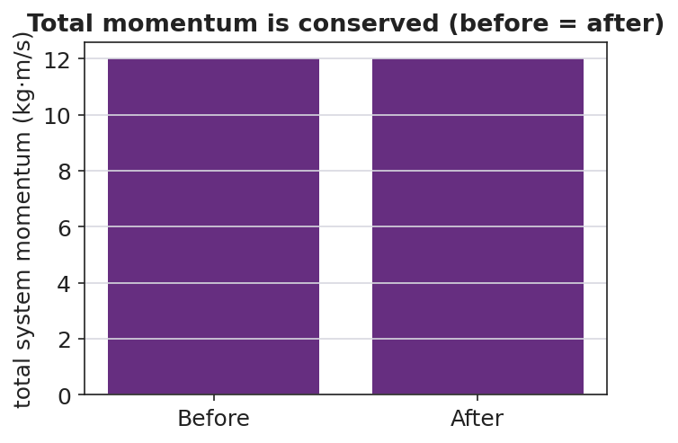

# Conservation of Momentum — Student Notes

**Unit: Momentum & Impulse — Lesson 03**
Name: _______________________  Date: __________  Period: ____

---

## Learning Targets

By the end of today's 42 minutes I can:

- State the law of **conservation of momentum** and the condition it requires.
- Define the **system** and identify a **collision** or push-off as an internal interaction.
- Use **Σp_before = Σp_after** to solve for an unknown velocity.

---

## Key Vocabulary

- **conservation of momentum** — _______________________________________________
- **system** — _______________________________________________
- **collision** — _______________________________________________

---

## Guided Notes

**Big idea (conservation of momentum):** The total momentum of a system stays __________ when the external net force on it is __________.

- Equation: **Σp_before = Σp________** .
- The **system** is the set of objects whose momenta we __________ together.
- Forces the objects exert on *each other* are __________ forces; they come in equal-and-opposite pairs (Newton's Third Law), so their impulses __________.
- Conservation breaks if an __________ net force (like friction or a hand) acts on the system.

**Signs and direction.** Momentum is a vector, so always add __________ values. If East is +, a momentum pointing West is __________.

**Push-off from rest.** Total before = 0, so total after must also = ____ . The two objects get __________ and opposite momenta.

---

## Worked Example

**Problem.** A 2 kg cart moving East at 3 m/s collides with a 1 kg cart at rest and they stick together. Find their final velocity.

**Solution.**
1. Total before: Σp = (2)(3) + (1)(0) = __________ kg·m/s East.
2. After sticking, combined mass = __________ kg.
3. Conservation: Σp_before = Σp_after → 6 = (3)(v).
4. Solve: v = __________ m/s, directed __________.

---

## Summary

Finish the sentence (Because / But / So):

> Two skaters who push apart both start at rest
> because __________________________________________,
> but __________________________________________,
> so __________________________________________.