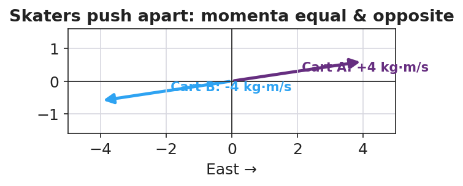

# Conservation of Momentum — Teacher Guide

## Cover

**Unit: Momentum & Impulse — Lesson 03: Conservation of Momentum**
East Meadow Schools × Valley Stream Central High School District
Strategy chips: ACTIVE LEARNING

---

## Curated Resources (from East Meadow Scope & Sequence)

### NYSSLS Standards

This is the heart of the unit, the lesson the standard is written around:

> **HS-PS2-2.** "Use mathematical representations to support the claim that the total momentum of a system of objects is conserved when there is no net force on the system." *(Crosscutting Concept: Systems and System Models)*

Students used **p = m·v** (L01) and **J = F·Δt = Δp** (L02); here they combine them across a *system*. Because the forces two objects exert on each other are an equal-and-opposite pair (Newton's Third Law), the impulses cancel, so the **total momentum before a collision equals the total momentum after** when no external net force acts: **Σp_before = Σp_after**.

### Phenomenon

- Two dynamics carts colliding on a track (district anchor demo / video).
- Two ice skaters pushing off each other and gliding apart: <https://youtu.be/5Y2bgFkWQqc>

### Javalab / Labs

- **PhET Collision Lab** — turn on the "momentum vectors" and "total" readout; verify total stays fixed: <https://phet.colorado.edu/en/simulations/collision-lab>
- Javalab "conservation of momentum": <https://javalab.org/en/conservation_of_momentum_en/>

### Assessments

- Exit Ticket below (compute an unknown final velocity using Σp_before = Σp_after) is the formative check, scored with the Answer Key rubric.

---

## Lesson Overview

| | |
|---|---|
| **Duration** | 42 minutes (1 period) |
| **NYSSLS link** | HS-PS2-2 (core) |
| **CCC focus** | Systems and System Models — define the *system*; when its external net force is zero, total momentum is constant. |
| **Strategy chips** | ACTIVE LEARNING (predict-measure-reconcile with carts; PhET station rotation) |
| **Materials** | Dynamics carts + track (or low-friction floor), masses, motion sensor or stopwatch + meterstick; rolling chairs / scooter boards (for the push-off); devices for PhET. |
| **Safety** | Clear the track path; spotters for any scooter-board push-off; no head-on cart launches toward people. |
| **Prior knowledge** | L01 momentum p = m·v (vector, signs); L02 impulse J = Δp; Newton's Third Law (force pairs). |

**Lesson objectives — students can:**

- State the law of **conservation of momentum**: a closed system's total momentum is constant when the external net force is zero.
- Define the **system** and recognize a **collision** or push-off as an internal interaction.
- Use **Σp_before = Σp_after** to solve for an unknown velocity, tracking signs/direction.

---

## Phase 1 · Engage *(0 – 12 min)*

### 0–3 min · Opening Connection (SEL, 30 seconds)

Quick partner greeting; name today's goal: "We've measured momentum for one object — today we follow it through a whole system of objects and find something that never changes."

### 3–8 min · Phenomenon hook — skaters push apart / carts collide

**Teacher actions.** Collide two carts of equal mass (one moving, one still) and let students watch the motion transfer. Then show two skaters at rest who push off and glide apart in opposite directions.

**Sample teacher language:**

> "Before they push, the skaters' total momentum is zero — nobody's moving. After, both are gliding. Where did that momentum come from — and what's the total now?"

**Anticipated student responses:**

- "They got momentum from pushing." — capture that the push is *internal* to the system.
- "They go opposite ways." — capture *opposite signs*.
- "The total is still zero because the two cancel." — gold; if no one says it, leave it as the open question.

### 8–12 min · Notice & Wonder + Turn-and-Talk #1

Two columns on the board. Then:

> "Turn to your partner: if the skaters started with zero total momentum, what is the total *after* they push apart? Use plus and minus signs."

Target insight: *equal and opposite momenta add to zero — the total didn't change.*

### Bridge to Phase 2

Initial model sentence: "When the two carts interact, the total momentum of the system ______."

---

## Phase 2 · Explore *(12 – 32 min)*

### 12–17 min · Initial Model (silent / individual)

Prompt on the board:

> *"Draw two carts before and after a collision. Label each cart's momentum arrow (size and direction) before and after. Predict: is the total (adding as vectors) the same before and after?"*

### 17–32 min · Investigation — ACTIVE LEARNING: predict, measure, reconcile

Active-learning rotation. Each group predicts first, then measures:

1. **Equal-mass collision** — one cart moving into a still cart of equal mass. Predict final velocities; measure with sensor/stopwatch.
2. **Unequal-mass collision** — load one cart; repeat.
3. **Push-off** — two carts (or students on scooter boards) at rest push apart; measure both speeds.
4. **PhET check** — recreate each in Collision Lab; read the **total momentum** before and after.

Groups record total momentum before and after in a shared class table.

**Teacher facilitation language:**

> "What did you predict for the total *before* you measured? Did the total change after the collision?"
> "Which momentum is positive and which is negative here? Add them as signed numbers."
> "The carts pushed on each other — is that force *inside* or *outside* your system?"

### Teacher facilitation during Explore

- **What to look for** — groups finding total before ≈ total after within measurement error.
- **What to resist** — don't announce "conservation" until Phase 3; let the class data table reveal it.
- **What to redirect** — groups who say momentum "disappeared" in the push-off should add the *signed* values; opposite directions cancel to the original total.

---

## Phase 3 · Explain *(32 – 37 min)*

### 32–35 min · Turn-and-Talk #2 + class consensus

> "Look at the class data table. Write one sentence about the *total* momentum before vs. after every interaction."

Target consensus:

> "The total momentum of the system was the same before and after, as long as nothing from outside pushed on it."

### 35–37 min · Vocabulary introduction (≤ 3 terms)

**Sample teacher language:**

> "When we add up the momenta of every object we are tracking, that group is the **system**. A **collision** (or push-off) is an interaction *inside* the system. The law of **conservation of momentum** says: if the external net force on the system is zero, the total momentum is constant — **Σp_before = Σp_after**."

### Discussion prompts to deploy here

- "Why must we include *both* skaters in the system for the total to stay constant?"
  - *Sample student response:* "Because the push is internal; if we only watched one skater, an outside force (the other skater) acts on it."
- "What outside force could break conservation on a real cart track?"
  - *Sample student response:* "Friction or a hand — those are external net forces."

---

## Phase 4 · Elaborate *(37 – 40 min)*

### 37–39 min · Revise the model

> *"Return to your before/after cart drawing. Write Σp_before = Σp_after with the actual signed momentum values. If one number was unknown, solve for it."*

### 39–40 min · Return to the phenomenon

> "In one sentence, explain why the two skaters glide apart at different speeds if one is heavier — using conservation of momentum."

Target: "Their momenta must stay equal and opposite to keep the total at zero, so the heavier skater moves slower (smaller v for larger m at equal p)."

---

## Phase 5 · Evaluate *(40 – 42 min)*

### 40–42 min · Exit Ticket + Closing Reflection

> *"A 2 kg cart moving East at 3 m/s collides with a 1 kg cart at rest, and they stick together.
> (a) Find the total momentum of the system before the collision.
> (b) After they stick, what is the combined mass, and what is their velocity?
> (c) State the condition under which momentum is conserved."*

Expected: (a) Σp = (2)(3) + (1)(0) = 6 kg·m/s East; (b) combined mass 3 kg, v = 6/3 = 2 m/s East; (c) when the external net force on the system is zero (a closed/isolated system). See `Answer_Key.docx`.

**Closing Reflection (SEL, 30 seconds):**

> "Whose prediction in your group was closest today, and what did you learn from comparing predictions to data?"

---

## Common Misconceptions

- **Misconception:** "Momentum disappears in a push-off because it started at zero." → **Correction:** Equal-and-opposite momenta add (as signed vectors) to the original total — still zero; nothing disappeared.
- **Misconception:** "The bigger object always ends up faster." → **Correction:** For equal-and-opposite momenta, the larger mass moves *slower* (p = m·v).
- **Misconception:** "Momentum is always conserved, no matter what." → **Correction:** Only when the *external* net force on the system is zero; friction or an outside push breaks it.

---

## Access & Differentiation

- **ELL/ENL supports:** Sentence frame: *"The total momentum is the ___ before and after because the ___ force on the system is ___."* Word-choice box: {system, collision, conservation of momentum, external, zero, equal}. Color-code East (+) and West (−) on the board.
- **IEP/SPED supports:** Provide the before/after table pre-labeled with mass and velocity columns; students fill momentum and the total only. Offer the PhET total-momentum readout as a check so the algebra is supported.
- **Extensions:** Have students predict and then verify the recoil speed of a "rocket" cart that ejects a mass, framing the ejected mass as part of the system.

---

## Strategy Spotlight

**ACTIVE LEARNING (predict–measure–reconcile).** Today's investigation is a structured active-learning rotation: every group commits to a *prediction* before each trial, then measures, then reconciles the gap. The cognitive work is in the reconciliation — students confront whether the total momentum really stayed constant. Keep groups accountable by collecting predictions in writing first, and build the shared class data table so the conservation pattern emerges from *their* numbers rather than from you. The closing reflection deliberately asks about prediction-vs-data to reinforce the move.

---

## NYSSLS Observation Checklist Crosswalk

| # | Checklist item | Where it appears in this lesson |
|---|---|---|
| 1 | Local/relatable phenomenon | Phase 1 — colliding carts; skaters pushing apart |
| 2 | Turn and Talk (2–3×) | Phase 1 (TT#1 — total after push-off), Phase 3 (TT#2 — total before vs. after) |
| 3 | Students develop questions/models/procedures | Phase 1 (initial model), Phase 2 (predict-measure rotation), Phase 4 (revise) |
| 4 | CCC defined and used | Lesson Overview · *Systems and System Models*, restated in Phase 2 (internal vs. external force) |
| 5 | ENL — ≤ 3 vocab, second half | Phase 3 — vocabulary at 35–37 min (system / collision / conservation of momentum) |
| 6 | Revisit phenomenon with evidence | Phase 4 — Σp_before = Σp_after with class data; heavier-skater answer |
| 7 | ENL/SPED supports | Access & Differentiation block |
| 8 | Assessment check | Phase 5 — Exit Ticket (stick-together collision) |

---

## Companion Materials

- `Student_Worksheet.docx` — the 5E student investigation (hand out at start of Phase 2)
- `Student_Notes.docx` — guided note-guide for vocabulary and the worked example
- `Answer_Key.docx` — answers to "Make It Make Sense" prompts and the Exit Ticket

---

## Key Vocabulary (max 3)

- **conservation of momentum** — the total momentum of a system stays constant when the external net force on it is zero: Σp_before = Σp_after
- **system** — the set of objects whose momenta we add together; interactions inside it are internal forces
- **collision** — an interaction in which objects exert forces on each other for a short time (a push-off counts)
