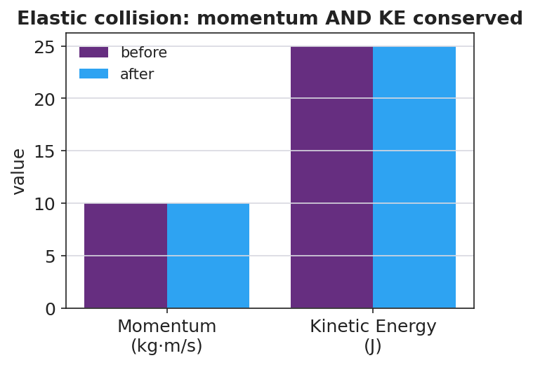

# Collisions: Elastic and Inelastic — Student Notes

**Unit: Momentum & Impulse — Lesson 04**
Name: _______________________  Date: __________  Period: ____

---

## Learning Targets

By the end of today's 42 minutes I can:

- Distinguish **elastic** from **inelastic** collisions by whether kinetic energy is conserved.
- Explain that **momentum is conserved in both** types of collision.
- Identify a perfectly inelastic collision and connect energy absorption to safety design.

---

## Key Vocabulary

- **elastic collision** — _______________________________________________
- **inelastic collision** — _______________________________________________
- **kinetic energy** — _______________________________________________

---

## Guided Notes

**Big idea:** **Momentum** is conserved in __________ collisions. **Kinetic energy** is conserved only in __________ collisions.

- Kinetic energy formula: **KE = ½ m ____²** .
- **Elastic** collision: KE is __________ (e.g. a Newton's cradle).
- **Inelastic** collision: KE is __________ ; the lost energy becomes __________, sound, and deformation.
- **Perfectly inelastic** collision: the objects __________ together and move as one.

**Bookkeeping check.** In every collision with no external net force:
- Σp_before ____ Σp_after  (always true)
- KE_before = KE_after only if the collision is __________.

**Engineering link (HS-PS2-3).** Crumple zones and helmets are designed to be __________ — they absorb kinetic energy and extend Δt, reducing the __________ on people.

---

## Worked Example

**Problem.** A 2 kg ball moving at 4 m/s strikes a 2 kg ball at rest. They stick together. Find the final velocity, then check kinetic energy.

**Solution.**
1. Momentum before: Σp = (2)(4) + (2)(0) = __________ kg·m/s.
2. After sticking, combined mass = __________ kg → 8 = (4)(v) → v = __________ m/s.
3. KE before = ½(2)(4²) = __________ J.
4. KE after = ½(4)(2²) = __________ J.
5. KE __________ conserved → the collision is __________.

---

## Summary

Finish the sentence (Because / But / So):

> Sticking clay and a Newton's cradle both conserve momentum
> because __________________________________________,
> but __________________________________________,
> so __________________________________________.