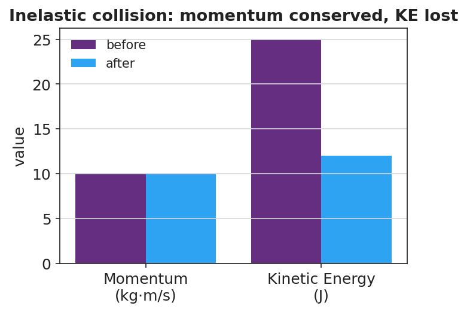
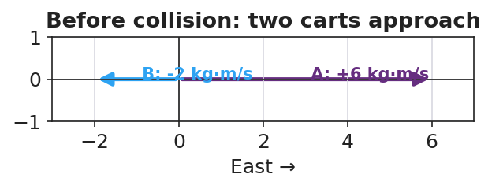

# Collisions: Elastic and Inelastic — Teacher Guide

## Cover

**Unit: Momentum & Impulse — Lesson 04: Collisions: Elastic and Inelastic**
East Meadow Schools × Valley Stream Central High School District
Strategy chips: BTC

---

## Curated Resources (from East Meadow Scope & Sequence)

### NYSSLS Standards

This closing lesson connects conservation to energy and to engineering design:

> **HS-PS2-2.** "Use mathematical representations to support the claim that the total momentum of a system of objects is conserved when there is no net force on the system." *(Systems and System Models)*
>
> **HS-PS2-3.** "Apply scientific and engineering ideas to design, evaluate, and refine a device that minimizes the force on a macroscopic object during a collision." *(Cause and Effect)*

Momentum is conserved in **every** collision (HS-PS2-2). What distinguishes collision *types* is **kinetic energy**: in an **elastic** collision KE is conserved; in an **inelastic** collision some KE is converted to heat, sound, and deformation (a **perfectly inelastic** collision is one where the objects stick together). Recognizing that inelastic collisions *absorb* energy is the physics behind crumple zones and helmets (HS-PS2-3). Reference-Table relationships in play: **p = m·v**, **J = F·Δt = Δp**, and KE = ½mv².

### Phenomenon

- Newton's cradle (≈ elastic — balls bounce, motion passes through): <https://youtu.be/2UHS883_P60>
- Two balls of clay thrown together and sticking (perfectly inelastic) — teacher demo.

### Javalab / Labs

- **PhET Collision Lab** — the **elasticity slider** (0 % = perfectly inelastic/stick, 100 % = elastic); watch the KE bar vs. the momentum bar: <https://phet.colorado.edu/en/simulations/collision-lab>
- Javalab "elastic and inelastic collision": <https://javalab.org/en/collision_en/>

### Assessments

- Exit Ticket below (classify a collision; argue momentum conserved but KE not) is the formative check, scored with the Answer Key rubric.

---

## Lesson Overview

| | |
|---|---|
| **Duration** | 42 minutes (1 period) |
| **NYSSLS link** | HS-PS2-2 (momentum conserved in both) · HS-PS2-3 (energy absorption → safety design) |
| **CCC focus** | Cause and Effect — what *causes* kinetic energy to be lost, and how engineers use that. |
| **Strategy chips** | BTC (Building Thinking Classrooms: visibly random groups + vertical non-permanent surfaces) |
| **Materials** | Newton's cradle; modeling clay; two superballs; whiteboards/VNPS around the room; deck of cards for random grouping; devices for PhET. |
| **Safety** | Throw clay only at the designated target; keep cradle clear of edges. |
| **Prior knowledge** | L01 p = m·v; L03 conservation of momentum; Energy unit — KE = ½mv². |

**Lesson objectives — students can:**

- Distinguish **elastic** from **inelastic** collisions by whether **kinetic energy** is conserved.
- Argue that **momentum is conserved in both** collision types, while KE is conserved only in elastic ones.
- Identify a **perfectly inelastic** collision (objects stick) and connect energy absorption to safety design.

---

## Phase 1 · Engage *(0 – 12 min)*

### 0–3 min · Opening Connection (SEL, 30 seconds) + BTC random groups

Form **visibly random groups** (deal cards) and send each to a vertical non-permanent surface (VNPS). Name today's goal: "Two collisions both conserve momentum, but only one bounces back full of life — let's find what's different."

### 3–8 min · Phenomenon hook — Newton's cradle vs. clay

**Teacher actions.** Run the Newton's cradle (balls click and pass motion cleanly). Then press two clay balls together so they stick and stop with a dull thud.

**Sample teacher language:**

> "Both collisions kept momentum — we proved that last lesson. But listen: the cradle *clicks* and keeps bouncing; the clay goes *thud* and stops. Where did the clay's motion energy go?"

**Anticipated student responses:**

- "The clay squished." — capture *deformation* (energy went into changing shape).
- "It made a thud — sound." — capture *sound / heat*.
- "The cradle didn't lose energy." — capture the elastic case.

### 8–12 min · Notice & Wonder + Turn-and-Talk #1

Two columns on the board. Then:

> "Turn to your group: momentum is conserved in both. So what is *different* between the bouncy cradle and the sticky clay? Use the word *energy*."

Target insight: *the clay loses kinetic energy (to heat/sound/squish); the cradle keeps it.*

### Bridge to Phase 2

Initial model sentence: "Both collisions conserve momentum, but they differ in whether ______ is conserved."

---

## Phase 2 · Explore *(12 – 32 min)*

### 12–17 min · Initial Model (at the VNPS, as a group)

Prompt:

> *"At your board, draw before/after for the cradle and for the clay. Predict for each: is momentum conserved? Is kinetic energy conserved? Defend your prediction."*

### 17–32 min · Investigation — BTC thin-slice at the VNPS

The thin-slice problem, posed in escalating steps at the vertical surfaces (BTC):

1. **Compute momentum** before and after for a given elastic collision (superballs) — confirm it's conserved.
2. **Compute kinetic energy** (KE = ½mv²) before and after the *same* elastic collision — is it conserved?
3. **Repeat both computations** for a perfectly inelastic collision (clay sticks): a 2 kg ball at 4 m/s hits a 2 kg ball at rest and they move off together.
4. **PhET check** — slide elasticity 100 % → 0 % and watch the **KE bar drop** while the **total momentum bar stays fixed**.

Groups graph their before/after results:

**Teacher facilitation language (BTC — keep them thinking):**

> "Where did the missing kinetic energy go? It didn't vanish — name three places."
> "Is the *momentum* bar different before and after? Is the *energy* bar different?"
> "Build the next question for the group next to you."

### Teacher facilitation during Explore

- **What to look for** — groups finding momentum conserved in both, but KE lower after the inelastic collision.
- **What to resist** — don't pre-label "elastic / inelastic"; let the KE numbers force the distinction.
- **What to redirect** — groups who think momentum is also lost in the clay collision should re-add signed momenta; only KE drops.

---

## Phase 3 · Explain *(32 – 37 min)*

### 32–35 min · Turn-and-Talk #2 + class consensus

> "Across both collisions, what was always conserved, and what was only *sometimes* conserved?"

Target consensus:

> "Momentum was conserved in both collisions. Kinetic energy was conserved only in the bouncy one; in the sticky one some KE turned into heat, sound, and deformation."

### 35–37 min · Vocabulary introduction (≤ 3 terms)

**Sample teacher language:**

> "A collision where **kinetic energy** is conserved is **elastic** — like the cradle. A collision where kinetic energy is *not* conserved is **inelastic**; if the objects stick together it's *perfectly inelastic* — like the clay. Momentum is conserved in **both** — only the energy bookkeeping changes."

### Discussion prompts to deploy here

- "A car crash where the bumpers lock is which type? Where does the KE go?"
  - *Sample student response:* "Perfectly inelastic — KE goes into bending metal (deformation), heat, and sound."
- "Why is an *inelastic* crumple zone safer than a perfectly elastic bumper?"
  - *Sample student response:* "It absorbs kinetic energy and extends the time, so less force reaches the passengers (HS-PS2-3)."

---

## Phase 4 · Elaborate *(37 – 40 min)*

### 37–39 min · Revise the model

> *"Return to your VNPS before/after drawings. Label each collision elastic or inelastic, and annotate where any lost kinetic energy went. Confirm momentum is conserved in both with the numbers."*

### 39–40 min · Return to the phenomenon

> "In one sentence, explain why the clay 'thud' and the cradle 'click' both conserve momentum but only one conserves kinetic energy."

Target: "Both conserve momentum because no outside net force acts, but the clay is inelastic — its kinetic energy converts to heat, sound, and deformation — while the cradle is nearly elastic and keeps its kinetic energy."

---

## Phase 5 · Evaluate *(40 – 42 min)*

### 40–42 min · Exit Ticket + Closing Reflection

> *"A 2 kg ball moving at 4 m/s strikes a 2 kg ball at rest. They stick and move off together.
> (a) Find their combined velocity using conservation of momentum.
> (b) Compute the kinetic energy before and after. Is KE conserved?
> (c) Is this collision elastic or inelastic? Justify with your numbers, and name where the missing energy went."*

Expected: (a) Σp = (2)(4) = 8 = (4)(v) → v = 2 m/s; (b) KE_before = ½(2)(4²) = 16 J, KE_after = ½(4)(2²) = 8 J — not conserved; (c) inelastic (perfectly inelastic, they stick); missing 8 J went to heat, sound, and deformation. See `Answer_Key.docx`.

**Closing Reflection (SEL, 30 seconds):**

> "What idea got clearer for you when you saw it written on the board by your group instead of in a notebook?"

---

## Common Misconceptions

- **Misconception:** "Momentum is lost when objects stick together." → **Correction:** Momentum is conserved in *every* collision with no external net force; only kinetic energy is lost in an inelastic one.
- **Misconception:** "Lost kinetic energy is destroyed." → **Correction:** It is *converted* — to heat, sound, and deformation; total energy is still conserved.
- **Misconception:** "Elastic just means stretchy/bouncy in general." → **Correction:** In physics, *elastic* specifically means kinetic energy is conserved in the collision.

---

## Access & Differentiation

- **ELL/ENL supports:** Sentence frame: *"This collision is ___ because the kinetic energy ___ conserved, but the momentum ___ conserved."* Word-choice box: {elastic, inelastic, kinetic energy, conserved, momentum, heat}. Pair *elastic* with a bounce gesture, *inelastic* with a "splat."
- **IEP/SPED supports:** Provide the KE = ½mv² and p = m·v formulas with one worked substitution shown; students complete the parallel one. Offer a pre-built two-bar (momentum/energy) chart to fill rather than draw.
- **Extensions:** Have students design and justify a collision device (egg car / crumple bumper) that maximizes energy absorbed and extends Δt, citing HS-PS2-3 — then predict whether their device makes the collision more or less elastic.

---

## Strategy Spotlight

**BTC (Building Thinking Classrooms).** Today uses two core BTC moves: **visibly random groups** (deal cards so students cannot self-sort) and **vertical non-permanent surfaces** (whiteboards on the walls). The investigation is a *thin-slice* sequence — momentum first, then energy, then a sticking case — posed in small escalating steps so every group can start and the cognitive load rises gradually. Keep yourself mobile, answer questions with questions ("where did the energy go?"), and have groups build the next question for a neighboring group. The closing reflection asks about the public-board experience to reinforce the practice.

---

## NYSSLS Observation Checklist Crosswalk

| # | Checklist item | Where it appears in this lesson |
|---|---|---|
| 1 | Local/relatable phenomenon | Phase 1 — Newton's cradle vs. sticking clay |
| 2 | Turn and Talk (2–3×) | Phase 1 (TT#1 — what's different), Phase 3 (TT#2 — always vs. sometimes conserved) |
| 3 | Students develop questions/models/procedures | Phase 1 (initial model at VNPS), Phase 2 (BTC thin-slice), Phase 4 (revise) |
| 4 | CCC defined and used | Lesson Overview · *Cause and Effect*, restated in Phase 3 (where KE goes) |
| 5 | ENL — ≤ 3 vocab, second half | Phase 3 — vocabulary at 35–37 min (elastic / inelastic / kinetic energy) |
| 6 | Revisit phenomenon with evidence | Phase 4 — label collisions + annotate energy on the VNPS |
| 7 | ENL/SPED supports | Access & Differentiation block |
| 8 | Assessment check | Phase 5 — Exit Ticket (stick-together: momentum vs. KE) |

---

## Companion Materials

- `Student_Worksheet.docx` — the 5E student investigation (hand out at start of Phase 2)
- `Student_Notes.docx` — guided note-guide for vocabulary and the worked example
- `Answer_Key.docx` — answers to "Make It Make Sense" prompts and the Exit Ticket

---

## Key Vocabulary (max 3)

- **elastic collision** — a collision in which kinetic energy is conserved (e.g. a Newton's cradle); momentum is conserved too
- **inelastic collision** — a collision in which kinetic energy is *not* conserved (some becomes heat/sound/deformation); momentum is still conserved. Perfectly inelastic = objects stick together
- **kinetic energy** — the energy of motion, KE = ½mv²; the quantity that distinguishes elastic from inelastic collisions
