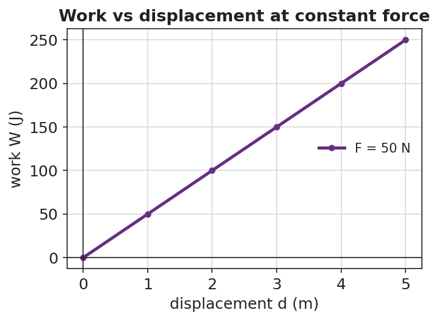

# Work — Student Notes

**Unit: Work, Energy & Power — Lesson 01**
Name: _______________________  Date: __________  Period: ____

---

## Learning Targets

By the end of today's 42 minutes I can:

- Define **work** and state its unit, the **joule**.
- Calculate work with **W = F·d**, using only the force *along* the displacement.
- Explain why carrying a load horizontally does zero work on it.

---

## Key Vocabulary

- **work** — _______________________________________________
- **joule** — _______________________________________________
- **displacement** — _______________________________________________

---

## Guided Notes

**Big idea:** Work is energy __________ when a force moves an object through a __________.

- The formula (reference table): **W = F·d**, where F is the force in __________ and d is the distance moved __________ the force.
- The unit of work is the __________ (J). One joule = one __________·meter (1 J = 1 N·m).
- Only the part of the force that points __________ the displacement does work.
- If a force is __________ (at 90°) to the motion, it does __________ work.
- If the object does not move, d = __________, so W = __________.

**Two cases (fill in):**

| | Force direction | Motion direction | Work on object |
|---|---|---|---|
| Lifting a bag | up | up | __________ (positive / zero) |
| Carrying a bag at steady height | up | sideways | __________ (positive / zero) |

---

## Worked Example

**Problem.** A mover pushes a crate with a steady 150 N force and the crate slides 4.0 m in the direction of the push. How much work is done on the crate?

**Solution.**
1. List what you know: F = __________ N, d = __________ m.
2. Use the reference-table formula: W = __________ × __________.
3. Compute: W = __________ J.
4. Units check: newtons × meters = __________ = joules. ✓

---

## Summary

Finish the sentence (Because / But / So):

> Carrying a box across a level room does zero work on the box
> because __________________________________________,
> but __________________________________________,
> so __________________________________________.