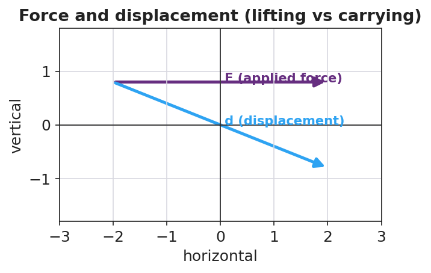

# Work — Teacher Guide

## Cover

**Unit: Work, Energy & Power — Lesson 01: Work**
East Meadow Schools × Valley Stream Central High School District
Strategy chips: HOCHMAN

---

## Curated Resources (from East Meadow Scope & Sequence)

### NYSSLS Standards

The Work, Energy & Power unit develops **HS-PS3** (energy). This opening lesson defines the *transfer* mechanism — work — that the rest of the unit quantifies. It builds the vocabulary and the W = F·d relationship that make **HS-PS3-1** possible: *"Create a computational model to calculate the change in energy of one component in a system when the change in energy of the other component(s) and energy flows in and out of the system are known."* (Crosscutting Concept: **Systems and System Models**.) Work is the first "energy flow in/out" students will compute.

### Phenomenon

- Lifting a loaded backpack straight up onto a high shelf vs. carrying the same backpack across a level hallway. <https://www.youtube.com/watch?v=2WS1sErgcUI> (Khan Academy: Work as the transfer of energy)
- The Physics Classroom — "Definition and Mathematics of Work": <https://www.physicsclassroom.com/class/energy/Lesson-1/Definition-and-Mathematics-of-Work>

### Javalab / Labs

- Javalab — Work and energy simulations index: <https://javalab.org/en/category/energy_en/>

### Assessments

- The Physics Classroom check-set on the work equation (link above). The Exit Ticket below is the formative check; the constructed-response "Make It Make Sense" items map to HS-PS3-1.

---

## Lesson Overview

| | |
|---|---|
| **Duration** | 42 minutes (1 period) |
| **NYSSLS link** | HS-PS3-1 (foundation — work as an energy flow into/out of a system) |
| **CCC focus** | Systems and System Models — work is energy transferred *into* or *out of* a chosen system. |
| **Strategy chips** | HOCHMAN (Because/But/So + appositive on W = F·d) |
| **Materials** | A loaded backpack or textbook stack; a bathroom/spring scale (N) or known masses; meter stick; whiteboards/markers. |
| **Safety** | Lift with knees; keep walkways clear; do not drop masses on feet. |
| **Prior knowledge** | Forces — net force and the newton; displacement as a vector (size + direction). |

**Lesson objectives — students can:**

- Define **work** as energy transferred when a force moves an object through a displacement, and state its unit, the **joule**.
- Calculate work with W = F·d, using only the component of force *along* the displacement.
- Explain why carrying a load horizontally at steady speed does *zero* work on the load, while lifting it does positive work.

---

## Phase 1 · Engage *(0 – 10 min)*

### 0–3 min · Opening Connection (SEL)

Quick pair-share, one sentence each: *"Name a time today your arms or legs felt tired even though you didn't really go anywhere."* Hold a few responses (holding a sibling, carrying groceries, standing on the train). Plant the puzzle: *being tired is not the same as doing physics "work."*

### 3–7 min · Phenomenon hook — lift it vs. carry it

**Teacher actions.** Hold a loaded backpack. (1) Lift it straight up from the floor to a high shelf. (2) Now carry it across the room at a steady walk, holding it at constant height.

**Sample teacher language:**

> "Both made my arms tired. But a physicist would say I did *work* in only one of these. Watch where the bag moves compared to the direction I'm pushing or pulling on it."

**Anticipated student responses:**

- "You did work both times — you were holding it!" — surface; honor the effort, then redirect to *direction of motion*.
- "The lift was harder so that's the work one." — closer; we will tie work to force *and* distance, not just effort.
- "When you carried it, it went sideways but you held it up." — capture this; it is the seed of "force ⟂ motion."

### 7–10 min · Notice & Wonder + Turn-and-Talk #1

Two columns on the board. Then:

> "Turn to your partner: in which case did the force you applied point the *same direction* the bag actually moved? Use the words *force* and *direction*."

Take 2–3 responses. Desirable insight: *when lifting, your force (up) and the bag's motion (up) line up; when carrying, your force is up but the motion is sideways.*

### Bridge to Phase 2

Every student leaves Phase 1 with an initial model sentence: "Work was done when ______ because ______."

---

## Phase 2 · Explore *(10 – 28 min)*

### 10–15 min · Initial Model (silent / individual)

Prompt on the board:

> *"Draw the backpack in each case. Draw one arrow for your force and one arrow for the bag's displacement. Then predict: in which case did you do more work on the bag — and is one of them zero?"*

This surfaces the alignment intuition before any equation.

### 15–28 min · Investigation — measure the work

Whole-class or small groups with one scale and a meter stick:

1. **Lift it.** Read the weight (force, in N) needed to hold the load. Lift it a measured height h. Record F and d (= h). Compute W = F·d.
2. **Carry it.** Walk the same load a measured horizontal distance at constant height. Ask: what is the *vertical* force you apply? What direction did the load move? How much of your force points along that motion?
3. **Vary the distance.** Lift the same load 0.5 m, then 1.0 m, then 1.5 m. Tabulate W vs. d.

Project the figure as the data come in:

**Teacher facilitation language:**

> "When you carried it, which way did the bag move? Which way did your force point? Is any part of your push pointing *along* the walk?"
> "Double the lift height. What happened to the work? Predict before you compute."

**Anticipated student responses:**

- "When I doubled the height, the work doubled." — exactly; W is proportional to d at fixed F.
- "Carrying it, my force is up but it moved sideways, so... none of my force is along the motion?" — land this; that is *zero work on the bag*.

### Teacher facilitation during Explore

- **What to look for** — students noting that only the part of the force *along* the displacement counts.
- **What to resist** — don't hand them "joule" or the formula yet; let the scale and meter stick build it.
- **What to redirect** — "I was tired so I did work" → ask *what direction did the object move relative to your force?*

---

## Phase 3 · Explain *(28 – 35 min)*

### 28–31 min · Turn-and-Talk #2 + class consensus

> "Across both cases, what two things did it take to do work *on the bag* — and why was carrying it zero?"

Target consensus:

> "Work happens when a force moves an object *in the direction of the force*. Lifting: force up, motion up — they line up, so work is done. Carrying at steady height: force up, motion sideways — the force is perpendicular to the motion, so it does zero work on the bag."

### 31–35 min · Vocabulary introduction (≤ 3 terms) + HOCHMAN

Build the equation from the reference table: **W = F·d** (force × distance moved *along* the force). Units: a newton-meter is a **joule (J)**.

**Sample teacher language (Hochman appositive + Because/But/So):**

> "Write it as an appositive: *Work, the energy transferred when a force moves an object through a displacement, is measured in joules.*
> Now Because/But/So: *Carrying the box does zero work on it **because** the upward force is perpendicular to the sideways motion, **but** my muscles still get tired, **so** 'tired' and 'work' are not the same thing in physics.*"

### Discussion prompts to deploy here

- "A waiter holds a tray steady while standing still. How much work does he do on the tray? Why?"
  - *Sample response:* "Zero — the tray doesn't move, so d = 0, so W = 0."
- "You push a 200 N crate 3 m across the floor. How much work?"
  - *Sample response:* "W = F·d = 200 × 3 = 600 J."

---

## Phase 4 · Elaborate *(35 – 40 min)*

### 35–38 min · Revise the model + apply the graph

> *"Return to your two drawings. Re-label each: is the force along the motion, or perpendicular to it? Compute the work for the lift. Then sketch how work changes as the lift distance grows."*

Project:

Target: *at constant force, work grows in direct proportion to distance — a straight line through the origin whose slope is the force.*

### 38–40 min · Return to the phenomenon

> "Explain to your partner, in one Because/But/So sentence, why carrying the backpack down the hall does zero work on it but lifting it onto the shelf does positive work."

---

## Phase 5 · Evaluate *(40 – 42 min)*

### 40–42 min · Exit Ticket + Closing Reflection

> *"A custodian pushes a 250 N mop bucket 8.0 m across a level floor at steady speed.
> (a) How much work does she do on the bucket? Show W = F·d.
> (b) She then holds the bucket still for 10 seconds. How much work does she do during those 10 seconds? Explain.
> (c) A student carries a 40 N lunch tray across the cafeteria at constant height. How much work is done on the tray, and why?"*

Expected: (a) 250 × 8.0 = 2000 J; (b) zero — no displacement; (c) zero — the supporting force is perpendicular to the horizontal motion. See `Answer_Key.docx`.

**Closing Reflection (SEL, 30 seconds):**

> "What is one everyday moment you'll now describe differently because of today — and who helped you see it?"

---

## Common Misconceptions

- **Misconception:** "If I get tired, I did work." → **Correction:** Physics work requires the object to *move in the direction of the force*; holding something still does zero work (d = 0).
- **Misconception:** "Any force on a moving object does work." → **Correction:** Only the component of force *along* the displacement does work; a perpendicular force does zero work.
- **Misconception:** "Carrying a box across a room does work on the box." → **Correction:** At constant height the support force is vertical while motion is horizontal — they are perpendicular, so W = 0 on the box.

---

## Access & Differentiation

- **ELL/ENL supports:** Sentence frame: *"Work was done on the ___ because the force pointed ___ the motion, so energy was transferred."* Word box: {force, displacement, joule, along, perpendicular}. Pair *perpendicular* with an L-shaped hand gesture.
- **IEP/SPED supports:** Provide a pre-drawn two-panel diagram (lift / carry) with force and motion arrows already drawn; students only label "along" or "perpendicular" and circle which does work. Provide the W = F·d formula and a worked unit example on a reference card.
- **Extensions:** Introduce work done by a force at an angle (W = F·d·cosθ): predict and check the work when a sled rope is pulled at 30° vs. 0°.

---

## Strategy Spotlight

**HOCHMAN (literacy).** Today's writing moves are the **appositive** (defining *work* mid-sentence) and **Because/But/So** (explaining the zero-work case). Model the appositive aloud, then have students expand one kernel sentence — "Work is energy transferred" — into a full appositive definition. The Because/But/So in Phase 4 forces students to hold the "tired ≠ work" distinction in a single, precise sentence. Collect two or three on the board and revise for precision as a class.

---

## NYSSLS Observation Checklist Crosswalk

| # | Checklist item | Where it appears in this lesson |
|---|---|---|
| 1 | Local/relatable phenomenon | Phase 1 — backpack lift vs. carry; custodian bucket in Phase 5 |
| 2 | Turn and Talk (2–3×) | Phase 1 (TT#1 — force vs. direction), Phase 3 (TT#2 — what makes work) |
| 3 | Students develop questions/models/procedures | Phase 1 (initial model), Phase 2 (measure W = F·d), Phase 4 (revise model) |
| 4 | CCC defined and used | Lesson Overview · *Systems and System Models*, applied in Phase 2 |
| 5 | ENL — ≤ 3 vocab, second half | Phase 3 — vocabulary at 31–35 min (work / joule / displacement) |
| 6 | Revisit phenomenon with evidence | Phase 4 — re-label lift vs. carry with measured W |
| 7 | ENL/SPED supports | Access & Differentiation block |
| 8 | Assessment check | Phase 5 — Exit Ticket (mop bucket + lunch tray) |

---

## Companion Materials

- `Student_Worksheet.docx` — the 5E student investigation (hand out at start of Phase 2)
- `Student_Notes.docx` — guided note-guide for vocabulary and the worked example
- `Answer_Key.docx` — answers to "Make It Make Sense" prompts and the Exit Ticket

---

## Key Vocabulary (max 3)

- **work** — energy transferred when a force moves an object through a displacement *along the force*; W = F·d
- **joule** — the SI unit of work and energy; one joule equals one newton-meter (1 J = 1 N·m)
- **displacement** — the change in an object's position (size and direction); only motion along the force counts toward work
