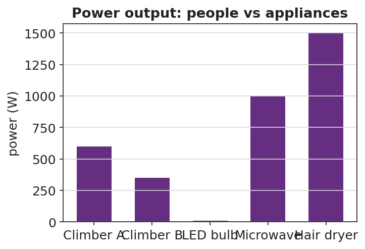
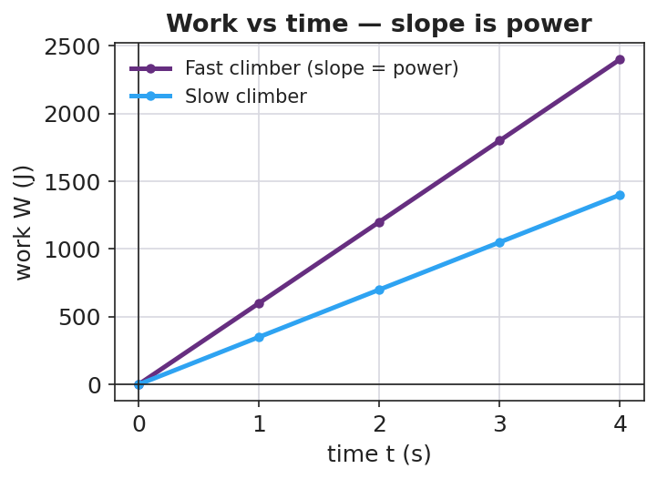

# Power — Student Worksheet

**Unit: Work, Energy & Power — Lesson 02**
Name: _______________________  Date: __________  Period: ____

---

## Phenomenon

Two students climb the same staircase. One climbs fast, one climbs slowly. Both reach the top, so both did about the same *work* against gravity — but everyone agrees something is different.

**Driving question:** If two people do the same work, what makes one of them "more powerful," and how do we measure it?

---

## Notice & Wonder

| I notice… | I wonder… |
|---|---|
|  |  |
|  |  |
|  |  |

**Turn & Talk #1:** If both climbers did the same work, what made the fast climber different? Use the word *time*.

> _______________________________________________

---

## Initial Model

Write, in words, a formula for "how fast work is done." What would you divide by what?

> How-fast-work-is-done = ____________ ÷ ____________

> My prediction — who has more of it, a heavier climber or a faster climber? Why? _______________________________________________

---

## Investigation — Stair-Climb Personal-Power Lab

Roles: climber, timer, recorder, calculator. **Walk, hold the rail, one at a time.** Record two trials for the same climber.

| Trial | Weight F (N) | Vertical height d (m) | Work W = F·d (J) | Time t (s) | Power P = W/t (W) |
|---|---|---|---|---|---|
| 1 (normal pace) |  |  |  |  |  |
| 2 (faster) |  |  |  |  |  |

**Key question:** Your two trials did the *same work*. Why was your power different? What changed?

> _______________________________________________

---

## Make It Make Sense

1. Two motors raise the same load the same height. Motor A takes 2.0 s; motor B takes 8.0 s. Which motor is more powerful, and by what factor? Explain.
2. A 60 W light bulb runs for 10 seconds. How much energy does it use? (Hint: rearrange P = W/t.)
3. Your friend says, "The faster climber did more work." Correct your friend using the words *work*, *time*, and *power*.

---

## Vocabulary in Action

Use each term in a sentence about today's phenomenon.

- **power:** _______________________________________________
- **watt:** _______________________________________________
- **energy:** _______________________________________________

---

## Revise Your Model

Plot work vs. time for a fast climber and a slow climber. What does the **slope** of each line represent? Rewrite your explanation of "more powerful" in one sentence using *power* and *time*.

> The slope of a work-vs-time graph represents ____________.
> The fast climber is more powerful because _______________________________________________

---

## Exit Ticket

An elevator does 48,000 J of work lifting a load.

(a) If it takes 8.0 s, what is its power output? Show P = W/t.

(b) A second elevator does the same 48,000 J in 16 s. How does its power compare to the first?

(c) A 700 N student runs up a 4.0 m staircase in 5.0 s. What is the student's power output?
