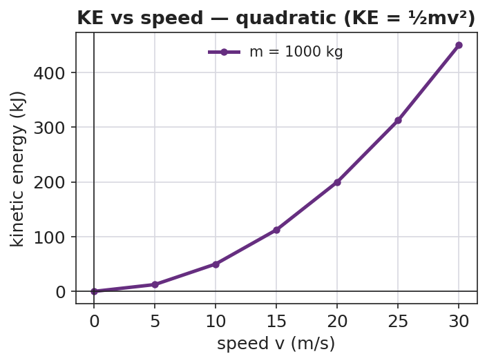
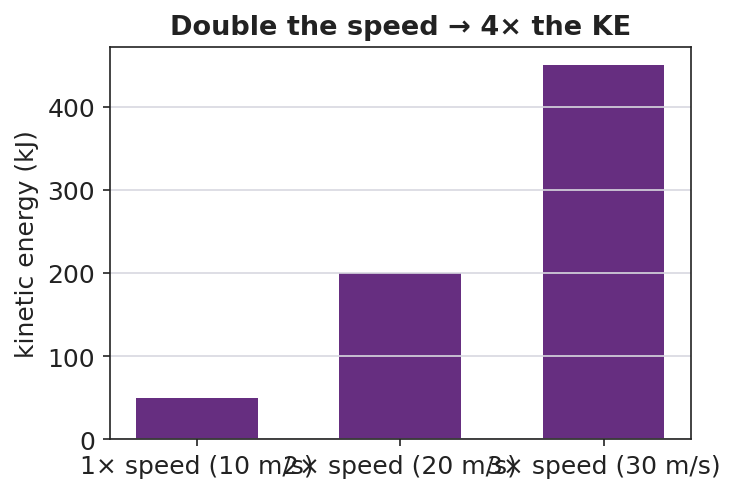

# Kinetic Energy — Teacher Guide

## Cover

**Unit: Work, Energy & Power — Lesson 03: Kinetic Energy**
East Meadow Schools × Valley Stream Central High School District
Strategy chips: BTC

---

## Curated Resources (from East Meadow Scope & Sequence)

### NYSSLS Standards

Kinetic energy names the energy of motion — the macroscopic "energy of motion of particles" half of **HS-PS3-2**: *"Develop and use models to illustrate that energy at the macroscopic scale can be accounted for as a combination of energy associated with the motions of particles (objects) and energy associated with the relative positions of particles (objects)."* (CCC: **Energy and Matter**.) It also supplies a quantity for **HS-PS3-1** energy models: the moving component's energy is ½mv².

### Phenomenon

- Car stopping distance vs. speed — doubling speed roughly *quadruples* the stopping distance. <https://www.youtube.com/watch?v=PIA1AfQfM4U> (Stopping distance and speed)
- The Physics Classroom — "Kinetic Energy": <https://www.physicsclassroom.com/class/energy/Lesson-1/Kinetic-Energy>

### Javalab / Labs

- Javalab energy index (kinetic/potential sims for VNPS support): <https://javalab.org/en/category/energy_en/>

### Assessments

- The Physics Classroom kinetic-energy problem set (link above). The Exit Ticket below is the formative check; the "Make It Make Sense" items map to HS-PS3-2.

---

## Lesson Overview

| | |
|---|---|
| **Duration** | 42 minutes (1 period) |
| **NYSSLS link** | HS-PS3-2 (energy of motion); supports HS-PS3-1 |
| **CCC focus** | Energy and Matter — kinetic energy is the energy a moving object carries because of its motion. |
| **Strategy chips** | BTC (random groups, vertical non-permanent surfaces, a thin-sliced KE = ½mv² task) |
| **Materials** | Vertical whiteboards / wall surfaces + markers; calculators; visibly random grouping cards; the stopping-distance video. |
| **Safety** | Standard classroom movement protocols for VNPS rotation. |
| **Prior knowledge** | Work (W = F·d), the joule; speed/velocity from Kinematics. |

**Lesson objectives — students can:**

- Define **kinetic energy** as the energy of motion and compute it with KE = ½mv².
- Explain why kinetic energy depends on the *square* of speed: doubling the speed multiplies KE by four.
- Use the v² relationship to reason about why fast cars need far more stopping distance.

---

## Phase 1 · Engage *(0 – 10 min)*

### 0–3 min · Opening Connection (SEL)

Pair-share, one sentence: *"Describe a time you (or a car) needed way more room to stop than you expected."* Surface a couple. Plant the puzzle that *speed* changes stopping distance more than people think.

### 3–7 min · Phenomenon hook — stopping distance vs. speed

**Teacher actions.** Play the stopping-distance clip (or show a stopping-distance table). At 20 mph vs. 40 mph, the stopping distance roughly *quadruples*, not doubles.

**Sample teacher language:**

> "Speed only doubled — 20 to 40. So why does it take *four times* the distance to stop? The energy of motion isn't growing the way you'd guess."

**Anticipated student responses:**

- "Double the speed, double the distance." — capture this prediction; the data will contradict it.
- "It's heavier when it's faster?" — no, mass is unchanged; the change is in speed.
- "Faster means way more energy somehow." — yes; we'll find the v² rule.

### 7–10 min · Notice & Wonder + Turn-and-Talk #1

Two columns. Then:

> "Turn to your partner: if speed only doubled, why might the energy grow by *more* than double? Make a guess about the math."

### Bridge to Phase 2

Each student leaves with an initial model: "When the car's speed doubles, its energy of motion ______ because ______."

---

## Phase 2 · Explore *(10 – 28 min)*

### 10–13 min · BTC setup — visibly random groups + VNPS

Form **visibly random groups of 3** with cards. Each group claims a **vertical non-permanent surface** (whiteboard/wall). No sitting; thinking happens standing at the board.

### 13–28 min · Thin-sliced task — building KE = ½mv²

Reveal the task one slice at a time; let early groups race ahead. Give m = 1000 kg throughout so the v² pattern is unmasked.

1. Compute KE at v = 10 m/s using KE = ½mv².
2. Now v = 20 m/s (double). Compare to slice 1 — by what factor did KE grow?
3. Now v = 30 m/s (triple). Factor?
4. Generalize: "If speed becomes n times bigger, KE becomes ____ times bigger. Why?"
5. Extension slice: two cars, same speed, one twice the mass — compare KE.

Project the building pattern when most groups reach slice 3:

**Teacher facilitation language (BTC — answer questions with questions):**

> "You doubled v and KE went up by four — where did the 4 come from in ½mv²?"
> "Will tripling the speed triple the energy? Test it on the board before you tell me."

**Anticipated student responses:**

- "Doubling v gave 4× because we square the velocity!" — the target insight.
- "Tripling gives 9× — it's n²." — generalization reached.

### Teacher facilitation during Explore

- **What to look for** — groups connecting the v² in the formula to the 4×, 9× growth.
- **What to resist** — don't confirm answers; bounce questions back; let groups check each other's boards.
- **What to redirect** — groups computing 2× growth → "show me 20² vs 10² — is that doubling?"

---

## Phase 3 · Explain *(28 – 35 min)*

### 28–31 min · Turn-and-Talk #2 + class consensus

> "Tour two other boards. What is the rule connecting speed to kinetic energy?"

Target consensus:

> "Kinetic energy is ½mv². Because the speed is *squared*, doubling the speed gives four times the KE, and tripling gives nine times. Mass matters too, but only to the first power."

### 31–35 min · Vocabulary introduction (≤ 3 terms)

From the reference table: **KE = ½mv²**, in joules. Name the terms.

**Sample teacher language:**

> "**Kinetic energy** is the energy of motion. It grows with **mass** to the first power, but with **speed** *squared* — that v² is why a small jump in speed is a big jump in energy, and a big jump in stopping distance."

### Discussion prompts to deploy here

- "A 2.0 kg ball moves at 3.0 m/s. What is its KE?"
  - *Sample response:* "KE = ½(2.0)(3.0²) = ½(2.0)(9.0) = 9.0 J."
- "Why is a highway speed limit so important for safety, in energy terms?"
  - *Sample response:* "A small speed increase squares into a large KE increase, so far more energy must be removed to stop — much longer stopping distance."

---

## Phase 4 · Elaborate *(35 – 40 min)*

### 35–38 min · Revise the model + the bar chart

> *"Return to your initial model. Using KE = ½mv², make a bar chart of KE at 1×, 2×, and 3× speed for the same car. Label each bar with the factor (1, 4, 9)."*

Project:

Target: *the bars are in the ratio 1 : 4 : 9, matching n².*

### 38–40 min · Return to the phenomenon

> "In one sentence, explain why a car at 40 mph needs about *four* times the stopping distance of a car at 20 mph. Use KE = ½mv²."

---

## Phase 5 · Evaluate *(40 – 42 min)*

### 40–42 min · Exit Ticket + Closing Reflection

> *"A 1500 kg car travels at 10 m/s.
> (a) Calculate its kinetic energy. Show KE = ½mv².
> (b) The car speeds up to 20 m/s. What is its new KE, and by what factor did it change?
> (c) In one sentence, explain why doubling speed makes the car so much harder to stop."*

Expected: (a) 75,000 J; (b) 300,000 J — 4×; (c) KE depends on v², so doubling v quadruples KE, requiring 4× the work/distance to stop. See `Answer_Key.docx`.

**Closing Reflection (SEL, 30 seconds):**

> "What is one idea your group cracked today that you couldn't alone — and who pushed the thinking forward?"

---

## Common Misconceptions

- **Misconception:** "Double the speed, double the kinetic energy." → **Correction:** KE depends on v², so doubling speed *quadruples* KE.
- **Misconception:** "Mass affects KE the same way speed does." → **Correction:** Mass is to the first power, speed is squared — speed has a far stronger effect.
- **Misconception:** "A stopped object has some kinetic energy." → **Correction:** If v = 0, KE = ½m(0)² = 0; kinetic energy requires motion.

---

## Access & Differentiation

- **ELL/ENL supports:** Sentence frame: *"When the speed becomes ___ times bigger, the kinetic energy becomes ___ times bigger because the speed is ___."* Word box: {kinetic energy, mass, speed, squared, four times}. Provide a labeled ½mv² formula card.
- **IEP/SPED supports:** Pre-fill the m and v values in a table so the cognitive load is on the squaring and the pattern, not setup. Allow calculator use for v². Provide the bar chart pre-drawn for labeling.
- **Extensions:** Derive KE = ½mv² from work: a net force does work W = F·d on a mass, and with kinematics this equals ½mv². Explore why kinetic energy is always positive.

---

## Strategy Spotlight

**BTC (Building Thinking Classrooms).** This lesson uses the three core BTC moves: **visibly random groups** (cards, no friend-clusters), **vertical non-permanent surfaces** (everyone standing and writing at boards), and a **thin-sliced task** (KE at 1×, 2×, 3× speed) that lets every group find an entry point and lets fast groups push to the n² generalization. Answer questions with questions; let groups verify against neighboring boards rather than against you. The v² pattern is *discovered*, not told.

---

## NYSSLS Observation Checklist Crosswalk

| # | Checklist item | Where it appears in this lesson |
|---|---|---|
| 1 | Local/relatable phenomenon | Phase 1 — car stopping distance vs. speed |
| 2 | Turn and Talk (2–3×) | Phase 1 (TT#1 — why energy grows more than double), Phase 3 (TT#2 — board tour consensus) |
| 3 | Students develop questions/models/procedures | Phase 1 (initial model), Phase 2 (VNPS thin-sliced task), Phase 4 (revise model) |
| 4 | CCC defined and used | Lesson Overview · *Energy and Matter*, applied in Phase 2 |
| 5 | ENL — ≤ 3 vocab, second half | Phase 3 — vocabulary at 31–35 min (kinetic energy / mass / speed) |
| 6 | Revisit phenomenon with evidence | Phase 4 — 1:4:9 bar chart; restate stopping distance |
| 7 | ENL/SPED supports | Access & Differentiation block |
| 8 | Assessment check | Phase 5 — Exit Ticket (1500 kg car) |

---

## Companion Materials

- `Student_Worksheet.docx` — the 5E student investigation + thin-sliced task (hand out at start of Phase 2)
- `Student_Notes.docx` — guided note-guide for vocabulary and the worked example
- `Answer_Key.docx` — answers to "Make It Make Sense" prompts and the Exit Ticket

---

## Key Vocabulary (max 3)

- **kinetic energy** — the energy an object has because of its motion; KE = ½mv², in joules
- **mass** — the amount of matter in an object (kg); kinetic energy is proportional to mass (first power)
- **speed** — how fast an object moves (m/s); kinetic energy is proportional to speed *squared* (v²)
