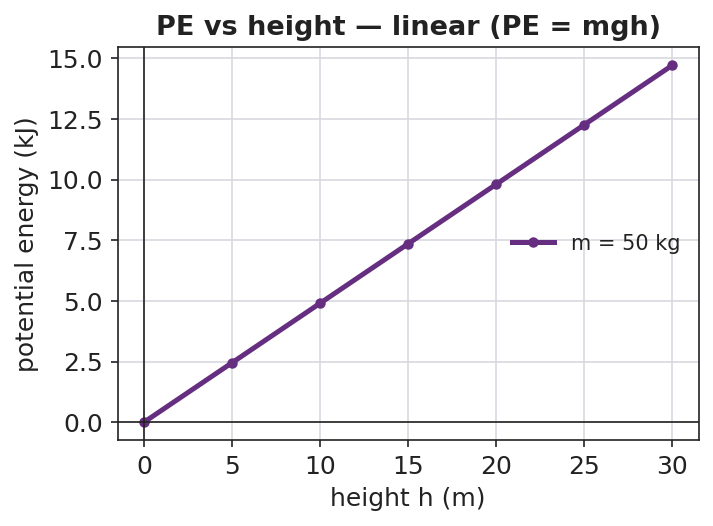

# Gravitational Potential Energy — Student Notes

**Unit: Work, Energy & Power — Lesson 04**
Name: _______________________  Date: __________  Period: ____

---

## Learning Targets

By the end of today's 42 minutes I can:

- Define **gravitational potential energy** and compute it with **PE = mgh**.
- Explain why PE is measured *relative to a reference height*.
- Predict how PE changes when height or mass changes.

---

## Key Vocabulary

- **potential energy** — _______________________________________________
- **height** — _______________________________________________
- **gravitational field** — _______________________________________________

---

## Guided Notes

**Big idea:** Gravitational potential energy is energy __________ because of an object's __________ above a reference point.

- Reference-table formula: **PE = mgh**, where m is __________ (kg), g ≈ __________ m/s², and h is __________ (m). Unit: __________ (J).
- PE grows in a __________ line with height: double the height → __________ the PE.
- PE also grows with __________: double the mass → __________ the PE.
- Height must be measured from a chosen __________. Change the reference → the PE value __________.
- g (the strength of the __________) is about 9.81 m/s² near Earth's surface.

**Pattern table (m = 50 kg, g ≈ 9.81):**

| Height | PE | 
|---|---|
| 10 m | ≈ __________ J |
| 20 m | ≈ __________ J |
| 30 m | ≈ __________ J |

---

## Worked Example

**Problem.** A 3.0 kg flowerpot sits on a balcony 5.0 m above the sidewalk. What is its gravitational PE relative to the sidewalk? (g ≈ 9.81 m/s²)

**Solution.**
1. List knowns: m = __________ kg, g ≈ __________ m/s², h = __________ m.
2. Formula: PE = mgh = __________ × __________ × __________.
3. Compute: PE ≈ __________ J.
4. The reference here is the __________; from the balcony floor the PE would be __________.

---

## Summary

Finish the sentence (Because / But / So):

> The tallest lift hill stores the most energy
> because __________________________________________,
> but __________________________________________,
> so __________________________________________.