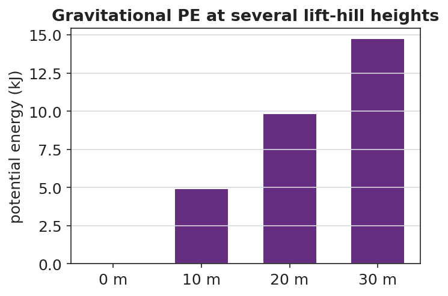

# Gravitational Potential Energy — Teacher Guide

## Cover

**Unit: Work, Energy & Power — Lesson 04: Gravitational Potential Energy**
East Meadow Schools × Valley Stream Central High School District
Strategy chips: HOCHMAN

---

## Curated Resources (from East Meadow Scope & Sequence)

### NYSSLS Standards

Gravitational potential energy names the "energy associated with relative position" half of **HS-PS3-2**: *"Develop and use models to illustrate that energy at the macroscopic scale can be accounted for as a combination of energy associated with the motions of particles (objects) and energy associated with the relative positions of particles (objects)."* (CCC: **Energy and Matter**.) Together with Lesson 03 (KE = motion), PE = mgh completes the two-component macroscopic energy account and feeds the HS-PS3-1 energy model.

### Phenomenon

- A roller-coaster lift hill / a water tower: stored energy that depends on height above the ground. <https://www.youtube.com/watch?v=Anv2Rr-A3MI> (Roller coaster energy)
- The Physics Classroom — "Potential Energy": <https://www.physicsclassroom.com/class/energy/Lesson-1/Potential-Energy>

### Javalab / Labs

- **Javalab — Potential energy due to gravity** (this lesson's interactive): <https://javalab.org/en/potential_energy_en/>

### Assessments

- The Physics Classroom potential-energy problem set (link above). The Exit Ticket below is the formative check; the "Make It Make Sense" items map to HS-PS3-2.

---

## Lesson Overview

| | |
|---|---|
| **Duration** | 42 minutes (1 period) |
| **NYSSLS link** | HS-PS3-2 (energy of relative position); supports HS-PS3-1 |
| **CCC focus** | Energy and Matter — stored energy depends on an object's position (height) relative to a reference. |
| **Strategy chips** | HOCHMAN (appositive + Because/But/So on PE = mgh and the reference height) |
| **Materials** | Computers/tablets for the Javalab sim; masses at different heights (book on desk vs. shelf); meter stick; whiteboards. |
| **Safety** | Keep raised masses secured; do not let objects fall on people or devices. |
| **Prior knowledge** | Work (W = F·d), the joule; weight = mass × g; g ≈ 9.81 m/s². |

**Lesson objectives — students can:**

- Define **gravitational potential energy** as stored energy that depends on height and compute it with PE = mgh.
- Explain why PE is measured *relative to a chosen reference height* (ground, floor, table).
- Predict how PE changes when height or mass changes, and connect lift-hill height to a coaster's stored energy.

---

## Phase 1 · Engage *(0 – 10 min)*

### 0–3 min · Opening Connection (SEL)

Pair-share, one sentence: *"Name the highest place you've ever climbed or stood — and how it felt to look down."* Surface a couple. Plant the intuition that *height* feels like stored "ready-to-fall" energy.

### 3–7 min · Phenomenon hook — the lift hill / water tower

**Teacher actions.** Show the slow climb up a roller-coaster lift hill (or a water tower). Pause at the top before the drop.

**Sample teacher language:**

> "Nothing exciting happens on the way up — the chain just hauls the car higher. But every meter of height is *storing* something the coaster will spend on the way down. What is being stored, and what does it depend on?"

**Anticipated student responses:**

- "It's storing speed for later." — close; it stores *energy* that will *become* speed.
- "The higher it goes, the bigger the drop." — capture height as the key variable.
- "A heavier car stores more." — yes; mass matters too.

### 7–10 min · Notice & Wonder + Turn-and-Talk #1

Two columns. Then:

> "Turn to your partner: what two things about the coaster car decide how much energy is stored at the top? Use the word *height*."

### Bridge to Phase 2

Each student leaves with an initial model: "Stored energy at the top depends on ______ because ______."

---

## Phase 2 · Explore *(10 – 28 min)*

### 10–14 min · Initial Model (silent / individual)

Prompt:

> *"Draw the coaster on the lift hill at three heights. Predict how the stored energy changes as the height doubles. Does it double? More? Less?"*

### 14–28 min · Investigation — Javalab "Potential energy due to gravity"

Students use the Javalab sim (<https://javalab.org/en/potential_energy_en/>) and a desk/shelf comparison.

1. Set a mass at height h; read/record PE. Double h; record again. What happened to PE?
2. Keep h fixed; double the mass. What happened to PE?
3. Move the reference line (floor → tabletop): does the *same* object now have a different PE? Why?
4. Tabulate PE vs. h for a fixed mass.

Project as data come in:

**Teacher facilitation language:**

> "You doubled the height — what did the stored energy do? Now predict tripling before you test."
> "When you moved the reference line, the object didn't move — so why did the PE number change?"

**Anticipated student responses:**

- "Doubling the height doubled the PE — it's a straight line." — yes; PE ∝ h.
- "PE changed when we moved the zero line — so 'height' is measured *from somewhere*." — land the reference-height idea.

### Teacher facilitation during Explore

- **What to look for** — students seeing PE ∝ h (linear) and recognizing that PE is relative to a chosen zero.
- **What to resist** — don't pre-state PE = mgh; let the sim build the proportionality.
- **What to redirect** — "PE is just height" → no, it's mass × g × height; height alone isn't energy.

---

## Phase 3 · Explain *(28 – 35 min)*

### 28–31 min · Turn-and-Talk #2 + class consensus

> "From the sim: what three things set the stored energy, and why does the *reference height* matter?"

Target consensus:

> "Gravitational potential energy is mass × g × height: PE = mgh. It grows in a straight line with height. The height must be measured from a chosen reference — change the reference and the number changes, because PE is about *relative* position."

### 31–35 min · Vocabulary introduction (≤ 3 terms) + HOCHMAN

From the reference table: **PE = mgh**, with g ≈ 9.81 m/s², in joules.

**Sample teacher language (Hochman appositive + Because/But/So):**

> "Appositive: *Gravitational potential energy, the energy stored because of an object's height above a reference point, equals mgh.*
> Because/But/So: *We can call the floor 'zero height' **because** PE is measured relative to a reference, **but** if we chose the tabletop as zero the same book would have less PE, **so** PE depends on the reference we pick.*"

### Discussion prompts to deploy here

- "A 2.0 kg book sits on a 1.0 m table. What is its PE relative to the floor? (g ≈ 9.81)"
  - *Sample response:* "PE = mgh = 2.0 × 9.81 × 1.0 ≈ 19.6 J."
- "Why does a water tower need to be tall?"
  - *Sample response:* "Height gives the water gravitational PE, which provides pressure to push water through the pipes."

---

## Phase 4 · Elaborate *(35 – 40 min)*

### 35–38 min · Revise the model + the bar chart

> *"Return to your three-height drawing. Using PE = mgh, make a bar chart of PE at several lift-hill heights for one car. What pattern do the bar heights follow?"*

Project:

Target: *bar heights are proportional to the lift-hill height — double the height, double the stored energy (a linear pattern).*

### 38–40 min · Return to the phenomenon

> "In one Because/But/So sentence, explain why the tallest lift hill stores the most energy — and why we always state PE relative to the ground."

---

## Phase 5 · Evaluate *(40 – 42 min)*

### 40–42 min · Exit Ticket + Closing Reflection

> *"A 500 kg roller-coaster car is hauled to the top of a 30 m lift hill. (Use g ≈ 9.81 m/s².)
> (a) Calculate its gravitational potential energy relative to the ground. Show PE = mgh.
> (b) If the lift hill were only 15 m, what would its PE be, and how does it compare?
> (c) Explain why your answer to (a) would change if we measured height from a platform halfway up instead of the ground."*

Expected: (a) ≈ 147,150 J; (b) ≈ 73,575 J — half; (c) PE depends on the reference height, so a higher zero gives a smaller h and thus a smaller PE. See `Answer_Key.docx`.

**Closing Reflection (SEL, 30 seconds):**

> "What is one idea about 'stored energy' you'll carry out of here — and who helped it click?"

---

## Common Misconceptions

- **Misconception:** "Potential energy is just an object's height." → **Correction:** PE = mgh — it depends on mass and g as well as height; height alone is not energy.
- **Misconception:** "An object has one true potential energy." → **Correction:** PE is measured *relative to a chosen reference*; change the reference and the PE value changes.
- **Misconception:** "Heavier objects always fall faster, so they store more PE per height." → **Correction:** PE scales with mass (mgh), but in free fall all masses accelerate at g; the two ideas are separate.

---

## Access & Differentiation

- **ELL/ENL supports:** Sentence frame: *"The object stores more potential energy when its ___ is greater, because PE = m·g·___."* Word box: {potential energy, height, gravitational field, reference, stored}. Pair "stored" with a "loading-up" gesture.
- **IEP/SPED supports:** Provide the PE = mgh formula card with g ≈ 9.81 already filled in. Pre-label the reference line on the diagram. Allow the Javalab sim as a hands-on alternative to symbolic work.
- **Extensions:** Combine with Lesson 03: predict the speed at the bottom of the hill by setting the PE lost equal to KE gained (preview of conservation, Lesson 05).

---

## Strategy Spotlight

**HOCHMAN (literacy).** The writing moves are the **appositive** (defining gravitational PE inside the sentence) and **Because/But/So** to capture the subtle reference-height idea — the place students most often lose precision. Model the appositive, then have students expand the kernel "PE is stored energy" into a full definition naming *height* and *reference*. The Because/But/So in Phase 4 forces them to articulate *why the reference matters* in one controlled sentence; collect and revise two or three as a class.

---

## NYSSLS Observation Checklist Crosswalk

| # | Checklist item | Where it appears in this lesson |
|---|---|---|
| 1 | Local/relatable phenomenon | Phase 1 — roller-coaster lift hill / water tower |
| 2 | Turn and Talk (2–3×) | Phase 1 (TT#1 — what sets stored energy), Phase 3 (TT#2 — PE = mgh + reference) |
| 3 | Students develop questions/models/procedures | Phase 1 (initial model), Phase 2 (Javalab sim investigation), Phase 4 (revise model) |
| 4 | CCC defined and used | Lesson Overview · *Energy and Matter*, applied in Phase 2 |
| 5 | ENL — ≤ 3 vocab, second half | Phase 3 — vocabulary at 31–35 min (potential energy / height / gravitational field) |
| 6 | Revisit phenomenon with evidence | Phase 4 — PE-at-heights bar chart; restate lift hill |
| 7 | ENL/SPED supports | Access & Differentiation block |
| 8 | Assessment check | Phase 5 — Exit Ticket (500 kg coaster car) |

---

## Companion Materials

- `Student_Worksheet.docx` — the 5E student investigation + Javalab sim guide (hand out at start of Phase 2)
- `Student_Notes.docx` — guided note-guide for vocabulary and the worked example
- `Answer_Key.docx` — answers to "Make It Make Sense" prompts and the Exit Ticket

---

## Key Vocabulary (max 3)

- **potential energy** — energy stored because of an object's position; gravitational PE = mgh, in joules
- **height** — the vertical distance above a chosen reference point; the h in PE = mgh
- **gravitational field** — the region where gravity acts; its strength g ≈ 9.81 m/s² near Earth's surface sets the g in PE = mgh
