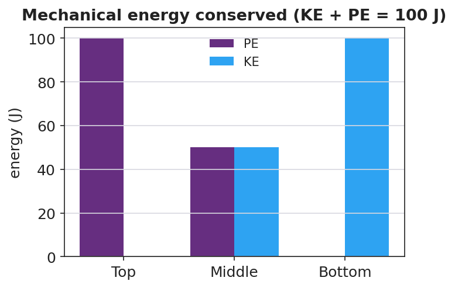

# Conservation of Energy — Student Notes

**Unit: Work, Energy & Power — Lesson 05**
Name: _______________________  Date: __________  Period: ____

---

## Learning Targets

By the end of today's 42 minutes I can:

- State **conservation of energy**: without friction, KE + PE stays constant.
- Describe the **energy transformation** PE ↔ KE as an object rises and falls.
- Use conservation to find a missing energy or speed (PE lost = KE gained).

---

## Key Vocabulary

- **mechanical energy** — _______________________________________________
- **conservation of energy** — _______________________________________________
- **energy transformation** — _______________________________________________

---

## Guided Notes

**Big idea:** **Mechanical energy** is the sum KE + PE. Without friction, this total stays __________.

- **Conservation of energy:** energy is never __________ or __________ — it only changes form.
- As an object moves **down**, __________ energy transforms into __________ energy.
- As an object moves **up**, __________ energy transforms into __________ energy.
- So: PE lost = __________ gained (no friction).
- With **friction**, some mechanical energy transforms into __________, so KE + PE __________ — but *total* energy is still conserved.

**At each point of a frictionless track (total = 100 J):**

| Point | PE | KE | Total |
|---|---|---|---|
| Top | 100 J | __________ | 100 J |
| Middle | 50 J | __________ | __________ |
| Bottom | __________ | 100 J | __________ |

---

## Worked Example

**Problem.** A 0.50 kg cart starts at rest at the top of a frictionless 2.0 m track. Find its KE and speed at the bottom. (g ≈ 9.81 m/s²)

**Solution.**
1. PE at top: PE = mgh = 0.50 × 9.81 × 2.0 = __________ J.
2. Conservation: PE lost = KE gained, so KE at bottom = __________ J.
3. Find speed from KE = ½mv²: __________ = ½ × 0.50 × v².
4. Solve: v² = __________ , so v = __________ m/s.

---

## Summary

Finish the sentence (Because / But / So):

> A frictionless pendulum returns to the same height every swing
> because __________________________________________,
> but __________________________________________,
> so __________________________________________.