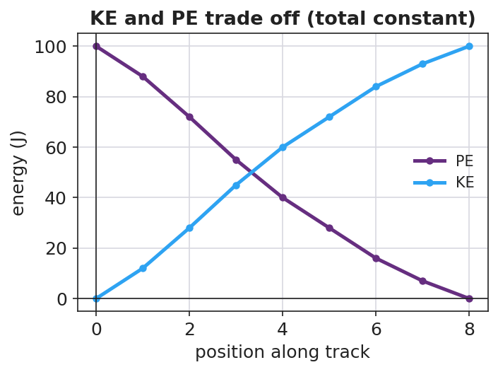

# Conservation of Energy — Student Worksheet

**Unit: Work, Energy & Power — Lesson 05**
Name: _______________________  Date: __________  Period: ____

---

## Phenomenon

A pendulum released from one side swings up to almost the same height on the other side — over and over. At the bottom it moves fast; at the top it stops. A skate-park half-pipe and a roller coaster do the same trade between height and speed.

**Driving question:** What is being traded as something rises and falls, and does the total amount of energy stay the same?

---

## Notice & Wonder

| I notice… | I wonder… |
|---|---|
|  |  |
|  |  |
|  |  |

**Turn & Talk #1:** Where is the pendulum fastest, where is it highest, and what does that tell you about where each kind of energy is biggest?

> _______________________________________________

---

## Initial Model

Sketch the half-pipe (or pendulum). Mark **TOP**, **MIDDLE**, **BOTTOM**. At each point, predict KE and PE as HIGH, MEDIUM, or ZERO.

| Point | KE (high/med/zero) | PE (high/med/zero) |
|---|---|---|
| TOP |  |  |
| MIDDLE |  |  |
| BOTTOM |  |  |

---

## Investigation — PhET Energy Skate Park (+ Javalab coaster)

Open <https://phet.colorado.edu/en/simulations/energy-skate-park-basics> and turn ON the energy **bar graph**. Start with friction **OFF**.

| Point | KE bar (J) | PE bar (J) | Total KE + PE (J) |
|---|---|---|---|
| Top |  |  |  |
| Middle |  |  |  |
| Bottom |  |  |  |

Now turn friction **ON** and watch over time.

**Key question:** With friction off, what is true about the total (KE + PE)? With friction on, the total shrinks — energy is never destroyed, so where did it go?

> _______________________________________________

---

## Make It Make Sense

1. A 2.0 kg ball is dropped from 5.0 m. Ignoring friction, what is its KE just before it lands? Use PE lost = KE gained, with g ≈ 9.81 m/s².
2. At the bottom of a frictionless hill, is the cart's PE maximum or minimum? Is its KE maximum or minimum? Explain.
3. Why does a real pendulum eventually stop, even though energy is conserved?

---

## Vocabulary in Action

Use each term in a sentence about today's phenomenon.

- **mechanical energy:** _______________________________________________
- **conservation of energy:** _______________________________________________
- **energy transformation:** _______________________________________________

---

## Revise Your Model

Plot KE and PE vs. position along the track. Where do the two curves cross, and what is true of their sum everywhere?

> The curves cross where ____________ . Their sum everywhere is ____________ . The pendulum returns to almost the same height because _______________________________________________

---

## Exit Ticket

A 0.50 kg cart starts at rest at the top of a **frictionless** track 2.0 m high. (Use g ≈ 9.81 m/s².)

(a) What is its PE at the top? Show PE = mgh.

(b) Using conservation of energy, what is its KE at the bottom? Explain.

(c) On a real track with friction, would the KE at the bottom be more, less, or equal? Where does the difference go?
