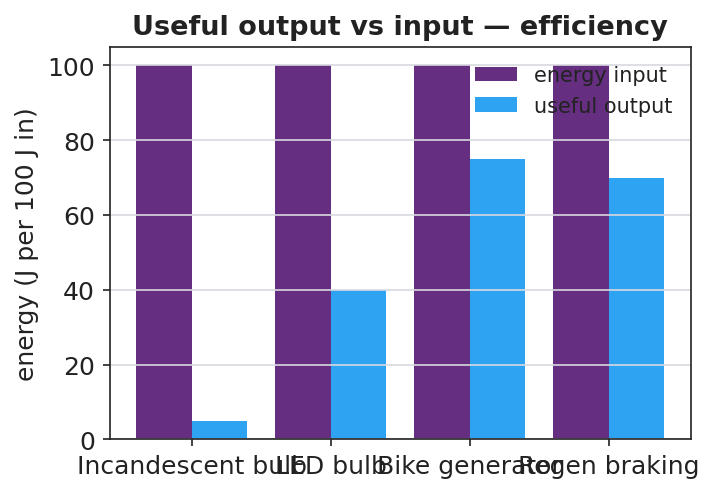
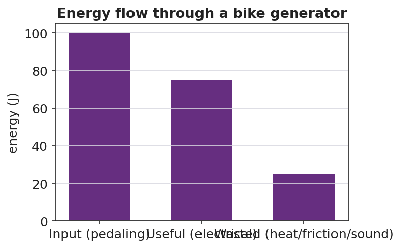

# Energy in Systems: Wheels to Watts — Teacher Guide

## Cover

**Unit: Work, Energy & Power — Lesson 06: Energy in Systems (Wheels to Watts)**
East Meadow Schools × Valley Stream Central High School District
Strategy chips: BTC

---

## Curated Resources (from East Meadow Scope & Sequence)

### NYSSLS Standards

This NYS Investigation lesson targets **HS-PS3-3**: *"Design, build, and refine a device that works within given constraints to convert one form of energy into another form of energy."* (CCC: **Energy and Matter**.) Students track energy flow through a real conversion device, separate useful from wasted energy, compute **efficiency**, and *refine* the design — the full engineering cycle. It rests on the conservation idea (Lesson 05): the "wasted" energy is not destroyed, only converted to heat.

### Phenomenon

- Regenerative braking / a bike generator powering a light — "Wheels to Watts": motion → electricity. <https://www.youtube.com/watch?v=q4_yTYHM8gc> (How regenerative braking works)
- The Physics Classroom — energy transformation & efficiency overview: <https://www.physicsclassroom.com/class/energy/Lesson-2/Mechanical-Energy>

### Javalab / Labs

- **Wheels-to-Watts build** (this lesson): a hand-crank or bike generator + small load (LED/buzzer). Javalab energy index for supporting sims: <https://javalab.org/en/category/energy_en/>

### Assessments

- The Wheels-to-Watts design rubric (useful output vs. input, with a refinement). The Exit Ticket below is the formative check; "Make It Make Sense" items map to HS-PS3-3.

---

## Lesson Overview

| | |
|---|---|
| **Duration** | 42 minutes (1 period; pairs well with a double period for the build/refine) |
| **NYSSLS link** | HS-PS3-3 (design, build, refine an energy-conversion device) |
| **CCC focus** | Energy and Matter — energy flows through a system, splitting into useful output and wasted (heat) energy. |
| **Strategy chips** | BTC (random groups, VNPS for the efficiency/refinement reasoning) |
| **Materials** | Hand-crank or bike generator; LED/buzzer/small motor; multimeter (optional); VNPS boards + markers; random grouping cards; the regenerative-braking clip. |
| **Safety** | Secure the generator; keep fingers clear of moving wheels/cranks; low-voltage loads only. |
| **Prior knowledge** | Work, power (Lesson 02), and conservation of energy (Lesson 05). |

**Lesson objectives — students can:**

- Trace **energy transfer** through a conversion device, separating useful output from wasted energy.
- Define and compute **efficiency** = useful output ÷ energy input (as a fraction or percent).
- Propose and justify a refinement that raises a device's efficiency (HS-PS3-3).

---

## Phase 1 · Engage *(0 – 10 min)*

### 0–3 min · Opening Connection (SEL)

Pair-share, one sentence: *"Name something you do that 'wastes' effort no matter how careful you are."* Surface a couple. Frame: *every machine wastes some energy too — the question is how much.*

### 3–7 min · Phenomenon hook — regenerative braking / bike generator

**Teacher actions.** Play the regenerative-braking clip, or hand-crank a generator to light an LED. Note how warm the generator gets.

**Sample teacher language:**

> "When this car brakes, instead of throwing away the motion as heat in the brake pads, it captures some of it as electricity. But not *all* of it — feel how warm this generator gets. Where does the rest of the energy go?"

**Anticipated student responses:**

- "It turns motion into electricity." — capture the transformation.
- "Some becomes heat — the generator is warm." — exactly the wasted-energy idea.
- "You can't get all of it back." — seeds efficiency < 100%.

### 7–10 min · Notice & Wonder + Turn-and-Talk #1

Two columns. Then:

> "Turn to your partner: of all the energy you put into the crank, how much do you think comes out as useful electricity — all of it? Where does the rest go?"

### Bridge to Phase 2

Each student leaves with an initial model: "Energy goes in as ______, comes out useful as ______, and is wasted as ______."

---

## Phase 2 · Explore *(10 – 28 min)*

### 10–13 min · BTC setup — random groups + VNPS

Form **visibly random groups of 3**. Claim a **vertical non-permanent surface**. Each group will track energy through the Wheels-to-Watts device and reason about efficiency at the board.

### 13–28 min · Investigation — Wheels to Watts (build → measure → refine)

Thin-sliced design task:

1. **Trace the flow.** For the bike/hand generator + LED, label the energy at each stage: input (your motion / chemical from food) → useful (electrical/light) → wasted (heat, friction, sound).
2. **Quantify.** Given an input of 100 J, decide where a realistic split goes (e.g., 75 J useful, 25 J wasted). Compute efficiency = useful ÷ input.
3. **Compare devices.** Rank an incandescent bulb (~5%), an LED (~40%+), the bike generator (~75%) by efficiency. Why so different?
4. **Refine (HS-PS3-3).** Propose ONE change to your device that would raise its efficiency (reduce friction, better gearing, less resistance). Predict the new efficiency and justify.

Project to anchor the input-vs-output idea:

**Teacher facilitation language (BTC — bounce questions back):**

> "If 100 J go in and 75 J come out useful, where are the other 25 J — are they destroyed?"
> "Your refinement claims higher efficiency — what term in 'useful ÷ input' did your change improve, and how do you know?"

**Anticipated student responses:**

- "Efficiency is useful over input — 75/100 = 75%." — target.
- "The wasted 25 J became heat; energy is conserved, it just isn't useful." — ties to Lesson 05.
- "Less friction → more useful output → higher efficiency." — valid refinement reasoning.

### Teacher facilitation during Explore

- **What to look for** — groups computing efficiency as a ratio and locating wasted energy as heat (not "lost").
- **What to resist** — don't grade refinements; ask groups to justify against another board.
- **What to redirect** — "energy is lost" → "conserved; it left the *useful* path as heat."

---

## Phase 3 · Explain *(28 – 35 min)*

### 28–31 min · Turn-and-Talk #2 + class consensus

> "Tour another board. How did they compute efficiency, and what happened to the energy that wasn't useful?"

Target consensus:

> "A device transfers energy from one form to another. Efficiency = useful output ÷ energy input. The rest isn't destroyed — it becomes heat (and a little sound/friction). No real device is 100% efficient."

### 31–35 min · Vocabulary introduction (≤ 3 terms)

Define from the flow charts.

**Sample teacher language:**

> "**Efficiency** is the fraction of input energy that comes out useful: useful ÷ input. **Energy transfer** is energy moving or changing form through the device. The whole crank-generator-LED setup is the **system** we're analyzing — and across the whole system, energy is conserved."

### Discussion prompts to deploy here

- "A motor uses 200 J and delivers 150 J of useful work. What is its efficiency?"
  - *Sample response:* "150 / 200 = 0.75 = 75%."
- "Why can no real device be 100% efficient?"
  - *Sample response:* "Friction and resistance always convert some energy to heat, so useful output is always less than input."

---

## Phase 4 · Elaborate *(35 – 40 min)*

### 35–38 min · Revise the model + the flow chart

> *"Return to your energy-flow sketch. Using a 100 J input, chart how much is useful vs. wasted for your refined device. Did your refinement raise the useful bar?"*

Project:

Target: *the input bar splits into a useful bar and a wasted (heat) bar; a good refinement shifts energy from the wasted bar to the useful bar, raising efficiency.*

### 38–40 min · Return to the phenomenon

> "In one sentence, explain why regenerative braking is better than normal braking in energy terms — and why it still can't recover 100% of the car's energy. Use *efficiency* and *energy transfer*."

---

## Phase 5 · Evaluate *(40 – 42 min)*

### 40–42 min · Exit Ticket + Closing Reflection

> *"A bike generator takes in 400 J of pedaling energy and delivers 300 J of useful electrical energy.
> (a) Calculate the efficiency. Show useful ÷ input.
> (b) Where did the other 100 J go? Did it disappear?
> (c) Propose ONE refinement that would raise the efficiency, and explain why it works."*

Expected: (a) 0.75 = 75%; (b) ~100 J became heat (friction in bearings/wires) and sound — conserved, not destroyed; (c) e.g., better bearings / less resistive wire → less heat → more useful output. See `Answer_Key.docx`.

**Closing Reflection (SEL, 30 seconds):**

> "What is one place in your life you now see 'wasted' energy you'd want to capture — and who sharpened that idea for you?"

---

## Common Misconceptions

- **Misconception:** "Wasted energy is destroyed." → **Correction:** Energy is conserved; "wasted" energy is converted to heat/sound that isn't useful — it still exists.
- **Misconception:** "A good machine can be 100% efficient." → **Correction:** Friction and resistance always divert some energy to heat, so real efficiency is always below 100%.
- **Misconception:** "Efficiency is the useful energy in joules." → **Correction:** Efficiency is a *ratio* (useful ÷ input), with no units; it's often written as a percent.

---

## Access & Differentiation

- **ELL/ENL supports:** Sentence frame: *"The device takes in ___ energy and gives out useful ___ energy; the rest becomes ___, so its efficiency is ___ ÷ ___."* Word box: {efficiency, energy transfer, system, useful, wasted, heat}. Use a "splitting" gesture for input → useful + wasted.
- **IEP/SPED supports:** Provide a pre-drawn energy-flow diagram with input/useful/wasted boxes to fill; provide the efficiency = useful ÷ input formula card and one worked percent. Offer a measuring/recording role on the build.
- **Extensions:** Build a multi-stage chain (generator → battery → motor) and compute the *overall* efficiency as the product of stage efficiencies; explain why long chains lose more.

---

## Strategy Spotlight

**BTC (Building Thinking Classrooms).** The design-and-refine task is delivered as thin slices at **vertical non-permanent surfaces** with **visibly random groups**: trace the flow, compute efficiency, compare devices, then propose a refinement. The refinement slice is the HS-PS3-3 core — groups must justify a design change against the efficiency ratio, defending it to a neighboring board rather than to the teacher. Answer questions with questions ("where did the 25 J go?") so the conservation-plus-efficiency reasoning is built by students.

---

## NYSSLS Observation Checklist Crosswalk

| # | Checklist item | Where it appears in this lesson |
|---|---|---|
| 1 | Local/relatable phenomenon | Phase 1 — regenerative braking / bike generator |
| 2 | Turn and Talk (2–3×) | Phase 1 (TT#1 — how much comes out useful), Phase 3 (TT#2 — board tour on efficiency) |
| 3 | Students develop questions/models/procedures | Phase 1 (initial model), Phase 2 (build + measure + refine), Phase 4 (revise model) |
| 4 | CCC defined and used | Lesson Overview · *Energy and Matter*, applied in Phase 2 |
| 5 | ENL — ≤ 3 vocab, second half | Phase 3 — vocabulary at 31–35 min (efficiency / energy transfer / system) |
| 6 | Revisit phenomenon with evidence | Phase 4 — energy-flow chart; restate regenerative braking |
| 7 | ENL/SPED supports | Access & Differentiation block |
| 8 | Assessment check | Phase 5 — Exit Ticket (bike generator efficiency + refinement) |

---

## Companion Materials

- `Student_Worksheet.docx` — the 5E student investigation + Wheels-to-Watts design log (hand out at start of Phase 2)
- `Student_Notes.docx` — guided note-guide for vocabulary and the worked example
- `Answer_Key.docx` — answers to "Make It Make Sense" prompts and the Exit Ticket

---

## Key Vocabulary (max 3)

- **efficiency** — the fraction of input energy that comes out as useful output; efficiency = useful ÷ input
- **energy transfer** — the movement or conversion of energy from one place or form to another
- **system** — the set of connected components being analyzed; energy is conserved across the whole system
