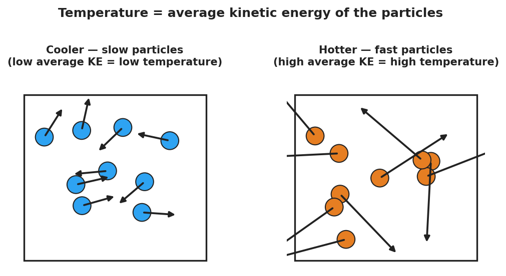
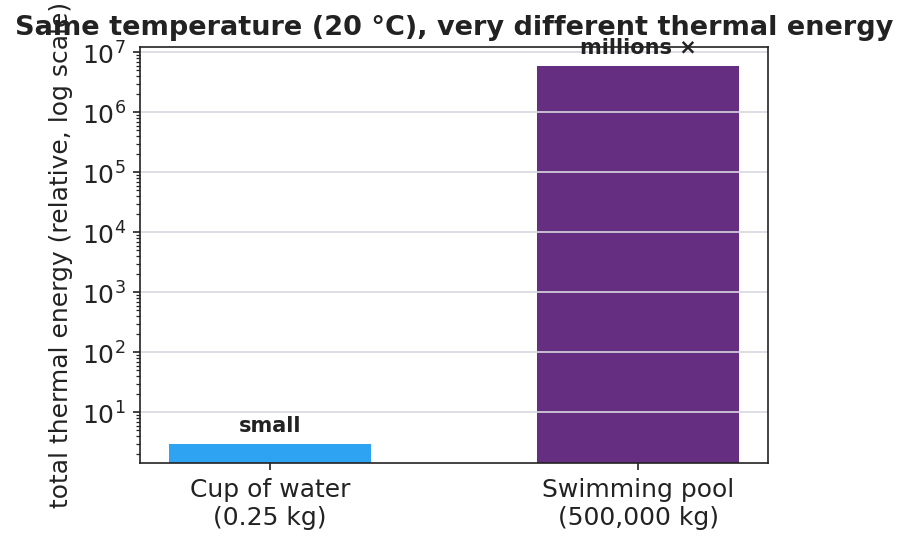

# Thermal Energy and Temperature — Teacher Guide

## Cover

**Unit: Thermal Energy & Conservation (Thermodynamics) — Lesson 01: Thermal Energy and Temperature**
East Meadow Schools × Valley Stream Central High School District
Strategy chips: RESTORATIVE CIRCLE

---

## Curated Resources (from East Meadow Scope & Sequence)

### NYSSLS Standards

This is the unit-opening lesson for **HS-PS3** (Energy). It builds the particle-level meaning of *temperature* and *thermal energy* that the whole unit rests on, threading directly toward **HS-PS3-4**: *"Plan and conduct an investigation to provide evidence that the transfer of thermal energy when two components of different temperature are combined within a closed system results in a more uniform energy distribution among the components (second law of thermodynamics). (Systems and System Models)."* Today students do not yet measure transfer — they first establish *what is being transferred* (energy carried by moving particles) and why temperature alone does not tell you how much. It also connects back to the Energy unit's **HS-PS3-2** (energy as the motion of particles and energy stored in fields).

### Phenomenon

- A sparkler glows at over 1,000 °C, yet you can hold it inches away unharmed; a warm bath at 40 °C would scald you if it were that hot. Which is "hotter," and which holds more thermal energy? <https://www.youtube.com/watch?v=A9eDRUd6lZk> (sparkler chemistry/temperature)
- Particle motion simulation (PhET *States of Matter*) — heat a sample and watch the particles speed up: <https://phet.colorado.edu/en/simulations/states-of-matter-basics>

### Javalab / Labs

- Javalab — *Brownian motion / molecular motion* (particles move faster as temperature rises): <https://javalab.org/en/brownian_motion_en/>
- Javalab — *Temperature and molecular motion*: <https://javalab.org/en/temperature_en/>

### Assessments

- Exit Ticket below (sparkler vs. bathtub ranking) is the formative check.
- PhET *States of Matter* has an embedded temperature/speed observation that can serve as a quick check-for-understanding.

---

## Lesson Overview

| | |
|---|---|
| **Duration** | 42 minutes (1 period) |
| **NYSSLS link** | HS-PS3-4 (unit anchor — foundation) · HS-PS3-2 (energy of particles) |
| **CCC focus** | Energy and Matter — energy is carried by the motion of particles; the *amount* of matter changes how much energy a sample holds. |
| **Strategy chips** | RESTORATIVE CIRCLE (unit opener) |
| **Materials** | Sparkler image/clip (no live flame indoors); two beakers of room-temperature water (a small cup and a large container) plus thermometers; whiteboards/markers; particle-diagram handout. |
| **Safety** | Do **not** light a sparkler indoors — use the clip/photo. Water beakers are room temperature only. |
| **Prior knowledge** | Energy unit — kinetic energy depends on mass and speed; energy is conserved and can transfer. |

**Lesson objectives — students can:**

- Define **temperature** as the *average* kinetic energy of the particles in a substance.
- Define **thermal energy** as the *total* kinetic energy of all the particles, which depends on temperature **and** the amount of substance.
- Explain how two objects can be at the same temperature yet hold very different amounts of thermal energy (a cup vs. a swimming pool).

---

## Phase 1 · Engage *(0 – 12 min)*

### 0–3 min · Opening Connection (SEL) — Restorative Circle (unit opener)

This launches the Thermodynamics unit, so open with a brief **restorative circle**. Pass a talking piece. Prompt: *"Tell us about a time you felt 'hot' or 'cold' in a way that surprised you — and one word for how it felt."* One sentence each, no cross-talk. This surfaces everyday sensory ideas about heat that we will sharpen into *temperature* and *thermal energy*.

### 3–8 min · Phenomenon hook — sparkler vs. bathtub

**Teacher actions.** Show the sparkler clip/photo (burning at ~1,000 °C) beside a photo of a warm bath (~40 °C). State the puzzle plainly.

**Sample teacher language:**

> "This sparkler is over a thousand degrees — far hotter than this bath. So why can a kid hold the sparkler an inch away and be fine, but that water at the same thousand degrees would be a disaster? Which one is 'hotter,' and which one carries more energy?"

**Anticipated student responses:**

- "The sparkler is hotter but tiny, so it can't hurt you much." — capture this; it is exactly the thermal-energy-vs-temperature distinction in plain words.
- "The water has more stuff in it." — name "amount of substance"; hold it for Phase 3.
- "Degrees just mean how hot something is." — note it; we will refine "degrees" into *average particle motion*.

### 8–12 min · Notice & Wonder + Turn-and-Talk #1

Capture two columns on the board. Then:

> "Turn to your partner: what is the difference between something being *hot* and something *having a lot of heat energy*? Use the word *particles* if you can."

Take 2–3 responses. Desirable seed: *the sparkler's bits move fast but there are very few of them; the bath has slower-moving water but enormous amounts of it.* Leave it open if no one lands it.

### Bridge to Phase 2

Every student leaves Phase 1 with a one-sentence **initial model**: "The sparkler is hotter but the bath has more energy because ______."

---

## Phase 2 · Explore *(12 – 32 min)*

### 12–17 min · Initial Model (silent / individual)

Prompt on the board:

> *"Draw the particles inside the sparkler tip and inside the bathtub. Use arrows to show how fast each particle is moving and dots to show how many there are. Then write one sentence: which has faster particles, and which has more total particle motion?"*

This surfaces intuitions about *speed* (temperature) vs. *count × speed* (thermal energy) before any vocabulary.

### 17–32 min · Investigation — particles, speed, and amount

Use the PhET *States of Matter* sim (projected or on devices) and the two beakers of room-temperature water.

1. **Speed = temperature.** In PhET, add heat and watch the particles. Record: what happens to particle *speed* as the thermometer climbs? What happens when you cool it?
2. **Same temperature, different amounts.** Measure the small cup and the large container of water — both read room temperature. Ask: if every particle in both is moving at the *same average speed*, which container has more total particle motion?
3. **Particle diagram.** Give students this diagram and have them annotate which side is hotter and why:

**Teacher facilitation language:**

> "Heating it up — are the particles getting bigger, or moving faster?"
> "Both beakers are the same temperature. Same *average* speed. So why would the big one take far more energy to boil away?"
> "If I doubled the amount of water but kept the temperature the same, did the average particle speed change? Did the *total* energy change?"

### Teacher facilitation during Explore

- **What to look for** — students separating *how fast* (per particle) from *how many* (total). That split is the whole lesson.
- **What to resist** — don't say "temperature is average KE" yet; let the sim and beakers establish "faster = hotter, more particles = more total energy" first.
- **What to redirect** — students who say "more water is hotter" should be asked: *"Both thermometers read the same. Is it hotter, or does it just hold more?"*

---

## Phase 3 · Explain *(32 – 37 min)*

### 32–35 min · Turn-and-Talk #2 + class consensus

> "Across the sim and the beakers, what did *temperature* actually measure — and what did *amount* change?"

Target consensus:

> "Temperature measures how fast the particles move *on average*. Thermal energy is the *total* motion of *all* the particles — so it depends on temperature **and** how much substance there is."

Reinforce with the comparison chart:

### 35–37 min · Vocabulary introduction (≤ 3 terms)

**Sample teacher language:**

> "The energy of motion is **kinetic energy**. **Temperature** is the *average* kinetic energy of the particles — how fast they move, on average. **Thermal energy** is the *total* kinetic energy of *all* the particles, so it grows with both temperature and the amount of substance. A cup and a pool can read the same temperature, but the pool has far more thermal energy."

### Discussion prompts to deploy here

- "A cup of tea and a backyard pool both read 30 °C. Which has more thermal energy, and why?"
  - *Sample student response:* "The pool — same average particle speed, but vastly more particles, so far more total kinetic energy."
- "Why is the sparkler safe to hold even though it is hotter than the bath?"
  - *Sample student response:* "Its particles move fast (high temperature), but there are very few of them, so the total thermal energy delivered to your skin is tiny."

---

## Phase 4 · Elaborate *(37 – 40 min)*

### 37–39 min · Revise the model

> *"Return to your particle drawing. Re-label one side 'high average KE = high temperature' and use dots to show total amount. Rewrite your one-sentence explanation using the words temperature and thermal energy."*

### 39–40 min · Return to the phenomenon

> "Why would a single drop of boiling water sting but not seriously burn, while a whole bathtub at the same 100 °C would be deadly? Answer in one sentence using temperature and thermal energy."

Target: "Both are at the same temperature (same average particle speed), but the bathtub holds enormously more thermal energy because it has so many more particles — so it can transfer far more energy to you."

---

## Phase 5 · Evaluate *(40 – 42 min)*

### 40–42 min · Exit Ticket + Closing Reflection

> *"A lit sparkler tip is about 1,000 °C. A warm bath is about 40 °C.
> (a) Which has the higher temperature, and what does temperature measure about the particles?
> (b) Which one could transfer more thermal energy to your body, and why?
> (c) Two buckets of water read exactly 25 °C, but one holds 1 L and the other holds 50 L. Which has more thermal energy? Explain."*

Expected: (a) the sparkler — temperature is the average kinetic energy (average speed) of the particles; (b) the bath — far more particles means far more total thermal energy to transfer; (c) the 50 L bucket — same average particle speed but 50× as many particles, so much more total kinetic energy. See `Answer_Key.docx`.

**Closing Reflection (SEL, 30 seconds):**

> "What is one idea today that changed how you think about 'hot'? Who helped you make sense of it?"

---

## Common Misconceptions

- **Misconception:** "Temperature and heat energy are the same thing." → **Correction:** Temperature is the *average* particle motion; thermal energy is the *total* — it also depends on how much substance there is.
- **Misconception:** "A bigger/hotter object always has more energy." → **Correction:** A tiny very-hot object (sparkler) can hold less thermal energy than a large cooler object (pool); amount of substance matters.
- **Misconception:** "Heating something makes its particles bigger." → **Correction:** Particles do not grow; they *move faster*. Higher temperature = faster average particle motion.

---

## Access & Differentiation

- **ELL/ENL supports:** Sentence frame: *"The ___ has a higher temperature because its particles move ___, but the ___ has more thermal energy because it has ___ particles."* Word-choice box: {faster, slower, more, fewer, average, total}. Pair *temperature* with a hand gesture (fingers wiggling fast vs. slow) and *thermal energy* with arms spread wide (lots of particles).
- **IEP/SPED supports:** Provide a pre-drawn two-box particle diagram; students add arrow *lengths* and dot *counts* rather than drawing from scratch. Offer the PhET slider as a hands-on alternative to writing.
- **Extensions:** Ask students to estimate, in words, how many times more thermal energy a 50 L pool of 25 °C water holds than a 1 L cup at the same temperature, and justify the ratio using "same average speed, 50× the particles."

---

## Strategy Spotlight

**RESTORATIVE CIRCLE (unit opener).** Today's opening uses a circle to launch the Thermodynamics unit. Use a talking piece, one-sentence responses, and equity of voice (everyone speaks or passes). The prompt — *a time you felt surprisingly hot or cold* — is chosen so you can call it back in Phase 3 ("that surprise — something small but intensely hot, or something mild but huge — is exactly temperature vs. thermal energy"). Keep the circle to ~2–3 minutes; the goal is community plus a shared anchor, not a long discussion.

---

## NYSSLS Observation Checklist Crosswalk

| # | Checklist item | Where it appears in this lesson |
|---|---|---|
| 1 | Local/relatable phenomenon | Phase 1 — sparkler vs. bathtub; boiling drop in Phase 4 |
| 2 | Turn and Talk (2–3×) | Phase 1 (TT#1 — hot vs. lots of energy), Phase 3 (TT#2 — temperature vs. amount) |
| 3 | Students develop questions/models/procedures | Phase 1 (initial model), Phase 2 (PhET + beaker investigation), Phase 4 (revise model) |
| 4 | CCC defined and used | Lesson Overview · *Energy and Matter*, restated in Phase 2 |
| 5 | ENL — ≤ 3 vocab, second half | Phase 3 — vocabulary at 35–37 min (temperature / thermal energy / kinetic energy) |
| 6 | Revisit phenomenon with evidence | Phase 4 — boiling drop vs. bathtub + particle-diagram re-labeling |
| 7 | ENL/SPED supports | Access & Differentiation block |
| 8 | Assessment check | Phase 5 — Exit Ticket (sparkler/bath + two buckets) |

---

## Companion Materials

- `Student_Worksheet.docx` — the 5E student investigation (hand out at start of Phase 2)
- `Student_Notes.docx` — guided note-guide for vocabulary and the worked example
- `Answer_Key.docx` — answers to "Make It Make Sense" prompts and the Exit Ticket
- `figures/particle_speed.png`, `figures/cup_vs_pool_energy.png` — projection visuals

---

## Key Vocabulary (max 3)

- **temperature** — a measure of the *average* kinetic energy of the particles in a substance (how fast they move, on average)
- **thermal energy** — the *total* kinetic energy of *all* the particles in a substance; depends on temperature **and** the amount of substance
- **kinetic energy** — the energy an object or particle has because of its motion
