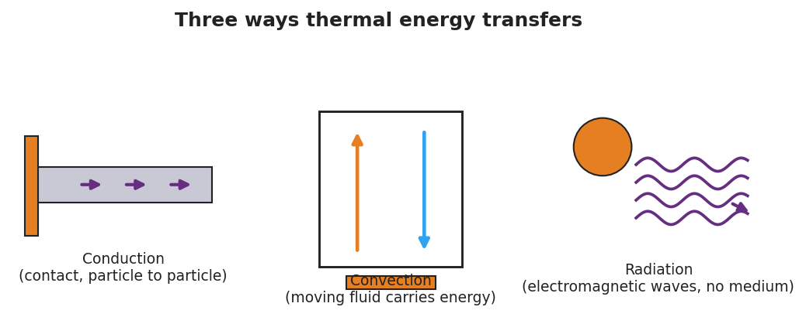
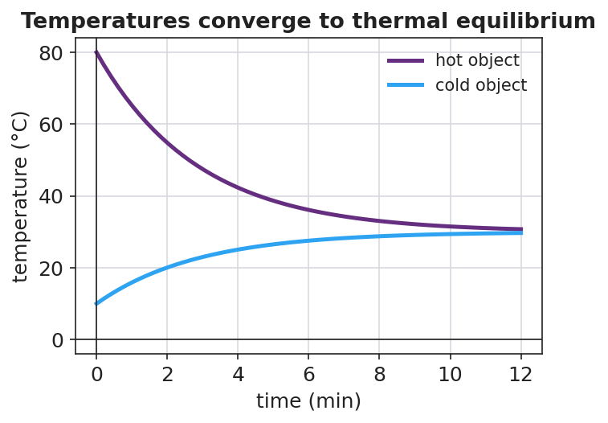

# Heat Transfer and the Second Law of Thermodynamics — Teacher Guide

## Cover

**Unit: Thermal Energy & Conservation (Thermodynamics) — Lesson 02: Heat Transfer and the Second Law of Thermodynamics**
East Meadow Schools × Valley Stream Central High School District
Strategy chips: HOCHMAN

---

## Curated Resources (from East Meadow Scope & Sequence)

### NYSSLS Standards

This lesson is the conceptual core of the unit's anchor standard, **HS-PS3-4**: *"Plan and conduct an investigation to provide evidence that the transfer of thermal energy when two components of different temperature are combined within a closed system results in a more uniform energy distribution among the components (second law of thermodynamics). (Systems and System Models)."* Students establish the *direction* of spontaneous heat flow (hot → cold), the idea of **thermal equilibrium**, and the **second law of thermodynamics** as the statement that energy spreads toward a more uniform distribution. Lesson 03 then measures the transfer quantitatively with Q = m·c·ΔT.

### Phenomenon

- **Penguin huddle** (BBC) — emperor penguins rotate through a tight huddle so warmth spreads and no one stays frozen on the outside: <https://www.youtube.com/watch?v=4Py9eXIO_z0>
- An **ice cube melting in a warm drink** — track the drink cooling and the ice warming until both reach one temperature.
- **Heat pipe / metal spoon in hot soup** — the handle warms even though only the bowl end touched the soup.

### Javalab / Labs

- Javalab — *Heat transfer / thermal equilibrium* (two bodies at different temperatures reach equilibrium): <https://javalab.org/en/heat_transfer_en/>
- Javalab — *Conduction, convection, radiation*: <https://javalab.org/en/heat_transfer_methods_en/>

### Assessments

- Exit Ticket below (spoon in soup + direction of heat flow) is the formative check.
- Javalab equilibrium sim has an observable "temperatures meet" endpoint usable as a quick check.

---

## Lesson Overview

| | |
|---|---|
| **Duration** | 42 minutes (1 period) |
| **NYSSLS link** | HS-PS3-4 (core — second law, uniform energy distribution) |
| **CCC focus** | Systems and System Models — within a closed system, energy redistributes from concentrated (hot) to spread-out (uniform). |
| **Strategy chips** | HOCHMAN (sentence-level literacy: Because/But/So) |
| **Materials** | Warm water + ice cubes + clear cups + thermometers (one set per group); metal spoon; penguin-huddle clip; heat-transfer-modes diagram; whiteboards. |
| **Safety** | Use warm (not scalding) tap water. Wipe spills to prevent slips. |
| **Prior knowledge** | Lesson 01 — temperature is average particle KE; thermal energy is total particle KE. |

**Lesson objectives — students can:**

- Describe how **heat** flows spontaneously from a hotter object to a cooler one until they reach **thermal equilibrium**.
- Identify conduction, convection, and radiation as the three ways thermal energy transfers.
- State the **second law of thermodynamics** in their own words: in a closed system, thermal energy spreads to a more uniform distribution.

---

## Phase 1 · Engage *(0 – 12 min)*

### 0–3 min · Opening Connection (SEL)

Quick whip-around (one sentence): *"Name one thing you do to warm up or cool down — and say whether you are adding or letting go of energy."* This primes the direction-of-flow idea.

### 3–8 min · Phenomenon hook — the penguin huddle / ice in a drink

**Teacher actions.** Play ~60 seconds of the penguin-huddle clip; the birds on the cold edge rotate inward and warmth spreads through the group. Then drop an ice cube into a cup of warm water at each table and start a stopwatch.

**Sample teacher language:**

> "Watch the penguins on the outside — they're freezing. Watch what the huddle does about it. Now, in your cup: the water is warm and the ice is cold. In two minutes, what will the thermometer say? Will the ice 'win,' will the water 'win,' or something else?"

**Anticipated student responses:**

- "The water warms the ice up until they're the same." — capture "the same"; that is thermal equilibrium.
- "Cold flows into the water." — gently flag: we will argue it is *energy* that flows (hot → cold), not "cold."
- "The penguins share heat so nobody freezes." — name it: energy spreads out to become more uniform.

### 8–12 min · Notice & Wonder + Turn-and-Talk #1

Two columns on the board. Then:

> "Turn to your partner: which way does the energy move — from the warm water to the ice, or from the ice to the water? How do you know?"

Target seed: *energy always moves from the hotter thing to the colder thing, never the other way on its own.* Leave open if unresolved.

### Bridge to Phase 2

Each student leaves with a one-sentence **initial model**: "The energy moves from ______ to ______ because ______."

---

## Phase 2 · Explore *(12 – 32 min)*

### 12–17 min · Initial Model (silent / individual)

Prompt on the board:

> *"Draw the warm water and the ice cube the instant they meet. Use arrows to show which way thermal energy flows. Predict the final temperature: closer to the ice, closer to the warm water, or in between?"*

### 17–32 min · Investigation — tracking two temperatures to equilibrium

Each group measures **two** temperatures over time: the warm water and a cold-water (or melting-ice) sample, recording every 30 seconds.

1. **Direction.** Which sample's temperature goes *down*? Which goes *up*?
2. **Equilibrium.** Do the two temperatures meet? What happens after they meet?
3. **Modes.** Touch the metal spoon left in hot water (conduction); watch warm water rise in the cup (convection); feel warmth from a lamp without touching it (radiation). Use the diagram:

Plot the class data as two converging curves:

**Teacher facilitation language:**

> "Tell me which thermometer is dropping and which is climbing. Now — do they ever cross, or do they meet and stop?"
> "Is 'cold' flowing into the water, or is energy flowing *out* of the water into the ice?"
> "Once they're equal, does energy keep moving back and forth, or has it spread out evenly?"

### Teacher facilitation during Explore

- **What to look for** — students noticing the two curves *converge* and then flatten at one shared temperature.
- **What to resist** — don't name the second law yet; let the converging curves do the arguing.
- **What to redirect** — "cold flows in" → ask *"What is actually moving — energy, or cold? Which direction?"* Steer to "energy flows hot → cold."

---

## Phase 3 · Explain *(32 – 37 min)*

### 32–35 min · Turn-and-Talk #2 + class consensus

> "Across every group, which way did the energy always flow, and where did the temperatures end up?"

Target consensus:

> "Thermal energy always flows on its own from the hotter object to the cooler one, until both reach the same temperature — thermal equilibrium. The energy spreads out to become more uniform."

### 35–37 min · Vocabulary introduction (≤ 3 terms)

**Sample teacher language:**

> "The thermal energy that moves because of a temperature difference is called **heat**. It always flows from hot to cold until the objects reach **thermal equilibrium** — the same temperature. The rule that energy spontaneously spreads to a more uniform distribution is the **second law of thermodynamics**."

### Discussion prompts to deploy here

- "Why does the metal spoon handle get warm even though only the bowl end is in the soup?"
  - *Sample student response:* "Conduction — fast-moving particles at the hot end bump the next particles, passing energy along until the handle warms toward equilibrium."
- "Why do the penguins rotate through the huddle?"
  - *Sample student response:* "So thermal energy spreads more uniformly through the group — no one stays at the cold edge; that's the second law working for them."

---

## Phase 4 · Elaborate *(37 – 40 min)*

### 37–39 min · Revise the model — Hochman Because/But/So

This is the **Hochman** strategy lesson. Have every student expand one kernel sentence using all three conjunctions:

> *"Complete: 'Thermal energy flows from the hot water into the ice **because** ____, **but** ____, **so** ____.'"*

Model one on the board first, e.g.: *"…because the hot water's particles have more energy, **but** the flow stops once both are the same temperature, **so** the system reaches thermal equilibrium with energy spread evenly."*

### 39–40 min · Return to the phenomenon

> "Use the second law to explain in one sentence why the penguin huddle keeps the whole group alive."

Target: "Energy spreads from the warm inner birds outward to a more uniform distribution as they rotate, so no penguin stays cold enough to die — the second law made even."

---

## Phase 5 · Evaluate *(40 – 42 min)*

### 40–42 min · Exit Ticket + Closing Reflection

> *"You drop a warm metal spoon into a cup of cold water in an insulated (closed) container.
> (a) Which way does thermal energy flow, and why?
> (b) What is the final situation called, and how do the two temperatures compare then?
> (c) Name the heat-transfer mode that warms the spoon's handle, and state the second law of thermodynamics in your own words."*

Expected: (a) from the warmer spoon to the cooler water — heat flows hot → cold; (b) thermal equilibrium — the spoon and water reach the *same* temperature; (c) conduction; second law: in a closed system energy spontaneously spreads to a more uniform distribution. See `Answer_Key.docx`.

**Closing Reflection (SEL, 30 seconds):**

> "What is one thing today that changed how you think? Who helped you make sense of it?"

---

## Common Misconceptions

- **Misconception:** "Cold flows into warm objects." → **Correction:** Cold is not a substance. *Thermal energy* flows from hot to cold; "getting colder" means losing energy.
- **Misconception:** "Heat and temperature are the same." → **Correction:** Heat is energy *in transit* due to a temperature difference; temperature is the average particle KE of one object.
- **Misconception:** "At equilibrium, energy stops moving entirely." → **Correction:** Particles still move and exchange energy, but there is no *net* flow — the distribution is uniform.

---

## Access & Differentiation

- **ELL/ENL supports:** Sentence frame: *"Thermal energy flows from the ___ object to the ___ object until they reach ___."* Word-choice box: {hotter, cooler, thermal equilibrium, heat, uniform}. Pair *equilibrium* with two hands meeting at the same height.
- **IEP/SPED supports:** Provide a pre-labeled two-line graph axis; students draw the two converging curves rather than building the table from scratch. Offer the spoon-in-water station as a hands-on alternative to writing.
- **Extensions:** Ask students to explain why a closed thermos slows — but cannot stop — the approach to equilibrium, and which transfer modes a thermos is designed to block.

---

## Strategy Spotlight

**HOCHMAN (sentence-level literacy).** Phase 4 uses the Hochman *Because / But / So* expansion on a single kernel sentence about heat flow. Model one complete expansion first, then require each student to produce one that is physics-correct (energy flows hot → cold; flow stops at equilibrium). The three conjunctions force cause (because), limitation (but), and consequence (so) — exactly the reasoning the second law demands. Keep it to one sentence; quality over quantity.

---

## NYSSLS Observation Checklist Crosswalk

| # | Checklist item | Where it appears in this lesson |
|---|---|---|
| 1 | Local/relatable phenomenon | Phase 1 — penguin huddle / ice in a warm drink; spoon in soup in Phase 3 |
| 2 | Turn and Talk (2–3×) | Phase 1 (TT#1 — which way energy moves), Phase 3 (TT#2 — direction + endpoint) |
| 3 | Students develop questions/models/procedures | Phase 1 (initial model), Phase 2 (two-temperature investigation), Phase 4 (revise model) |
| 4 | CCC defined and used | Lesson Overview · *Systems and System Models*, restated in Phase 2 |
| 5 | ENL — ≤ 3 vocab, second half | Phase 3 — vocabulary at 35–37 min (heat / thermal equilibrium / second law) |
| 6 | Revisit phenomenon with evidence | Phase 4 — penguin huddle re-explained + Because/But/So |
| 7 | ENL/SPED supports | Access & Differentiation block |
| 8 | Assessment check | Phase 5 — Exit Ticket (spoon in cold water) |

---

## Companion Materials

- `Student_Worksheet.docx` — the 5E student investigation (hand out at start of Phase 2)
- `Student_Notes.docx` — guided note-guide for vocabulary and the worked example
- `Answer_Key.docx` — answers to "Make It Make Sense" prompts and the Exit Ticket
- `figures/approach_equilibrium.png`, `figures/heat_transfer_modes.png` — projection visuals

---

## Key Vocabulary (max 3)

- **heat** — thermal energy that flows from a hotter object to a cooler one because of a temperature difference
- **thermal equilibrium** — the state in which two objects in contact reach the same temperature and there is no net flow of thermal energy between them
- **second law of thermodynamics** — in a closed system, thermal energy spontaneously spreads to a more uniform (less concentrated) distribution
