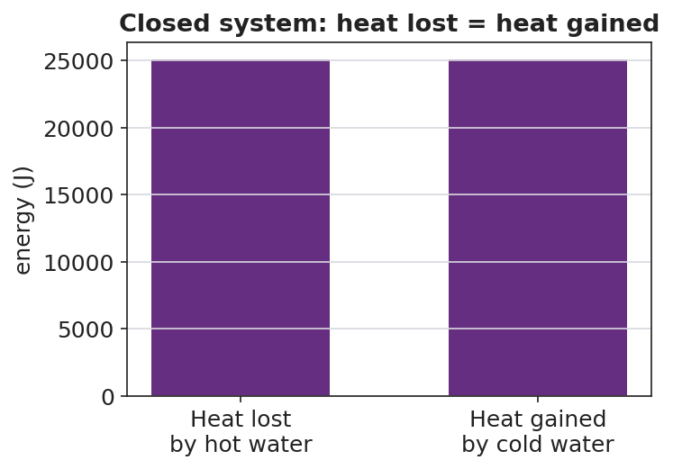
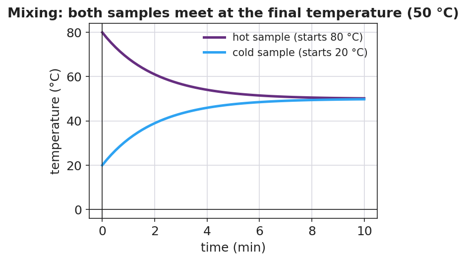

# Calorimetry — Thermal Tales — Student Notes

**Unit: Thermal Energy & Conservation — Lesson 03**
Name: _______________________  Date: __________  Period: ____

---

## Learning Targets

By the end of today's 42 minutes I can:

- Use **Q = m·c·ΔT** to calculate the heat gained or lost by a sample.
- Show that, in a closed system, heat **lost** = heat **gained**.
- Plan and conduct a **calorimetry** investigation and predict the final temperature.

---

## Key Vocabulary

- **calorimetry** — _______________________________________________
- **specific heat** — _______________________________________________
- **heat** — _______________________________________________

---

## Guided Notes

**The formula (Reference Table):** Q = m · c · ΔT

- **Q** = __________ transferred, in joules (J)
- **m** = __________ of the substance, in kilograms (kg)
- **c** = __________ heat (for water, c = __________ J/kg·°C)
- **ΔT** = change in __________ = T_final − T_start (°C)

**Closed-system rule:** When a hot object and a cold object mix in an insulated container, no energy escapes, so:

> heat __________ by the hot object = heat __________ by the cold object

- For **equal masses** of the same substance, the final temperature is the __________ of the two starting temperatures.
- For **unequal masses**, the final temperature lands closer to the __________ (larger-mass) sample.

---

## Worked Example

**Problem.** Mix 0.20 kg of water at 80 °C with 0.20 kg of water at 20 °C in an insulated cup. Find the final temperature and the heat transferred. (c = 4,186 J/kg·°C.)

**Solution.**
1. Equal masses of the same substance → final temperature is the __________ → T_f = __________ °C.
2. Heat gained by the cold water: Q = m·c·ΔT = (0.20)(4,186)(50 − 20) = __________ J.
3. Heat lost by the hot water: Q = (0.20)(4,186)(80 − 50) = __________ J.
4. The two Q's are __________ in size → energy is **conserved** (heat lost = heat gained).

---

## Summary

Finish the sentence (Because / But / So):

> When hot water and cold water mix in a closed cup, the final temperature settles in between
> because __________________________________________,
> but __________________________________________,
> so __________________________________________.
