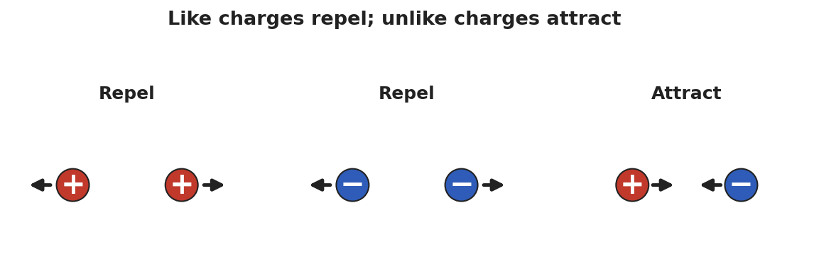

# Electric Charge — Student Worksheet

**Unit: Electrostatics — Lesson 01**
Name: _______________________  Date: __________  Period: ____

---

## Phenomenon

Your teacher rubs a balloon on their hair and it sticks to the wall — no glue. Held near your head, the balloon makes your hair rise toward it. Small bits of paper jump up to meet it.

**Driving question:** What invisible change does rubbing make, and why does it cause objects to pull or push on each other?

---

## Notice & Wonder

| I notice… | I wonder… |
|---|---|
|  |  |
|  |  |
|  |  |

**Turn & Talk #1:** The balloon and the wall were both ordinary before. What changed, and why would they now pull on each other?

> _______________________________________________

---

## Initial Model

Draw the rubbed balloon next to the wall. Show what you think **moved** (and which direction) when the balloon was rubbed. Then predict: will the balloon stick to a *second* rubbed balloon, or push it away?

> _______________________________________________
> _______________________________________________
> My prediction: _______________________________

---

## Investigation

The diagram shows the rule you are testing: same kinds of charge **repel**; opposite kinds **attract**.

Complete each station. Record what you observe and what it tells you.

| Station | What I did | What happened | What it tells me |
|---|---|---|---|
| 1. Two rubbed balloons on strings |  |  |  |
| 2. Charged balloon + paper bits |  |  |  |
| 3. Javalab electroscope |  |  |  |

**Key question:** When did the two objects pull *together*, and when did they push *apart*? What was different about those cases?

> _______________________________________________

---

## Make It Make Sense

1. Two balloons are each rubbed on the same wool sweater, then brought close. Do they attract or repel? How do you know?
2. A balloon is rubbed and gains a negative charge. Where did that charge come from, and what sign is the object it was rubbed on?
3. A neutral scrap of paper is pulled toward a charged balloon. Was the paper given a charge, or is something else going on?

---

## Vocabulary in Action

Use each term in a sentence about today's phenomenon.

- **electric charge:** _______________________________________________
- **positive charge:** _______________________________________________
- **negative charge:** _______________________________________________

---

## Revise Your Model

Return to your Initial Model. Re-label what moved using *electric charge* and *positive/negative*. Rewrite your explanation of why the balloon sticks, using the idea that **charge is conserved** (only moved, never made).

> _______________________________________________
> _______________________________________________

---

## Exit Ticket

Two small spheres hang side by side.

(a) When both are rubbed with the same cloth, they swing apart. What does that tell you about their charges?

(b) A third sphere is brought near, and the first sphere swings toward it. What sign is the third sphere?

(c) A balloon gains a charge of −8 units after being rubbed on a wool sock. What is the charge on the sock, and why?
