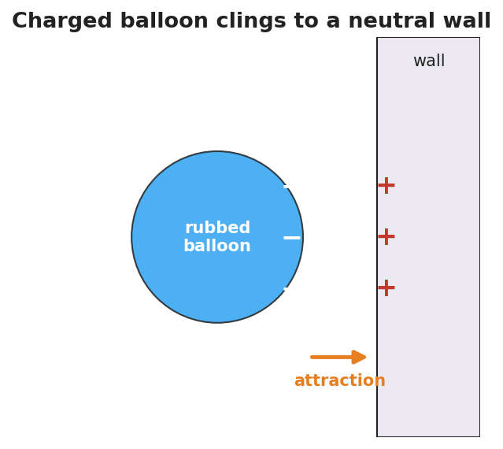

# Electric Charge — Teacher Guide

## Cover

**Unit: Electrostatics — Lesson 01: Electric Charge**
East Meadow Schools × Valley Stream Central High School District
Strategy chips: RESTORATIVE CIRCLE

---

## Curated Resources (from East Meadow Scope & Sequence)

### NYSSLS Standards

This unit opens the study of **HS-PS2** and **HS-PS3** as they apply to electricity. The Electric Charge row establishes the *cause* behind every later lesson — that matter carries two kinds of charge — so it threads toward **HS-PS3-5**: "Develop and use a model of two objects interacting through electric or magnetic fields to illustrate the forces between objects and the changes in energy of the objects due to the interaction. (Cause and Effect)." The quantitative force these charges exert (Coulomb's law, **HS-PS2-4**) is developed in Lesson 04.

### Phenomenon

- Balloon rubbed on hair sticks to a wall; hair stands up: <https://www.youtube.com/watch?v=VFbyDCG_QoM>
- Static shock from a doorknob after walking on carpet (Khan Academy, "Charge and electric force"): <https://www.khanacademy.org/science/physics/electric-charge-electric-force-and-voltage>

### Javalab / Labs

- Electroscope (charge detector): <https://javalab.org/en/electroscope_en/>
- Charging by friction (rub two materials, watch charge transfer): <https://javalab.org/en/charging_by_friction_en/>

### Assessments

- Khan Academy "Charge and electric force" check-for-understanding set (link above). The Exit Ticket below is the formative check for this lesson.

---

## Lesson Overview

| | |
|---|---|
| **Duration** | 42 minutes (1 period) |
| **NYSSLS link** | HS-PS3-5 (foundation — what charges are, before modeling their interaction) |
| **CCC focus** | Cause and Effect — the attraction or repulsion you *see* is caused by an invisible property, charge. |
| **Strategy chips** | RESTORATIVE CIRCLE (unit opener) |
| **Materials** | Balloons (one per pair); wool/hair; small paper bits; two inflated balloons on strings; an acetate/glass rod and silk if available; whiteboards/markers. |
| **Safety** | Standard classroom safety; keep balloons away from open flame. No high-voltage sources today. |
| **Prior knowledge** | Atoms contain protons (+) and electrons (−); the idea of a force as a push or pull (from the Forces unit). |

**Lesson objectives — students can:**

- State that there are exactly **two kinds of charge** (positive and negative), and that like charges repel while unlike charges attract.
- Explain a static-electricity phenomenon in terms of electrons transferring from one object to another (charge is **conserved** — never created or destroyed, only moved).
- Predict whether two charged objects will attract or repel given their signs.

---

## Phase 1 · Engage *(0 – 12 min)*

### 0–3 min · Opening Connection (SEL) — Restorative Circle (unit opener)

This is the first lesson of a new unit, so open with a brief **restorative circle**. Pass a talking piece. Prompt: *"Tell us about a time something surprised you with a shock, a spark, or a 'cling' — a sweater, a doorknob, a blanket fresh from the dryer."* One sentence each; no cross-talk. This builds community and surfaces the everyday static experiences you will explain today.

### 3–8 min · Phenomenon hook — the clinging balloon

**Teacher actions.** Rub a balloon on your hair (or wool) and hold it to the wall — it sticks. Bring it near a student's hair — strands rise toward it. Sprinkle small paper bits and lower the balloon; the bits leap up.

**Sample teacher language:**

> "I didn't put glue on this balloon. So what did rubbing it on my hair *do* to it that makes the wall hold onto it?"

**Anticipated student responses:**

- "It got staticky." — capture the word; "static" is exactly the everyday name for what we'll call charge.
- "The rubbing made heat / made it sticky." — reframe: rubbing moved something, not melted it.
- "It picked up electrons from your hair." — excellent; hold it for Phase 3, don't confirm yet.

### 8–12 min · Notice & Wonder + Turn-and-Talk #1

Capture two columns on the board. Then:

> "Turn to your partner: the balloon and the wall were both ordinary before. What changed, and why would they now pull on each other?"

Take 2–3 responses. Desirable insight: *something invisible moved onto the balloon when it was rubbed.* Leave it open if no one lands it.

### Bridge to Phase 2

Every student should leave Phase 1 with a one-sentence **initial model**: "The balloon sticks because ______."

---

## Phase 2 · Explore *(12 – 32 min)*

### 12–17 min · Initial Model (silent / individual)

Prompt on the board:

> *"Draw the rubbed balloon next to the wall. Show what you think moved (and which way) when it was rubbed. Then predict: will the balloon also stick to a second rubbed balloon, or push it away?"*

This surfaces students' intuitions about charge transfer before any vocabulary.

### 17–32 min · Investigation — two balloons and the electroscope

Stations (or whole-class):

1. **Two like-charged balloons** — rub both on hair, hang on strings; bring them close. They swing *apart*.
2. **Charged balloon + neutral paper bits** — the bits jump *toward* the balloon.
3. **Javalab electroscope** — touch a rubbed rod near the electroscope; the leaves spread. Repeat with the other material.

Use the attract/repel diagram below to make the rule visible while students test the balloons.

**Teacher facilitation language:**

> "When did the two objects pull together, and when did they push apart? What's different about those two cases?"
> "If both balloons were rubbed the same way, do they carry the same kind of charge or opposite kinds?"

### Teacher facilitation during Explore

- **What to look for** — students noticing that *two of the same* (two rubbed balloons) repel, while *charged + neutral* attracts.
- **What to resist** — don't supply "positive/negative" yet; let "same pushes, different pulls" emerge from the balloons.
- **What to redirect** — students who say "the balloon makes its own charge" should be asked where it could come from (the hair lost what the balloon gained).

---

## Phase 3 · Explain *(32 – 37 min)*

### 32–35 min · Turn-and-Talk #2 + class consensus

> "Across the stations, what was always true about objects that *pushed apart* versus objects that *pulled together*?"

Target consensus:

> "Matter carries one of two kinds of charge. The same kind repels; opposite kinds attract. Rubbing moves tiny charged particles (electrons) from one object to the other — it doesn't create them. Whatever one object loses, the other gains."

### 35–37 min · Vocabulary introduction (≤ 3 terms)

**Sample teacher language:**

> "We call the two kinds **positive charge** and **negative charge**. The thing being moved is **electric charge** itself — it comes in whole packages (multiples of the elementary charge *e* = 1.6 × 10⁻¹⁹ C), and it is **conserved**: never made or destroyed, only transferred. A neutral object simply has equal positive and negative charge."

The clinging balloon below is the model students return to in Phase 4.

### Discussion prompts to deploy here

- "Your hair stands up toward the balloon you just used on it. What sign is your hair now, and why?"
  - *Sample student response:* "The balloon took electrons, so my hair lost negatives and is positive — opposite to the balloon, so it's attracted."
- "If you charge a balloon −5 units, what happened to the hair?"
  - *Sample student response:* "The hair became +5 units; the total charge didn't change."

---

## Phase 4 · Elaborate *(37 – 40 min)*

### 37–39 min · Revise the model

> *"Return to your balloon drawing. Re-label what moved using the words electric charge and negative/positive. Write one sentence explaining the stick using conservation of charge."*

### 39–40 min · Return to the phenomenon

> "Why do you get a shock at a metal doorknob after walking across carpet? Answer in one sentence using charge."

Target: "Walking rubbed extra electrons onto me; touching the metal lets that built-up charge jump across as a spark, returning me to neutral."

---

## Phase 5 · Evaluate *(40 – 42 min)*

### 40–42 min · Exit Ticket + Closing Reflection

> *"Two small spheres hang side by side.
> (a) When both are rubbed with the same cloth, they swing apart. What does that tell you about their charges?
> (b) A third sphere is brought near and the first sphere swings toward it. What sign is the third sphere?
> (c) A balloon gains a charge of −8 units after being rubbed on a wool sock. What is the charge on the sock, and why?"*

Expected: (a) they carry the same sign (like charges repel); (b) opposite to the first — attraction means unlike charges; (c) +8 units, because charge is conserved (the electrons the balloon gained came from the sock). See `Answer_Key.docx`.

**Closing Reflection (SEL, 30 seconds):**

> "What is one everyday 'shock or cling' moment you now understand differently? Who helped you make sense of it?"

---

## Common Misconceptions

- **Misconception:** "Rubbing creates charge out of nothing." → **Correction:** Rubbing *transfers* charge; electrons move from one object to the other. Charge is conserved.
- **Misconception:** "There is only one kind of electricity that things have more or less of." → **Correction:** There are two distinct kinds, positive and negative; neutral means equal amounts of each.
- **Misconception:** "A charged object and a neutral object can't interact." → **Correction:** A charged object attracts a neutral one (it polarizes it) — developed fully in Lesson 03.

---

## Access & Differentiation

- **ELL/ENL supports:** Sentence frame: *"The two objects ___ (attracted/repelled) because they have ___ (the same / opposite) charge."* Word-choice box: {positive, negative, charge, attract, repel, conserved, neutral}. Pair *repel* with hands pushing apart and *attract* with hands pulling together.
- **IEP/SPED supports:** Provide the attract/repel diagram pre-printed; students label each pair "attract" or "repel" rather than drawing arrows from scratch. Offer the balloon-on-hair demo as a hands-on alternative to written explanation.
- **Extensions:** Have students rank a triboelectric list (hair, glass, rubber, plastic) and predict which way electrons move when two are rubbed together, justifying with conservation.

---

## Strategy Spotlight

**RESTORATIVE CIRCLE (unit opener).** Today's opening uses a circle to launch the Electrostatics unit. Use a talking piece, one-sentence responses, and equity of voice (everyone speaks or passes). The prompt — *a shock, spark, or cling you've felt* — is chosen so you can call back to it in Phase 3 ("that surprising zap has a name: a transfer of charge"). Keep the circle to ~2–3 minutes; the goal is community plus shared lived experience to explain, not a long discussion.

---

## NYSSLS Observation Checklist Crosswalk

| # | Checklist item | Where it appears in this lesson |
|---|---|---|
| 1 | Local/relatable phenomenon | Phase 1 — balloon on hair/wall; doorknob shock in Phase 4 |
| 2 | Turn and Talk (2–3×) | Phase 1 (TT#1 — what changed), Phase 3 (TT#2 — push vs. pull) |
| 3 | Students develop questions/models/procedures | Phase 1 (initial model), Phase 2 (balloon + electroscope investigation), Phase 4 (revise model) |
| 4 | CCC defined and used | Lesson Overview · *Cause and Effect*, restated in Phase 2 |
| 5 | ENL — ≤ 3 vocab, second half | Phase 3 — vocabulary at 35–37 min (electric charge / positive / negative) |
| 6 | Revisit phenomenon with evidence | Phase 4 — doorknob + balloon re-labeling |
| 7 | ENL/SPED supports | Access & Differentiation block |
| 8 | Assessment check | Phase 5 — Exit Ticket (two-sphere sign reasoning + conservation) |

---

## Companion Materials

- `Student_Worksheet.docx` — the 5E student investigation (hand out at start of Phase 2)
- `Student_Notes.docx` — guided note-guide for vocabulary and the worked example
- `Answer_Key.docx` — answers to "Make It Make Sense" prompts and the Exit Ticket

---

## Key Vocabulary (max 3)

- **electric charge** — a basic property of matter that causes electric forces; it comes in two kinds (positive and negative) and in whole multiples of the elementary charge *e* = 1.6 × 10⁻¹⁹ C
- **positive charge** — the kind of charge carried by protons; two positives repel
- **negative charge** — the kind of charge carried by electrons; a positive and a negative attract
