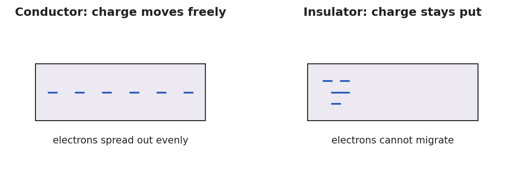
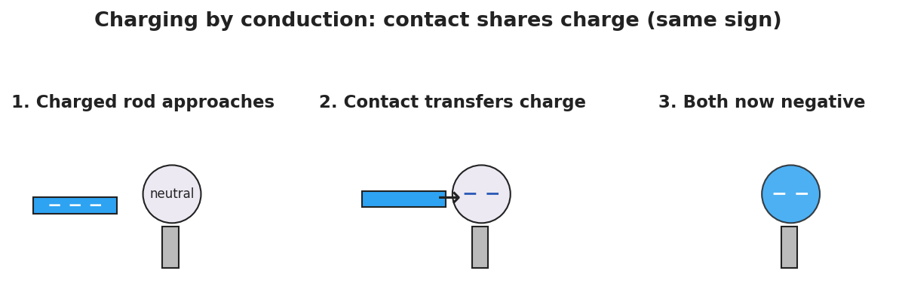

# Conductors, Insulators, and Charging by Conduction — Teacher Guide

## Cover

**Unit: Electrostatics — Lesson 02: Conductors, Insulators, and Charging by Conduction**
East Meadow Schools × Valley Stream Central High School District
Strategy chips: ACTIVE LEARNING

---

## Curated Resources (from East Meadow Scope & Sequence)

### NYSSLS Standards

This lesson continues building toward **HS-PS3-5**: "Develop and use a model of two objects interacting through electric or magnetic fields to illustrate the forces between objects and the changes in energy of the objects due to the interaction. (Cause and Effect)." Students model *why* a charged object shares its charge on contact — because in a conductor, charge is free to move — which is the mechanism behind the interactions they will quantify in later lessons.

### Phenomenon

- Van de Graaff generator makes hair stand on end (Physics demo): <https://www.youtube.com/watch?v=2gYUmTGYbeI>
- Touching a charged rod to a metal-leaf electroscope makes the leaves spread (PhET / classroom demo): <https://www.youtube.com/watch?v=Yb56oCEMBuc>

### Javalab / Labs

- Electroscope (charge by touching): <https://javalab.org/en/electroscope_en/>
- Conductor and insulator (where does charge go?): <https://javalab.org/en/conductor_and_insulator_en/>

### Assessments

- PhET "Balloons and Static Electricity" — sweater (insulator) vs. the conducting wall: <https://phet.colorado.edu/en/simulations/balloons-and-static-electricity>. The Exit Ticket below is the formative check for this lesson.

---

## Lesson Overview

| | |
|---|---|
| **Duration** | 42 minutes (1 period) |
| **NYSSLS link** | HS-PS3-5 (mechanism — free vs. fixed charge in interacting objects) |
| **CCC focus** | Cause and Effect — whether charge spreads or stays put is *caused* by the material's structure (free electrons or not). |
| **Strategy chips** | ACTIVE LEARNING |
| **Materials** | Electroscope (or Javalab); charged rod (PVC/acetate) + cloth; assorted samples (metal spoon, copper wire, wooden ruler, glass, rubber, plastic); aluminum foil; whiteboards/markers. |
| **Safety** | If a Van de Graaff is used, follow its discharge procedure; keep it away from students with cardiac devices. |
| **Prior knowledge** | Lesson 01 — two kinds of charge; like repel, unlike attract; charge is conserved and carried by electrons. |

**Lesson objectives — students can:**

- Distinguish a **conductor** (charge moves freely) from an **insulator** (charge stays put) and classify common materials.
- Describe **charging by conduction**: direct contact with a charged object transfers charge, leaving both objects with the **same sign**.
- Predict the sign of an object after it is charged by conduction.

---

## Phase 1 · Engage *(0 – 12 min)*

### 0–2 min · Opening Connection (SEL)

Quick whip-around (one phrase each): *"Name something that lets things pass through it easily, and something that blocks them."* (water vs. a wall; a hallway vs. a locked door.) This primes the conductor/insulator contrast without naming it.

### 2–8 min · Phenomenon hook — the electroscope jumps

**Teacher actions.** Show the metal electroscope. Touch a charged rod directly to its metal knob. The thin leaves spring apart and *stay* apart after the rod is gone. Then touch the knob with your finger — the leaves collapse. (If available, run the Van de Graaff: a volunteer's hair stands on end because the charge spreads over every strand.)

**Sample teacher language:**

> "I touched the metal once and the leaves are still spread. Why did the charge stay — and why does my finger make it vanish?"

**Anticipated student responses:**

- "The charge went into the metal and got stuck." — partly right; it moved *in*, but ask why it doesn't move *out* on its own.
- "Your finger is grounding it." — excellent; hold the word "ground" (we name it next lesson).
- "The leaves repel because they have the same charge." — yes! Connect to Lesson 01's "like charges repel."

### 8–12 min · Notice & Wonder + Turn-and-Talk #1

Capture two columns. Then:

> "Turn to your partner: the rod touched only the *top* knob, but the *bottom* leaves moved. How did the charge get all the way down?"

Target idea: *charge can travel through the metal.* Leave open if unspoken.

### Bridge to Phase 2

Each student writes a one-sentence **initial model**: "The leaves spread because ______."

---

## Phase 2 · Explore *(12 – 32 min)*

### 12–16 min · Initial Model (silent / individual)

> *"Draw the electroscope. Show where the charge is right after the rod touches the knob, and which way it moves. Predict whether a wooden ruler touched to the knob would do the same thing."*

### 16–32 min · Active-Learning investigation — sort and test

Hand each group a tray of samples (metal spoon, copper wire, wooden ruler, glass, rubber band, plastic, aluminum foil). Active-learning protocol:

1. **Predict + sort** — groups sort samples into "lets charge move" vs. "blocks charge" *before* testing, on a whiteboard.
2. **Test** — touch a charged rod, then the sample, to the electroscope knob. Does the charge reach the leaves?
3. **Gallery walk** — groups circulate, compare sorts, and revise. Mismatches become the discussion.

Use the diagram below as the model students are building.

**Teacher facilitation language:**

> "Which samples let the leaves move, and what do those samples have in common?"
> "When you touched the charged rod straight to the knob, did the rod *lose* some charge? How could you tell?"

### Teacher facilitation during Explore

- **What to look for** — groups grouping metals together as "charge moves" and naming the metal/non-metal pattern.
- **What to resist** — don't pre-classify the samples; let the gallery-walk disagreements drive the consensus.
- **What to redirect** — students who think the rod must *keep* all its charge should compare the rod before and after several touches.

---

## Phase 3 · Explain *(32 – 37 min)*

### 32–35 min · Turn-and-Talk #2 + class consensus

> "What kind of material let the charge travel to the leaves, and what happened to the rod's charge when it touched a conductor?"

Target consensus:

> "In some materials — metals — electrons are free to move, so charge spreads through them; these are conductors. In others — rubber, glass, plastic — charge stays where you put it; these are insulators. When a charged object *touches* a conductor, some charge moves onto it, and both end up with the **same** sign."

### 35–37 min · Vocabulary introduction (≤ 3 terms)

**Sample teacher language:**

> "A **conductor** lets charge move freely (metals). An **insulator** holds charge in place (rubber, glass). Transferring charge by direct touch is **charging by conduction** — and because charge just spreads from one to the other, both objects end up with the same sign."

The three-step diagram below is the model students revisit in Phase 4.

### Discussion prompts to deploy here

- "You charge a metal sphere by touching it with a negative rod. What sign is the sphere now?"
  - *Sample student response:* "Negative — conduction shares the rod's charge, so the sphere gets the same sign."
- "Why won't a charged rubber rod share its charge if you touch it to a wooden block?"
  - *Sample student response:* "Both are insulators; the charge can't move, so it stays on the rubber."

---

## Phase 4 · Elaborate *(37 – 40 min)*

### 37–39 min · Revise the model

> *"Return to your electroscope drawing. Re-label it: is the metal a conductor or insulator? Use conduction to explain in one sentence why the leaves stayed spread after the rod left."*

### 39–40 min · Return to the phenomenon

> "On the Van de Graaff, why does *every* hair stand up, not just the ones you touch? Answer in one sentence."

Target: "The dome is a conductor, so the charge spreads to every strand; all the hairs get the same sign and repel each other."

---

## Phase 5 · Evaluate *(40 – 42 min)*

### 40–42 min · Exit Ticket + Closing Reflection

> *"(a) Classify each as a conductor or insulator: copper wire, rubber band, aluminum foil, glass rod.
> (b) A negatively charged rod is touched directly to a neutral metal sphere. What sign is the sphere afterward? Name the charging method.
> (c) Explain in one sentence why a charged comb shares its charge with a metal doorknob you touch it to, but not with a dry plastic cup."*

Expected: (a) copper = conductor, rubber = insulator, aluminum = conductor, glass = insulator; (b) negative, by conduction (same sign as the rod); (c) the doorknob is a conductor so charge moves onto it, while the plastic cup is an insulator that won't let charge flow. See `Answer_Key.docx`.

**Closing Reflection (SEL, 30 seconds):**

> "What did a groupmate notice during the sort that changed your sorting? Name one thing you'd test differently next time."

---

## Common Misconceptions

- **Misconception:** "Conduction reverses the charge — the touched object becomes opposite." → **Correction:** Conduction shares charge, so both objects end up the **same** sign. (Opposite sign comes from *induction*, Lesson 03.)
- **Misconception:** "Insulators can't be charged at all." → **Correction:** Insulators *can* hold charge (a rubbed balloon!) — they just won't let it move or spread.
- **Misconception:** "Charge flows through anything if you push hard enough." → **Correction:** In an insulator the electrons are bound; ordinary contact does not free them to move.

---

## Access & Differentiation

- **ELL/ENL supports:** Sentence frame: *"A ___ (conductor/insulator) lets charge ___ (move/stay), so when it touches a charged object the charge ___."* Word-choice box: {conductor, insulator, move freely, stay put, same sign, conduction}. Provide a two-column T-chart pre-labeled "moves / stays."
- **IEP/SPED supports:** Pre-sort half the samples as worked examples; students place only the remaining ones. Offer the Javalab electroscope as a low-prep alternative to handling a physical rod.
- **Extensions:** Have students explain why airplanes and fuel trucks are bonded with a wire before refueling, using conductor + conduction + charge buildup.

---

## Strategy Spotlight

**ACTIVE LEARNING.** Today's Explore is a predict–sort–test–revise cycle on vertical whiteboards. Students commit to a sort *before* testing (productive struggle), then a gallery walk turns disagreements into the lesson's discussion. Keep groups to 3, rotate the marker, and resist confirming answers during the walk — the mismatches between groups are the teaching tool. Your role is to ask "what do your 'moves' samples have in common?" rather than to classify for them.

---

## NYSSLS Observation Checklist Crosswalk

| # | Checklist item | Where it appears in this lesson |
|---|---|---|
| 1 | Local/relatable phenomenon | Phase 1 — electroscope/Van de Graaff; doorknob + comb in Phase 5 |
| 2 | Turn and Talk (2–3×) | Phase 1 (TT#1 — how charge reached the leaves), Phase 3 (TT#2 — what let charge travel) |
| 3 | Students develop questions/models/procedures | Phase 1 (initial model), Phase 2 (predict-sort-test), Phase 4 (revise model) |
| 4 | CCC defined and used | Lesson Overview · *Cause and Effect*, restated in Phase 2 |
| 5 | ENL — ≤ 3 vocab, second half | Phase 3 — vocabulary at 35–37 min (conductor / insulator / charging by conduction) |
| 6 | Revisit phenomenon with evidence | Phase 4 — Van de Graaff hair + electroscope re-labeling |
| 7 | ENL/SPED supports | Access & Differentiation block |
| 8 | Assessment check | Phase 5 — Exit Ticket (classify + conduction sign) |

---

## Companion Materials

- `Student_Worksheet.docx` — the 5E student investigation (hand out at start of Phase 2)
- `Student_Notes.docx` — guided note-guide for vocabulary and the worked example
- `Answer_Key.docx` — answers to "Make It Make Sense" prompts and the Exit Ticket

---

## Key Vocabulary (max 3)

- **conductor** — a material (such as a metal) in which charge moves freely because some electrons are not bound to single atoms
- **insulator** — a material (such as rubber, glass, or plastic) in which charge stays put because electrons are bound and cannot migrate
- **charging by conduction** — transferring charge by direct contact with a charged object; both objects end up with the same sign
