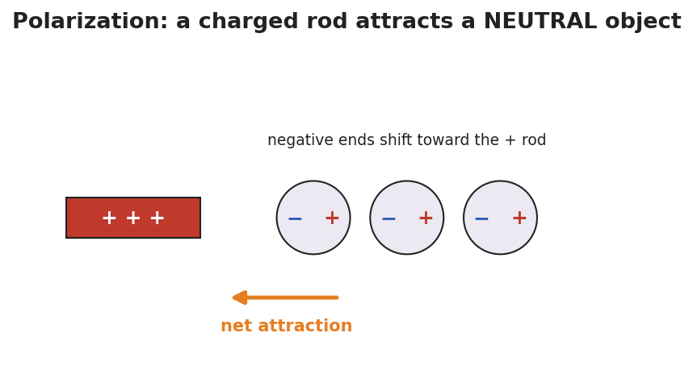

# Charging by Induction and Polarization — Student Notes

**Unit: Electrostatics — Lesson 03**
Name: _______________________  Date: __________  Period: ____

---

## Learning Targets

By the end of today's 42 minutes I can:

- Explain polarization and why a charged object attracts a neutral one.
- Describe the four steps of charging by induction.
- Contrast induction (opposite sign, no contact) with conduction (same sign, contact).

---

## Key Vocabulary

- **polarization** — _______________________________________________
- **induction** — _______________________________________________
- **grounding** — _______________________________________________

---

## Guided Notes

**Polarization** (in a neutral object):

- A charged object brought near makes the neutral object's charges __________.
- The near side becomes __________ (opposite to the rod); the far side becomes __________.
- The object is overall still __________, but its near side is attracted.

**Charging by induction** (with a negative rod, no contact):

1. Bring the negative rod __________ the neutral metal sphere → it polarizes.
2. __________ the far side; electrons (repelled by the rod) flee to the __________.
3. Remove the __________ first, while the rod is still near.
4. Remove the __________; the sphere is left with the __________ sign (positive).

**Why a neutral object is attracted (polarization):**

**Induction vs. conduction:**

| | Contact? | Final sign vs. rod |
|---|---|---|
| Conduction | __________ | __________ |
| Induction | __________ | __________ |

---

## Worked Example

**Problem.** A metal sphere is charged by **induction** using a rod that is **+8 units**. After the procedure, what sign is the sphere's net charge, and why?

**Solution.**
1. The + rod is brought near; it __________ the sphere (− on the near side, + on the far side).
2. Grounding lets the rod-repelled charge (the __________ charges) escape to the ground.
3. Remove the ground, then the rod → the sphere keeps the charge __________ to the rod.
4. The rod was +, so the sphere ends up __________ — opposite, with **no contact**.

---

## Summary

Finish the sentence (Because / But / So):

> A charged rod can attract a neutral object
> because __________________________________________,
> but to leave the object permanently charged without touching it __________________________________________,
> so __________________________________________.
