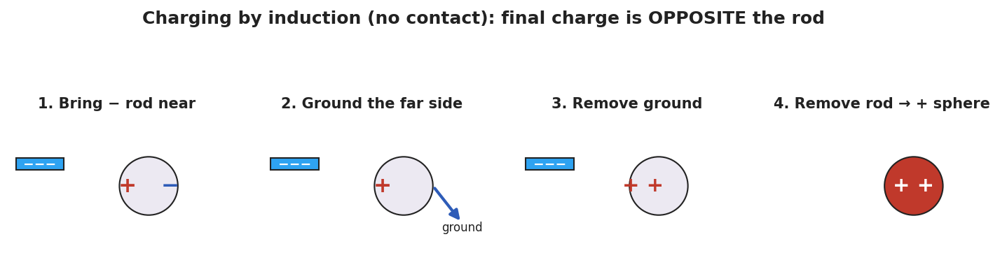

# Charging by Induction and Polarization — Student Worksheet

**Unit: Electrostatics — Lesson 03**
Name: _______________________  Date: __________  Period: ____

---

## Phenomenon

Your teacher holds a charged rod near a thin stream of water — the stream bends toward it. The rod never touches the water, and the water started out neutral. Held over tiny scraps of neutral paper, the rod makes them jump up to meet it.

**Driving question:** How can a charged object pull on a neutral object it never even touches?

---

## Notice & Wonder

| I notice… | I wonder… |
|---|---|
|  |  |
|  |  |
|  |  |

**Turn & Talk #1:** The paper is neutral, yet it's attracted. What could the charged rod be doing to the *inside* of the paper?

> _______________________________________________

---

## Initial Model

Draw a scrap of neutral paper with a charged rod held above it. Show what you think happens to the charges *inside* the paper. Predict whether the paper is pulled up, pushed down, or unaffected.

> _______________________________________________
> _______________________________________________
> My prediction: _______________________________

---

## Investigation

**BTC thin-slice task (vertical whiteboard, groups of 3):**

You have a **neutral metal sphere** on an insulating stand and a **negative rod** you may **not** touch to the sphere. Find a sequence of moves — bring the rod near, touch the sphere with a finger (ground), step away — that leaves the sphere with a **lasting positive** charge. Draw each step and show where the charges are.

Check your sequence against this model:

| Step | What I do | Where the charges are |
|---|---|---|
| 1 |  |  |
| 2 |  |  |
| 3 |  |  |
| 4 |  |  |

**Key question:** Why must you remove the ground *before* you remove the rod?

> _______________________________________________

---

## Make It Make Sense

1. A charged rod attracts a neutral piece of paper. Explain what happens to the paper's charges (use the word *polarization*).
2. A negative rod is used to charge a metal sphere by induction. What sign does the sphere end up with, and why?
3. A student lets the rod touch the sphere instead. Now what charging method is it, and what sign does the sphere get?

---

## Vocabulary in Action

Use each term in a sentence about today's phenomenon.

- **polarization:** _______________________________________________
- **induction:** _______________________________________________
- **grounding:** _______________________________________________

---

## Revise Your Model

Return to your Initial Model. Re-label it using *polarization*: which side of the paper is attracted, and why? Then write one sentence stating the final sign if you charged a metal sphere by induction with a **positive** rod.

> _______________________________________________
> _______________________________________________

---

## Exit Ticket

A **positive** rod is brought near (not touching) a neutral metal sphere on an insulating stand.

(a) Sketch where the + and − charges sit on the sphere while the rod is near. What is this called?

(b) You ground the sphere, remove the ground, then remove the rod. What sign is the sphere's net charge? Name the method.

(c) In one sentence, state the key difference between charging by induction and charging by conduction.
