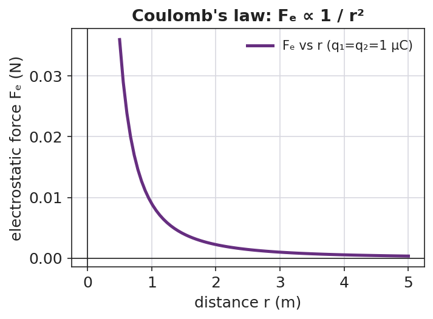
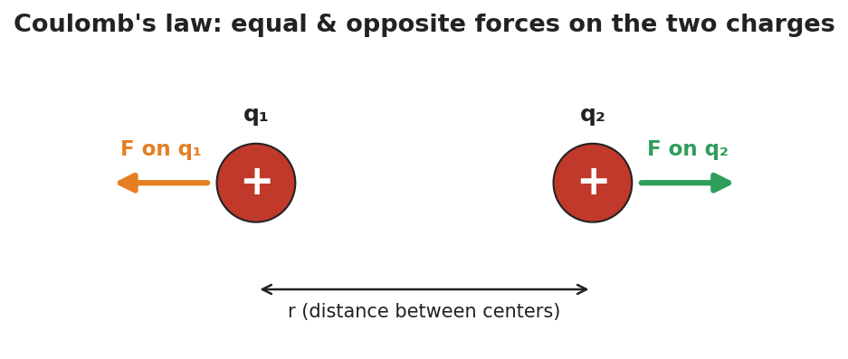

# Coulomb's Law — Teacher Guide

## Cover

**Unit: Electrostatics — Lesson 04: Coulomb's Law**
East Meadow Schools × Valley Stream Central High School District
Strategy chips: HOCHMAN

---

## Curated Resources (from East Meadow Scope & Sequence)

### NYSSLS Standards

This is the quantitative core of the unit and the unit's anchor to **HS-PS2-4**: "Use mathematical representations of Newton's Law of Gravitation and Coulomb's Law to describe and predict the gravitational and electrostatic forces between objects. (Patterns)." Students see the **same inverse-square pattern** they met in Universal Gravitation (Forces, Lesson 06) reappear for charge — a deliberate Patterns crosscutting-concept callback.

### Phenomenon

- PhET "Coulomb's Law" — drag two charged spheres, read the force in real time: <https://phet.colorado.edu/en/simulations/coulombs-law>
- Two charged pith balls / foil-covered balls swing apart on threads (classroom demo): <https://www.youtube.com/watch?v=G+coulombs+law+pith+ball>

### Javalab / Labs

- PhET "Coulomb's Law" macro scale (primary lab): <https://phet.colorado.edu/en/simulations/coulombs-law>
- Coulomb force between two charges (Javalab): <https://javalab.org/en/coulombs_law_en/>

### Assessments

- Reference Table relationship: **Fₑ = k·q₁·q₂ / r²**, with k = 8.99 × 10⁹ N·m²/C² and e = 1.6 × 10⁻¹⁹ C. The numeric Exit Ticket below is the formative check.

---

## Lesson Overview

| | |
|---|---|
| **Duration** | 42 minutes (1 period) |
| **NYSSLS link** | HS-PS2-4 (mathematical representation of Coulomb's Law; the inverse-square Pattern) |
| **CCC focus** | Patterns — the electrostatic force follows the **same** inverse-square pattern as gravity. |
| **Strategy chips** | HOCHMAN (literacy) |
| **Materials** | Devices for the PhET sim; calculators; Reference Table; sentence-expansion strips (Because/But/So); whiteboards/markers. |
| **Safety** | Standard classroom safety; simulation-based, no hazards. |
| **Prior knowledge** | Lessons 01–03 (like repel/unlike attract); the inverse-square law from Universal Gravitation (Fg = G·m₁·m₂ / r²). |

**Lesson objectives — students can:**

- State Coulomb's law in words and symbols: **Fₑ = k·q₁·q₂ / r²**, and identify each quantity and its unit.
- Predict how the force changes when charge or distance changes (especially the inverse-square fall-off with r).
- Calculate the electrostatic force between two charges using the Reference Table value of k.

---

## Phase 1 · Engage *(0 – 10 min)*

### 0–2 min · Opening Connection (SEL)

One-phrase whip-around: *"Name something that gets dramatically weaker the farther away you get from it."* (A campfire's warmth, a speaker's volume.) This primes the inverse-square fall-off.

### 2–7 min · Phenomenon hook — PhET two charges

**Teacher actions.** Open PhET "Coulomb's Law." Project two charges with the force readout visible. Double one charge — force doubles. Halve the distance — force *quadruples*. Let students call out predictions before each move.

**Sample teacher language:**

> "I'm going to move these two charges to half their distance apart. The force won't just double — watch the number. Predict first: by how much?"

**Anticipated student responses:**

- "It doubles when you halve the distance." — capture; the *surprise* that it quadruples is the hook.
- "More charge means more force." — yes, build on it: how exactly?
- "It looks like gravity from last unit." — gold; this is the Patterns callback to HS-PS2-4.

### 7–10 min · Notice & Wonder + Turn-and-Talk #1

> "Turn to your partner: halving the distance made the force four times bigger, not two. What relationship between force and distance would do that?"

Target idea: *force depends on distance squared.* Leave open if unspoken.

### Bridge to Phase 2

Each student writes a one-sentence **initial model**: "The force gets bigger when ______ and smaller when ______."

---

## Phase 2 · Explore *(10 – 28 min)*

### 10–14 min · Initial Model (silent / individual)

> *"Sketch two charges a distance r apart. Predict, in words, what happens to the force if you (a) triple one charge, (b) double the distance. Then test each on PhET."*

### 14–28 min · Investigation — find the pattern on PhET

Structured data collection (devices in pairs):

1. **Charge sweep** — fix r; set q₁ = 1, 2, 3, 4 µC; record force. Pattern: force is *proportional* to charge.
2. **Distance sweep** — fix charges; set r = 1, 2, 3, 4 units; record force. Pattern: force ÷ 4, ÷ 9, ÷ 16 → inverse-square.

Plot the distance data; it matches the curve below.

**Teacher facilitation language:**

> "When you doubled r, the force didn't halve — what fraction did it become? And at triple r?"
> "Where have you seen a force that dies off as 1/r² before this unit?"

### Teacher facilitation during Explore

- **What to look for** — pairs noticing force ÷ 4 at double distance, ÷ 9 at triple → "it's r squared."
- **What to resist** — don't write the formula yet; let the ÷4, ÷9 data force the squared relationship.
- **What to redirect** — pairs who confuse "double charge" (×2) with "double distance" (÷4) should re-run one variable at a time.

---

## Phase 3 · Explain *(28 – 36 min)*

### 28–31 min · Turn-and-Talk #2 + class consensus

> "In one sentence: how does the electrostatic force depend on the two charges and on the distance between them?"

Target consensus:

> "The force grows in proportion to each charge and falls off as the square of the distance — exactly like gravity, but for charge."

### 31–33 min · Vocabulary introduction (≤ 3 terms)

**Sample teacher language:**

> "This relationship is **Coulomb's law**. The push or pull between charges is the **electrostatic force**, Fₑ. Because it dies off as 1/r², we call it an **inverse-square law** — the same Pattern as gravity. In symbols: Fₑ = k·q₁·q₂ / r², with k = 8.99 × 10⁹ N·m²/C²."

The two-charge force pair below shows the forces are equal and opposite (Newton's third law for charge):

### 33–36 min · HOCHMAN sentence work

Run a **Because/But/So** expansion of the key relationship on sentence strips:

> Stem: *"The electrostatic force gets stronger…"*
> - **because** … (more charge → more force)
> - **but** … (it weakens fast as the charges move apart)
> - **so** … (doubling the distance cuts the force to one-quarter)

Then an **appositive** drill: *"Coulomb's law, **the rule that the force falls off as 1/r²**, predicts the force between any two charges."*

### Discussion prompts to deploy here

- "If you triple *both* charges, what happens to the force?"
  - *Sample student response:* "It goes up nine times — three times for each charge, 3 × 3."
- "Why is the unit of k written N·m²/C²?"
  - *Sample student response:* "So that q·q/r² (C²/m²) times k gives newtons — the units cancel to a force."

---

## Phase 4 · Elaborate *(36 – 40 min)*

### 36–39 min · Revise the model (with numbers)

> *"Two charges of +2.0 × 10⁻⁶ C each sit 0.30 m apart. Use Fₑ = k·q₁·q₂ / r² to find the force. Then state what happens to that force if the distance is doubled."*

Work it with the class (full solution in `Student_Notes.docx`): Fₑ = (8.99 × 10⁹)(2.0 × 10⁻⁶)(2.0 × 10⁻⁶) / (0.30)² ≈ **0.40 N**, repulsive. Doubling r → one-quarter the force ≈ 0.10 N.

### 39–40 min · Return to the phenomenon

> "On PhET, why did halving the distance quadruple the force? Answer in one Because/But/So sentence."

Target: "Halving r made r² one-quarter as big, *but* r² is in the denominator, *so* the force became four times larger."

---

## Phase 5 · Evaluate *(40 – 42 min)*

### 40–42 min · Exit Ticket (numeric) + Closing Reflection

> *"Use Fₑ = k·q₁·q₂ / r², k = 8.99 × 10⁹ N·m²/C².
> (a) Two charges, q₁ = +3.0 × 10⁻⁶ C and q₂ = +3.0 × 10⁻⁶ C, are 0.20 m apart. Calculate the electrostatic force. Is it attractive or repulsive?
> (b) Without recalculating from scratch, state what happens to the force if the distance is tripled.
> (c) Coulomb's law shares its 1/r² shape with which force from the Forces unit?"*

Expected: (a) Fₑ = (8.99 × 10⁹)(3.0 × 10⁻⁶)(3.0 × 10⁻⁶)/(0.20)² ≈ **2.0 N**, repulsive (both positive); (b) tripling r divides the force by 9 → ≈ 0.22 N; (c) gravitation (Fg = G·m₁·m₂/r²). See `Answer_Key.docx`.

**Closing Reflection (SEL, 30 seconds):**

> "Which sentence stem (because / but / so) made the math click for you today, and why?"

---

## Common Misconceptions

- **Misconception:** "Doubling the distance halves the force." → **Correction:** Distance is *squared*, so doubling r divides the force by **four**.
- **Misconception:** "The bigger charge feels a bigger force than the smaller one." → **Correction:** The two charges feel **equal and opposite** forces (Newton's third law), regardless of their relative sizes.
- **Misconception:** "k and the masses/charges have the same role as in gravity." → **Correction:** The form is identical (inverse-square), but k (8.99 × 10⁹) is enormous compared with G — the electric force is vastly stronger than gravity for the same separation.

---

## Access & Differentiation

- **ELL/ENL supports:** Provide the Because/But/So strips pre-printed with the stem. Word-choice box: {Coulomb's law, electrostatic force, inverse-square, charge, distance, quadruple, quarter}. Pair "inverse-square" with a hand gesture (force shrinking fast as hands separate).
- **IEP/SPED supports:** Provide a plug-in template for the calculation with the formula and k pre-filled; students substitute only the numbers. Offer a scaffolded "÷4, ÷9, ÷16" table for the distance pattern.
- **Extensions:** Have students compute the ratio of the electric force to the gravitational force between two protons and explain (with k vs. G) why electricity dominates at the atomic scale.

---

## Strategy Spotlight

**HOCHMAN (literacy).** Today's vocabulary and the key relationship are consolidated through **sentence-level** Hochman moves: a **Because/But/So** expansion of "the electrostatic force gets stronger…," and an **appositive** drill naming Coulomb's law inside the sentence. These force students to encode the inverse-square idea in precise prose, not just a formula. Keep the strips short (one clause each) and read several aloud — fluency with the sentence is the goal, not length.

---

## NYSSLS Observation Checklist Crosswalk

| # | Checklist item | Where it appears in this lesson |
|---|---|---|
| 1 | Local/relatable phenomenon | Phase 1 — PhET two charges; campfire warmth analogy |
| 2 | Turn and Talk (2–3×) | Phase 1 (TT#1 — why force quadruples), Phase 3 (TT#2 — force vs. charge and distance) |
| 3 | Students develop questions/models/procedures | Phase 1 (initial model), Phase 2 (PhET data sweeps), Phase 4 (numeric revision) |
| 4 | CCC defined and used | Lesson Overview · *Patterns* (inverse-square callback), restated in Phase 3 |
| 5 | ENL — ≤ 3 vocab, second half | Phase 3 — vocabulary at 31–33 min (Coulomb's law / electrostatic force / inverse-square law) |
| 6 | Revisit phenomenon with evidence | Phase 4 — PhET "why quadruple" Because/But/So |
| 7 | ENL/SPED supports | Access & Differentiation block |
| 8 | Assessment check | Phase 5 — numeric Exit Ticket (calculate Fₑ; predict ×⅑ at triple r) |

---

## Companion Materials

- `Student_Worksheet.docx` — the 5E student investigation (hand out at start of Phase 2)
- `Student_Notes.docx` — guided note-guide with the full worked calculation
- `Answer_Key.docx` — worked answers to "Make It Make Sense" prompts and the numeric Exit Ticket

---

## Key Vocabulary (max 3)

- **Coulomb's law** — the rule that the electrostatic force between two charges is Fₑ = k·q₁·q₂ / r², with k = 8.99 × 10⁹ N·m²/C²
- **electrostatic force** — the attractive or repulsive force (Fₑ) between charged objects
- **inverse-square law** — a relationship in which a quantity falls off as 1 / r²; shared by Coulomb's law and Newton's law of gravitation
