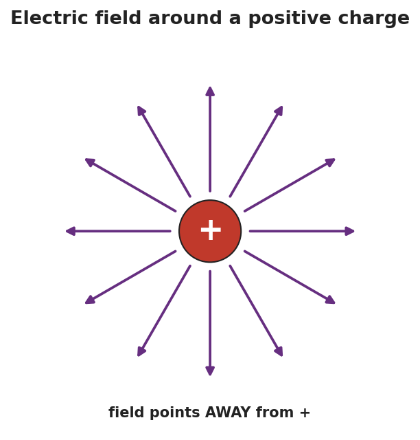
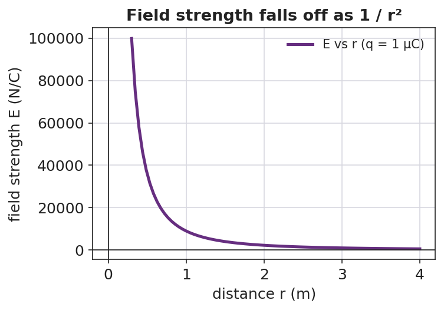

# Electric Fields — Student Worksheet

**Unit: Electrostatics — Lesson 05**
Name: _______________________  Date: __________  Period: ____

**Reference:** E = Fₑ / q  (units: N/C)  ·  k = 8.99 × 10⁹ N·m²/C²

---

## Phenomenon

Your teacher holds a fluorescent tube near a plasma ball — it glows, even though it isn't plugged in or touching the ball. Move it away and it dims. Something is filling the space around the ball.

**Driving question:** What is in the space around a charge, and how can we describe its direction and strength?

---

## Notice & Wonder

| I notice… | I wonder… |
|---|---|
|  |  |
|  |  |
|  |  |

**Turn & Talk #1:** The effect on the bulb got weaker as it moved away. What does that tell you about whatever surrounds the ball?

> _______________________________________________

---

## Initial Model

Draw the plasma ball. Around it, draw arrows showing how it would push or pull on a small **positive** test charge placed at several spots. Mark where the push would be **strongest**.

> _______________________________________________
> Strongest at: _________________________________

---

## Investigation

**Human field map.** Stand at your assigned spot holding a + test-charge card near the floor "+" source.

| My spot | Direction my + card is pushed | Near or far from source? | Strong or weak field? |
|---|---|---|---|
| Round 1 (+ source) |  |  |  |
| Round 2 (− source) |  |  |  |

Compare your map to the field around a single positive charge:

**Key question:** Which way does the field point near a **positive** source? Near a **negative** source?

> _______________________________________________

---

## Make It Make Sense

1. A 2.0 N force acts on a +0.5 C charge placed at a point. What is the electric field strength there? Show E = Fₑ/q.
2. The field strength drops as you move away from the source (see the graph). What shape is that fall-off, and where have you seen it before?

3. Why do we use a *positive* test charge (and a *small* one) to define the field's direction?

---

## Vocabulary in Action

Use each term in a sentence about today's phenomenon.

- **electric field:** _______________________________________________
- **test charge:** _______________________________________________
- **field strength:** _______________________________________________

---

## Revise Your Model

A field of 500 N/C exists at a point, pointing east. (a) What force would it exert on a +2.0 × 10⁻⁶ C charge placed there? (b) Which direction?

> Fₑ = E·q = ____________________  ≈ __________ N
> Direction: ____________________

---

## Exit Ticket

Use E = Fₑ / q.

(a) A charge of +4.0 × 10⁻⁶ C feels a force of 0.012 N at a point. Calculate the electric field strength there, with units.

(b) Draw the field around a single **negative** charge. Which way do the arrows point?

(c) In one sentence, explain what a "test charge" is and why it must be small.
