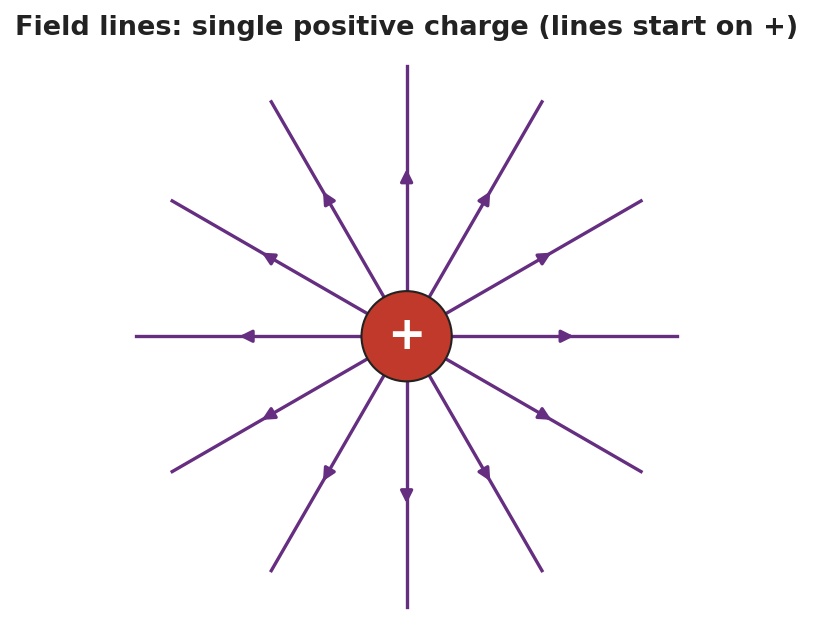
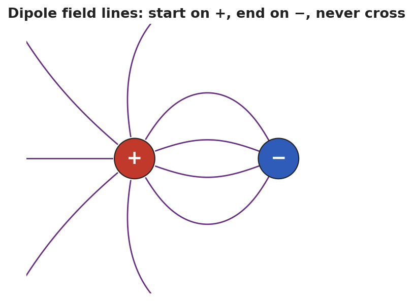
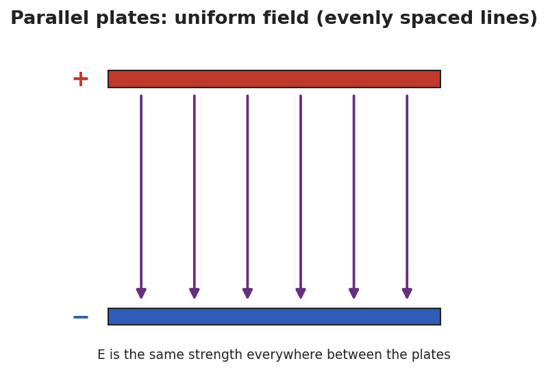

# Electric Field Lines — Student Notes

**Unit: Electrostatics — Lesson 06**
Name: _______________________  Date: __________  Period: ____

---

## Learning Targets

By the end of today's 42 minutes I can:

- State and apply the four rules for drawing field lines.
- Draw the field for a single charge, a dipole, and parallel plates.
- Read field strength from line spacing.

---

## Key Vocabulary

- **field line** — _______________________________________________
- **dipole** — _______________________________________________
- **uniform field** — _______________________________________________

---

## Guided Notes

**The four rules for field lines:**

1. Lines start on __________ charges and end on __________ charges.
2. They point the way a __________ test charge would move.
3. Field lines never __________.
4. Where lines are __________ together, the field is __________ (density shows strength).

**Three key patterns:**

- **Single charge:** lines go straight __________ (for +) and weaken with distance.

- **Dipole (+ and −):** lines curve from the __________ to the __________, never crossing.

- **Parallel plates:** straight, __________ spaced lines → a __________ field (same strength everywhere).

---

## Worked Example

**Problem.** Two field-line diagrams are drawn to the same scale. In Diagram A the lines are spaced 2 mm apart; in Diagram B they are spaced 8 mm apart. In which diagram is the electric field stronger, and how do you know?

**Solution.**
1. Rule 4: line __________ shows field strength.
2. Closer lines mean a __________ field; lines farther apart mean a __________ field.
3. Diagram A has lines only __________ mm apart (closer), so **Diagram A** has the stronger field.

---

## Summary

Finish the sentence (Because / But / So):

> Field lines that are close together show a strong field
> because __________________________________________,
> but far from a charge the lines spread out __________________________________________,
> so __________________________________________.
