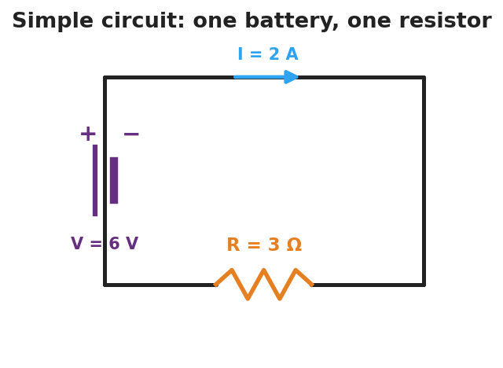
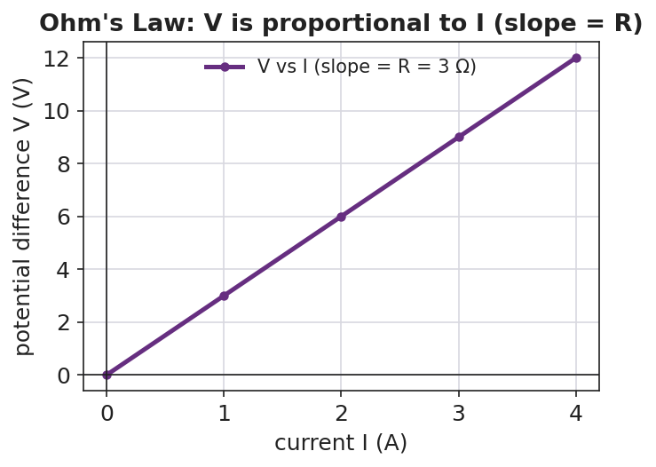

# Electric Current and Ohm's Law — Student Worksheet

**Unit: Current Electricity — Lesson 01**
Name: _______________________  Date: __________  Period: ____

---

## Phenomenon

Your teacher holds an "energy stick." Nothing happens — until two people grab the metal ends and complete the loop with their hands. Then it lights up and buzzes. Break the loop, and it goes dark again.

**Driving question:** What has to be true for electric charge to flow, and what controls how much flows?

---

## Notice & Wonder

| I notice… | I wonder… |
|---|---|
|  |  |
|  |  |
|  |  |

**Turn & Talk #1:** What has to be true for the charge to flow? Use the word *path* in your answer.

> _______________________________________________

---

## Initial Model

Draw the energy-stick loop with two people holding hands. Mark where the **push** comes from and draw arrows for which way the charge moves. Then predict: what would make the light brighter?

> _______________________________________________
> My prediction: _______________________________

---

## Investigation

In PhET **Circuit Construction Kit: DC**, build one battery connected to one resistor. Add an ammeter (reads current *I* in amperes) in the loop and a voltmeter (reads voltage *V* in volts) across the resistor.

**Part A — Same resistor, change the voltage.** Set the resistor to a fixed value. Record current at three battery voltages.

| Battery voltage V (V) | Current I (A) | V ÷ I (Ω) |
|---|---|---|
| 9 |  |  |
| 18 |  |  |
| 27 |  |  |

Plot your three points with **I on the x-axis** and **V on the y-axis**. Draw the best-fit line.

**Part B — Same voltage, change the resistor.** Keep the battery fixed and increase the resistance. What happens to the current?

> _______________________________________________

**Key question:** What number do you get every time you compute V ÷ I for the same resistor? What is that number called?

> _______________________________________________

---

## Make It Make Sense

1. A resistor has 12 V across it and 3 A flowing through it. Use V = I·R to find its resistance.
2. A 4 Ω resistor is connected to a 24 V battery. How much current flows?
3. The slope of your V-vs-I line was 3. What physical quantity does that slope represent, and what are its units?

---

## Vocabulary in Action

Use each term in a sentence about today's phenomenon.

- **current:** _______________________________________________
- **voltage:** _______________________________________________
- **resistance:** _______________________________________________

---

## Revise Your Model

Return to your Initial Model. Add the energy-stick hand-chain. Explain, using *resistance* and *current*, why adding more people makes the stick harder to light.

> _______________________________________________
> _______________________________________________

---

## Exit Ticket

A resistor has 6 V across it and carries 2 A of current.

(a) What is its resistance? Show V = I·R.

(b) The voltage is raised to 12 V with the same resistor. What is the new current?

(c) In one sentence, what does the slope of a V-vs-I graph represent?
