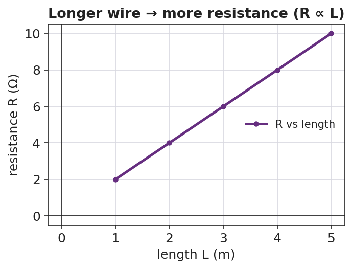
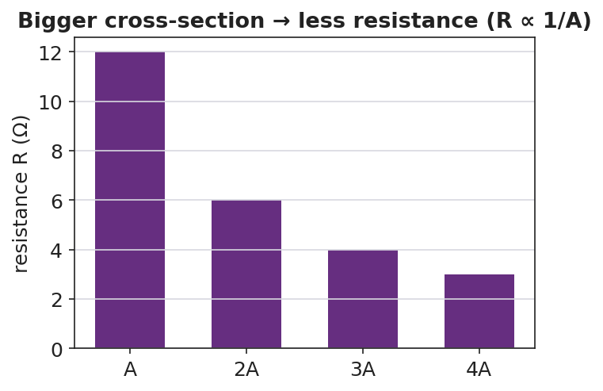
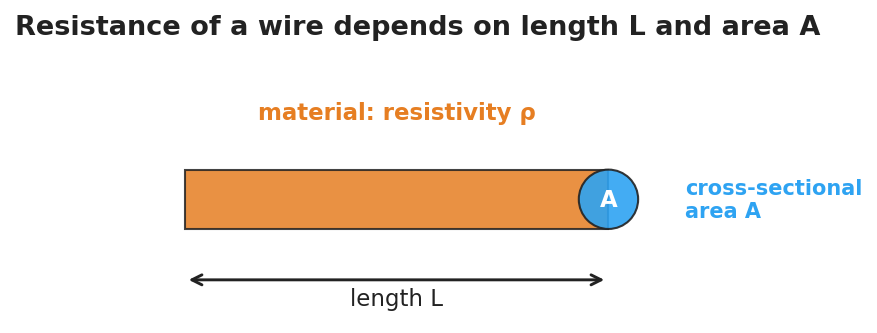

# Resistance in a Wire — Teacher Guide

## Cover

**Unit: Current Electricity — Lesson 02: Resistance in a Wire**
East Meadow Schools × Valley Stream Central High School District
Strategy chips: BTC

---

## Curated Resources (from East Meadow Scope & Sequence)

### NYSSLS Standards

This lesson supports **HS-PS3-6**: *"Analyze data to support the claim that Ohm's Law describes the mathematical relationship among the potential difference, current, and resistance of an electric circuit."* Here students analyze how the *resistance* term in Ohm's Law is itself determined — by the wire's length, cross-sectional area, material (resistivity), and temperature. It deepens Lesson 01's V = I·R by explaining where R comes from.

### Phenomenon

- A circuit built with a thin/long wire glows dim; the same circuit with a thick/short wire glows bright (extension-cord and filament demos): <https://www.youtube.com/results?search_query=wire+thickness+resistance+demonstration>
- Why long, thin extension cords drop voltage and run warm (Khan Academy, "Resistivity and conductivity"): <https://www.khanacademy.org/science/physics/circuits-topic/circuits-resistance/a/resistivity-and-conductivity>

### Javalab / Labs

- PhET — Resistance in a Wire: drag sliders for resistivity ρ, length L, and area A, and watch R change: <https://phet.colorado.edu/en/simulations/resistance-in-a-wire>
- PhET Circuit Construction Kit: DC — substitute wires of different length to see current change: <https://phet.colorado.edu/en/simulations/circuit-construction-kit-dc>

### Assessments

- PhET Resistance-in-a-Wire data table (R vs L, R vs A) — formative during Explore.
- Exit ticket below; full key in `Answer_Key.docx`.

---

## Lesson Overview

| | |
|---|---|
| **Duration** | 42 minutes (1 period) |
| **NYSSLS link** | HS-PS3-6 (supports — origin of the R term) |
| **CCC focus** | Patterns / Scale — R rises in proportion to length and falls in proportion to cross-sectional area. |
| **Strategy chips** | BTC (Building Thinking Classrooms — random groups, vertical surfaces) |
| **Materials** | Devices for PhET Resistance in a Wire; whiteboards / vertical non-permanent surfaces; markers; (optional) nichrome vs. copper wire samples, thick vs. thin. |
| **Safety** | If running a real filament demo, use a low-voltage supply; wire can get hot — do not touch a powered nichrome coil. |
| **Prior knowledge** | Lesson 01 — current, voltage, resistance, and Ohm's Law V = I·R. |

**Lesson objectives — students can:**

- Predict how the **resistance** of a wire changes when its length or cross-sectional area changes.
- Explain the role of the material's **resistivity** and of temperature in setting a wire's resistance.
- Analyze R-vs-L and R-vs-A data to state the proportional relationships (R ∝ L, R ∝ 1/A).

---

## Phase 1 · Engage *(0 – 10 min)*

### 0–2 min · Opening Connection (SEL)

One-sentence whip-around: *"Describe a time you used a really long extension cord — did anything seem off about the device on the end?"* Surface "it was dimmer / charged slower"; you'll explain why by the end.

### 2–7 min · Phenomenon hook — thin vs. thick, long vs. short

**Teacher actions.** Show (live or on video) the same battery + bulb circuit wired first with a long, thin wire, then a short, thick wire. The bulb is noticeably brighter with the short, thick wire.

**Sample teacher language:**

> "Same battery, same bulb — the only thing I changed was the *wire* connecting them. Why would the wire itself change how bright the bulb is?"

**Anticipated student responses:**

- "The thin wire blocks the electricity." — capture "blocks"; we'll sharpen to *more resistance*.
- "Longer means it has farther to travel." — useful intuition; longer wire = more resistance.
- "Different metal?" — flag it; material (resistivity) matters too.

### 7–10 min · Notice & Wonder + Turn-and-Talk #1

> "Turn to your partner: list every property of the *wire* that you think could change the brightness. Use the word *resistance*."

Target list: length, thickness (area), material, maybe temperature.

### Bridge to Phase 2

Each student writes a one-sentence **initial model**: "A thin, long wire dims the bulb because ______."

---

## Phase 2 · Explore *(10 – 30 min)*

### 10–14 min · Initial Model (BTC — random groups to vertical surfaces)

Form **visibly random groups of three** and send them to vertical non-permanent surfaces. Prompt:

> *"At your board, predict: if you make a wire twice as long, what happens to R? If you make it twice as thick (double the area), what happens to R? Write a prediction before you touch the sim."*

### 14–30 min · Investigation — PhET Resistance in a Wire

Groups drag the sliders one variable at a time and record R.

1. **Vary length L** (hold ρ and A fixed). Record R at L = 1, 2, 3, 4, 5.
2. **Vary area A** (hold ρ and L fixed). Record R as A doubles, triples, quadruples.
3. **Change material/resistivity ρ** qualitatively — does a higher ρ raise or lower R?

**Teacher facilitation language (circulating at the boards):**

> "When you doubled the length, exactly how did R change? Is that a straight-line pattern?"
> "When you doubled the area, did R double — or do something else?"
> "Convince your group: is area in the top or the bottom of the resistance relationship?"

Use the R-vs-length graph and the R-vs-area bar chart to consolidate the two patterns:

The wire model students are reasoning about — length L, cross-sectional area A, material resistivity ρ:

### Teacher facilitation during Explore

- **What to look for** — groups stating "R doubles when L doubles" (direct) and "R halves when A doubles" (inverse).
- **What to resist** — handing them ρ·L/A; let the sim's sliders reveal direct vs. inverse first.
- **What to redirect** — groups who change two sliders at once: insist on one variable at a time (control of variables).

---

## Phase 3 · Explain *(30 – 36 min)*

### 30–33 min · Group consensus + Turn-and-Talk #2

> "At your board, write one sentence each for length and for area: 'When ___ increases, R ___ because ___.'"

Target consensus:

> "Resistance goes *up* with length and *down* with cross-sectional area. A wider wire gives charge more room to flow; a longer wire makes it fight resistance over a greater distance."

### 33–36 min · Vocabulary introduction (≤ 3 terms)

**Sample teacher language:**

> "We already met **resistance**. The property of the *material* itself is its **resistivity** — symbol ρ. Copper has low ρ (good conductor); nichrome has high ρ. And the wire's thickness is its **cross-sectional area**, A. Put it together: R grows with length and resistivity, and shrinks with area. (Heating the wire also raises R for most metals.)"

Reference relationship to post: resistance ties back to Ohm's Law **V = I·R** — change R, and the current changes.

### Discussion prompts to deploy here

- "You have two copper wires, same thickness, but one is twice as long. Which has more resistance, and by how much?"
  - *Sample response:* "The long one — twice the resistance, because R is proportional to length."
- "Why are thick wires used for high-current appliances?"
  - *Sample response:* "More cross-sectional area means less resistance, so less heat and voltage loss."

---

## Phase 4 · Elaborate *(36 – 40 min)*

### 36–38 min · Apply to the extension cord

> *"Explain why a long, thin extension cord makes a power tool run weaker than a short, thick one. Use length, area, and resistance in your answer."*

Target: the long, thin cord has high resistance, so more voltage is lost in the cord and less reaches the tool.

### 38–40 min · Return to the phenomenon

> "Back to our two wires and the bulb: in one sentence, why did the short, thick wire make the bulb brighter?"

Target: "The short, thick wire has lower resistance, so more current reaches the bulb (I = V/R)."

---

## Phase 5 · Evaluate *(40 – 42 min)*

### 40–42 min · Exit Ticket + Closing Reflection

> *"Two wires are made of the same material.
> (a) Wire B is twice as long as Wire A (same thickness). How does B's resistance compare to A's?
> (b) Wire C is twice as thick as Wire A (same length, so double the cross-sectional area). How does C's resistance compare to A's?
> (c) Name one property of the material itself that affects resistance."*

Expected: (a) twice the resistance; (b) half the resistance; (c) resistivity (ρ) — also accept temperature. See `Answer_Key.docx`.

**Closing Reflection (SEL, 30 seconds):**

> "Whose explanation at the boards today helped you see the area pattern? Name them."

---

## Common Misconceptions

- **Misconception:** "A thicker wire has more resistance because there's more metal." → **Correction:** More cross-sectional area gives charge more parallel room to flow, so resistance *decreases* (R ∝ 1/A).
- **Misconception:** "Resistance only depends on the material." → **Correction:** It depends on material (ρ) *and* geometry (length and area) *and* temperature.
- **Misconception:** "Longer wires carry more current because they're bigger." → **Correction:** Longer wires have *more* resistance, so for the same voltage they carry *less* current.

---

## Access & Differentiation

- **ELL/ENL supports:** Sentence frames at the board: *"When length increases, resistance ___."* / *"When area increases, resistance ___."* Word box: {increases, decreases, longer, wider, resistivity, material}. Pair *resistivity* with sample wires labeled "easy flow" (copper) and "hard flow" (nichrome).
- **IEP/SPED supports:** Pre-filled data tables for the sim; students circle "up" or "down" rather than recording raw numbers. Provide the R-vs-L and R-vs-A figures with the patterns pre-drawn for annotation.
- **Extensions:** Introduce the full relationship **R = ρ·L / A** and have students compute R for a copper wire (ρ ≈ 1.7 × 10⁻⁸ Ω·m) of a given length and area; predict the effect of heating the wire.

---

## Strategy Spotlight

**BTC (Building Thinking Classrooms).** Use **visibly random groups of three** and **vertical non-permanent surfaces** (whiteboards or windows). Give the thin-slice task verbally, not on a handout, and keep students standing. Circulate with the facilitation questions above rather than answers; when one group lands the "R halves when A doubles" insight, route other groups to go read that board. The vertical surfaces make every group's thinking public, which is the point.

---

## NYSSLS Observation Checklist Crosswalk

| # | Checklist item | Where it appears in this lesson |
|---|---|---|
| 1 | Local/relatable phenomenon | Phase 1 — thin/thick wire bulb; extension cord |
| 2 | Turn and Talk (2–3×) | Phase 1 (TT#1 — wire properties), Phase 3 (TT#2 — length/area sentences) |
| 3 | Students develop questions/models/procedures | Phase 1 (initial model), Phase 2 (sim, control of variables), Phase 4 (revise) |
| 4 | CCC defined and used | Lesson Overview · *Patterns/Scale*, used in Phase 2 graphs |
| 5 | ENL — ≤ 3 vocab, second half | Phase 3 — resistance / resistivity / cross-sectional area at 33–36 min |
| 6 | Revisit phenomenon with evidence | Phase 4 — why the short, thick wire is brighter |
| 7 | ENL/SPED supports | Access & Differentiation block |
| 8 | Assessment check | Phase 5 — R-vs-length/area exit ticket |

---

## Companion Materials

- `Student_Worksheet.docx` — the 5E student investigation (hand out at start of Phase 2)
- `Student_Notes.docx` — guided note-guide for vocabulary and the worked example
- `Answer_Key.docx` — answers to "Make It Make Sense" prompts and the Exit Ticket

---

## Key Vocabulary (max 3)

- **resistance** — the opposition a wire offers to the flow of charge, set by its length, area, material, and temperature, measured in ohms (Ω)
- **resistivity** — a property of the material itself (symbol ρ) describing how strongly it opposes current; copper is low, nichrome is high
- **cross-sectional area** — the area of the wire's circular end face (A); a larger area gives charge more room to flow, lowering resistance
