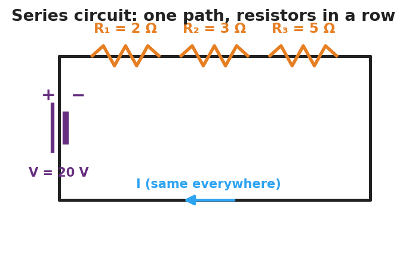
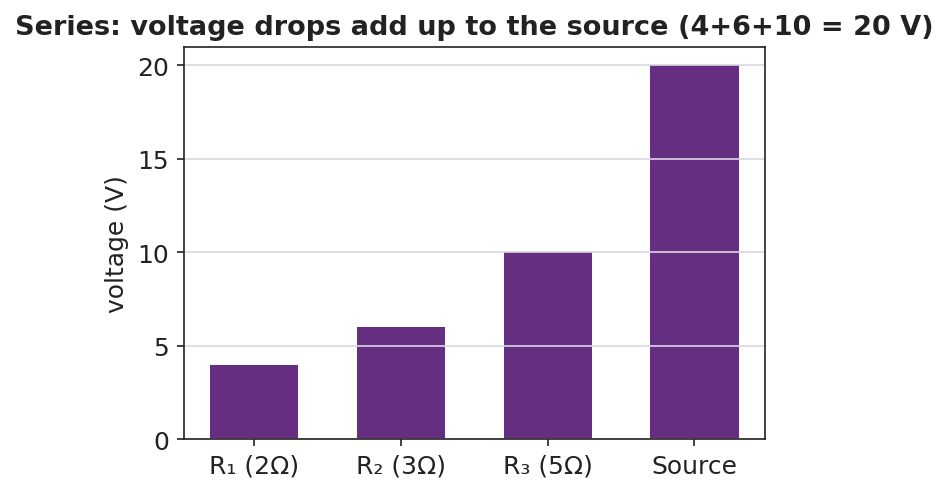

# Series Circuits — Teacher Guide

## Cover

**Unit: Current Electricity — Lesson 03: Series Circuits**
East Meadow Schools × Valley Stream Central High School District
Strategy chips: ACTIVE LEARNING

---

## Curated Resources (from East Meadow Scope & Sequence)

### NYSSLS Standards

This lesson supports **HS-PS3-6**: *"Analyze data to support the claim that Ohm's Law describes the mathematical relationship among the potential difference, current, and resistance of an electric circuit."* Students apply V = I·R to a single-path circuit, discover that resistances add (R_total = R₁ + R₂ + …) and that the same current flows everywhere while voltage drops add up to the source. It extends Lessons 01–02 to multi-resistor circuits.

### Phenomenon

- Old-style holiday light string where removing or burning out one bulb kills the whole string: <https://www.youtube.com/results?search_query=why+do+old+christmas+lights+all+go+out>
- Series-circuit walkthrough (Khan Academy, "Series resistors"): <https://www.khanacademy.org/science/physics/circuits-topic/circuits-resistance/a/ee-series-resistors>

### Javalab / Labs

- PhET Circuit Construction Kit: DC — build a one-loop series circuit with three resistors; measure current at several points and voltage across each resistor: <https://phet.colorado.edu/en/simulations/circuit-construction-kit-dc>

### Assessments

- PhET CCK-DC series data table (I at three points; V across each resistor) — formative during Explore.
- Exit ticket below; full key in `Answer_Key.docx`.

---

## Lesson Overview

| | |
|---|---|
| **Duration** | 42 minutes (1 period) |
| **NYSSLS link** | HS-PS3-6 (core — Ohm's Law in a series path) |
| **CCC focus** | Systems and System Models — a series circuit is one path; what happens at one element constrains the whole system. |
| **Strategy chips** | ACTIVE LEARNING (build-measure-predict at PhET stations) |
| **Materials** | Devices for PhET CCK-DC; whiteboards; calculators; (optional) an old holiday light string and a fresh one for the hook. |
| **Safety** | Low-voltage / simulated circuits only. If using a real light string, keep it unplugged during inspection. |
| **Prior knowledge** | Lessons 01–02 — Ohm's Law V = I·R; resistance and its origins. |

**Lesson objectives — students can:**

- Identify a **series circuit** as a single path and explain why the same **current** flows everywhere in it.
- Compute the **equivalent resistance** of resistors in series (R_total = R₁ + R₂ + …) and use it to find the current.
- Explain why the voltage drops across series resistors add up to the source voltage.

---

## Phase 1 · Engage *(0 – 10 min)*

### 0–2 min · Opening Connection (SEL)

One-sentence whip-around: *"Describe a time when one small thing breaking shut down something much bigger (a group project, a relay race, a recipe)."* Hold the metaphor; a series circuit fails exactly this way.

### 2–7 min · Phenomenon hook — the holiday lights

**Teacher actions.** Show the old light string. Remove (or "burn out") one bulb — the whole string goes dark. Contrast with a modern string where the rest stay lit.

**Sample teacher language:**

> "I pulled out *one* bulb and the entire string died. There are fifty bulbs — why would one missing bulb take down all of them?"

**Anticipated student responses:**

- "It broke the circle." — yes; one path, one break stops everything.
- "They're all connected in a line." — capture "line"; that's *series*.
- "The electricity can't get around the gap." — exactly; no alternate path.

### 7–10 min · Notice & Wonder + Turn-and-Talk #1

> "Turn to your partner: in a single-loop circuit, if you removed one resistor, what happens to the current everywhere else? Use the word *path*."

Target: with only one path, breaking it stops the current everywhere.

### Bridge to Phase 2

Each student writes a one-sentence **initial model**: "One missing bulb kills the whole string because ______."

---

## Phase 2 · Explore *(10 – 30 min)*

### 10–14 min · Initial Model (silent / individual)

Prompt on the board:

> *"Sketch three bulbs wired in a single loop with a battery. Draw one arrow showing the current. Predict: is the current the same at every bulb, or does it shrink as it passes each one?"*

This surfaces the "current gets used up" misconception before measurement.

### 14–30 min · Investigation — PhET CCK-DC series circuit

Students build a battery (20 V) with three resistors (2 Ω, 3 Ω, 5 Ω) in one loop.

1. **Measure current** at three points (before R₁, between R₂ and R₃, after R₃). Is it the same?
2. **Measure voltage** across each resistor; add the three drops.
3. **Remove one resistor** (open the loop) — what happens to the current?

**Teacher facilitation language:**

> "Is the ammeter reading the same at all three spots? What does that tell you about current in a series loop?"
> "Add up the three voltage drops — how does the total compare to the battery's 20 V?"
> "You found R_total. How does it compare to R₁ + R₂ + R₃?"

Use the schematic and the voltage-drop bar chart to consolidate:

### Teacher facilitation during Explore

- **What to look for** — groups stating "the ammeter reads the same everywhere" and "the three drops add to the battery voltage."
- **What to resist** — handing them R_total = ΣR; let them sum the resistors and check against I = V/R_total.
- **What to redirect** — students who think current is consumed: have them re-read all three ammeters aloud (identical).

---

## Phase 3 · Explain *(30 – 36 min)*

### 30–33 min · Turn-and-Talk #2 + class consensus

> "Across your measurements, what three rules describe a series circuit?"

Target consensus:

> "(1) The current is the same everywhere. (2) The total resistance is the sum of the resistors. (3) The voltage drops add up to the source voltage."

### 33–36 min · Vocabulary introduction (≤ 3 terms)

**Sample teacher language:**

> "A circuit with a single path is a **series circuit**. Because there's one path, the **current** is the same at every point. The single resistor that could replace all of them is the **equivalent resistance**: R_total = R₁ + R₂ + R₃. Then the loop current is just I = V ÷ R_total."

Reference relationships to post: **V = I·R**; series **R_total = R₁ + R₂ + …**; power **P = V·I = I²·R**.

### Discussion prompts to deploy here

- "Three 2 Ω resistors are in series with a 12 V battery. What's R_total and the current?"
  - *Sample response:* "R_total = 6 Ω; I = 12/6 = 2 A everywhere."
- "Why do the voltage drops have to add up to the source?"
  - *Sample response:* "All the energy the battery gives each charge is spent crossing the resistors, so the drops total the battery voltage."

---

## Phase 4 · Elaborate *(36 – 40 min)*

### 36–38 min · Apply — add a resistor

> *"You add a fourth resistor in series. Predict what happens to R_total and to the current. Explain in one sentence."*

Target: R_total increases, so the current decreases (same battery, more total resistance).

### 38–40 min · Return to the phenomenon

> "Explain, in one sentence using *series* and *path*, why one missing bulb kills the whole old light string."

Target: "The bulbs are in series — one path — so a missing bulb breaks the only path and stops the current everywhere."

---

## Phase 5 · Evaluate *(40 – 42 min)*

### 40–42 min · Exit Ticket + Closing Reflection

> *"A 24 V battery is connected in series to a 4 Ω and an 8 Ω resistor.
> (a) Find the equivalent (total) resistance.
> (b) Find the current in the circuit.
> (c) Find the voltage drop across the 8 Ω resistor and check that the two drops add to 24 V."*

Expected: (a) R_total = 12 Ω; (b) I = 24/12 = 2 A; (c) V₈ = I·R = 2 × 8 = 16 V; V₄ = 8 V; 16 + 8 = 24 V. See `Answer_Key.docx`.

**Closing Reflection (SEL, 30 seconds):**

> "What's one prediction you made today that the measurements proved wrong — and what changed your mind?"

---

## Common Misconceptions

- **Misconception:** "Current is used up as it passes each resistor." → **Correction:** Current is the same at every point in a series loop; it is the *voltage* (energy per charge) that drops across each resistor.
- **Misconception:** "Adding resistors in series increases the current." → **Correction:** Adding series resistors raises R_total, so the current *decreases* for the same battery.
- **Misconception:** "Each resistor gets the full battery voltage." → **Correction:** The battery voltage is *shared* — the drops across the resistors add up to the source.

---

## Access & Differentiation

- **ELL/ENL supports:** Sentence frames: *"In a series circuit, the current is ___ everywhere."* / *"The total resistance is the ___ of the resistors."* Word box: {same, sum, single path, voltage drops, add}. Color-code the single current path on the schematic.
- **IEP/SPED supports:** Provide a pre-built PhET file and a fill-in table (I at each point, V across each resistor). Give a partly worked R_total = R₁ + R₂ + R₃ template.
- **Extensions:** Have students show algebraically that the voltage drops must add to the source (V = I·R₁ + I·R₂ + I·R₃ = I·R_total) and compute the power dissipated in each resistor (P = I²·R), noting which runs hottest.

---

## Strategy Spotlight

**ACTIVE LEARNING.** Students build, measure, and predict at PhET stations rather than receive the three series rules. Structure each station with a predict → measure → reconcile loop: predict the ammeter reading, take it, then explain any mismatch. The removal-of-a-resistor test is the active hinge — it forces the "one path" idea into the open. Close by having groups post their three-rule consensus and compare.

---

## NYSSLS Observation Checklist Crosswalk

| # | Checklist item | Where it appears in this lesson |
|---|---|---|
| 1 | Local/relatable phenomenon | Phase 1 — old holiday light string |
| 2 | Turn and Talk (2–3×) | Phase 1 (TT#1 — removing a resistor), Phase 3 (TT#2 — three series rules) |
| 3 | Students develop questions/models/procedures | Phase 1 (initial model), Phase 2 (build/measure/predict), Phase 4 (revise) |
| 4 | CCC defined and used | Lesson Overview · *Systems and System Models*, used in Phase 2 |
| 5 | ENL — ≤ 3 vocab, second half | Phase 3 — series circuit / equivalent resistance / current at 33–36 min |
| 6 | Revisit phenomenon with evidence | Phase 4 — why one missing bulb kills the string |
| 7 | ENL/SPED supports | Access & Differentiation block |
| 8 | Assessment check | Phase 5 — series Ohm's-law exit ticket |

---

## Companion Materials

- `Student_Worksheet.docx` — the 5E student investigation (hand out at start of Phase 2)
- `Student_Notes.docx` — guided note-guide for vocabulary and the worked example
- `Answer_Key.docx` — answers to "Make It Make Sense" prompts and the Exit Ticket

---

## Key Vocabulary (max 3)

- **series circuit** — a circuit with a single path for charge, so the current is the same at every point
- **equivalent resistance** — the single resistance that could replace a group of resistors; in series, R_total = R₁ + R₂ + …
- **current** — the rate of flow of charge (amperes); in a series circuit it is identical everywhere in the loop
