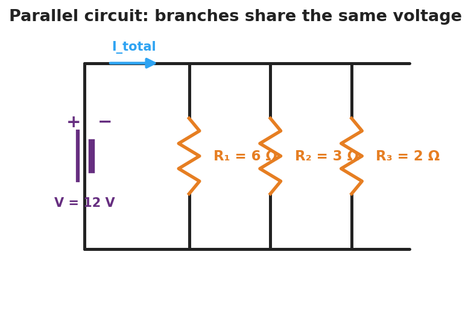
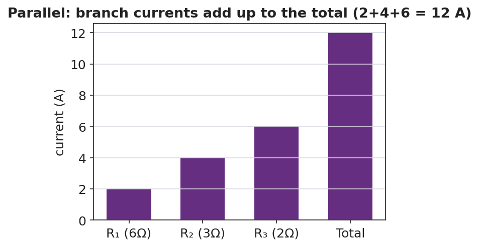

# Parallel Circuits — Student Notes

**Unit: Current Electricity — Lesson 04**
Name: _______________________  Date: __________  Period: ____

---

## Learning Targets

By the end of today's 42 minutes I can:

- Identify a **parallel circuit** and explain why each **branch** has the same voltage.
- Explain why branch currents add to the total and why one branch can fail while others stay on.
- Compute the **equivalent resistance** in parallel (1/R_total = 1/R₁ + 1/R₂ + …) and find branch currents.

---

## Key Vocabulary

- **parallel circuit** — _______________________________________________
- **branch** — _______________________________________________
- **equivalent resistance** — _______________________________________________

---

## Guided Notes

**A parallel circuit has more than one __________ for charge.** Because each branch connects to the same two points:

- The **voltage** across every branch is the __________ (the full source voltage).
- The branch currents __________ up to the total current in the main wire.
- The equivalent resistance combines as reciprocals:
  > **1 / R_total = 1/R₁ + 1/R₂ + 1/R₃ + …**
- R_total comes out __________ than any single branch (more paths = easier flow).
- Opening one branch leaves the other branches __________.

**Finding branch currents.** Each branch follows Ohm's Law with the full voltage:
> I_branch = V ÷ R_branch     then add them for the total.

**Branch currents add to the total:**

Reference: **V = I·R** · parallel **1/R_total = 1/R₁ + 1/R₂ + …** · power **P = V·I = I²·R**

---

## Worked Example

**Problem.** A 12 V battery has three parallel branches: R₁ = 6 Ω, R₂ = 3 Ω, R₃ = 2 Ω. (a) Voltage across each branch? (b) Current in each branch? (c) Total current and equivalent resistance.

**Solution.**
1. Each branch has the full __________ V across it.
2. Branch currents (I = V/R): I₁ = 12/6 = __________ A; I₂ = 12/3 = __________ A; I₃ = 12/2 = __________ A.
3. Total current = 2 + 4 + 6 = __________ A.
   Equivalent resistance: R_total = V ÷ I_total = 12 ÷ 12 = __________ Ω — note it's smaller than the 2 Ω branch.

---

## Summary

Finish the sentence (Because / But / So):

> Unplugging one lamp leaves the others lit
> because __________________________________________,
> but __________________________________________,
> so __________________________________________.
