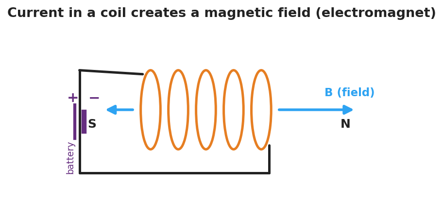
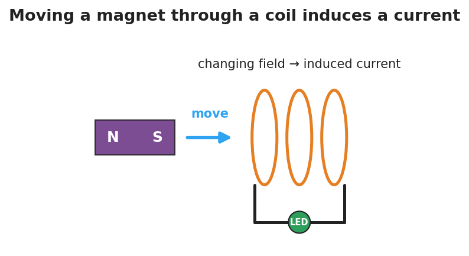

# Electromagnetism: The Induction Junction — Student Worksheet

**Unit: Current Electricity — Lesson 05**
Name: _______________________  Date: __________  Period: ____

---

## Phenomenon

A magnet held still inside a coil of wire does nothing. But *move* the magnet in and out, and an LED in the circuit flashes. Across the room, a coil wrapped around a nail picks up paperclips — but only while a battery is connected.

**Driving question:** What is the two-way connection between electric current and magnetism?

---

## Notice & Wonder

| I notice… | I wonder… |
|---|---|
|  |  |
|  |  |
|  |  |

**Turn & Talk #1:** What do the LED demo and the paperclip demo have in common? Use the words *magnetic field*.

> _______________________________________________

---

## Initial Model

Draw the coil with the magnet inside it and the LED in the loop. Mark when the LED is **ON**. Predict: does it matter how *fast* you move the magnet? What happens if you stop?

> _______________________________________________
> My prediction: _______________________________

---

## Investigation

Hands-on station + Javalab/PhET simulation.

**Part A — Electromagnet.** Connect the nail-coil to the battery and count paperclips lifted. Then add more coil turns or a second battery.

| Setup | Paperclips lifted |
|---|---|
| Battery + coil |  |
| More turns / more current |  |

What makes the electromagnet stronger?

> _______________________________________________

**Part B — Induction.** Move the magnet through the coil at different speeds and record the LED.

| Magnet action | LED (off / dim / bright) |
|---|---|
| Held still inside coil |  |
| Moved slowly |  |
| Moved quickly |  |
| Pulled back out |  |

**Part C — Reverse.** When you pull the magnet out instead of pushing it in, what happens to the current direction (which LED lead lights / which way the needle moves)?

> _______________________________________________

**Key question:** Under what condition does the coil have an induced current? What makes that current bigger?

> _______________________________________________

---

## Make It Make Sense

1. A current flows through a coil of wire. What forms around the coil, and what is the coil now acting like?
2. A magnet is held perfectly still inside a coil connected to an LED. Is there an induced current? Explain.
3. A hand-crank flashlight has no battery. Explain where the light's energy comes from, using *electromagnetic induction*.

---

## Vocabulary in Action

Use each term in a sentence about today's phenomenon.

- **magnetic field:** _______________________________________________
- **electromagnet:** _______________________________________________
- **electromagnetic induction:** _______________________________________________

---

## Revise Your Model

Return to your Initial Model. Did the speed of the magnet matter? Rewrite your explanation for why the LED only lights while the magnet *moves*, using *electromagnetic induction*.

> _______________________________________________
> _______________________________________________

---

## Exit Ticket

(a) A current flows through a coil of wire. What does it create around the coil?

(b) A magnet is held perfectly still inside a coil connected to an LED. Is there an induced current? Why or why not?

(c) Name one device that uses electromagnetic induction to generate electricity, and explain in one sentence where the energy comes from.
