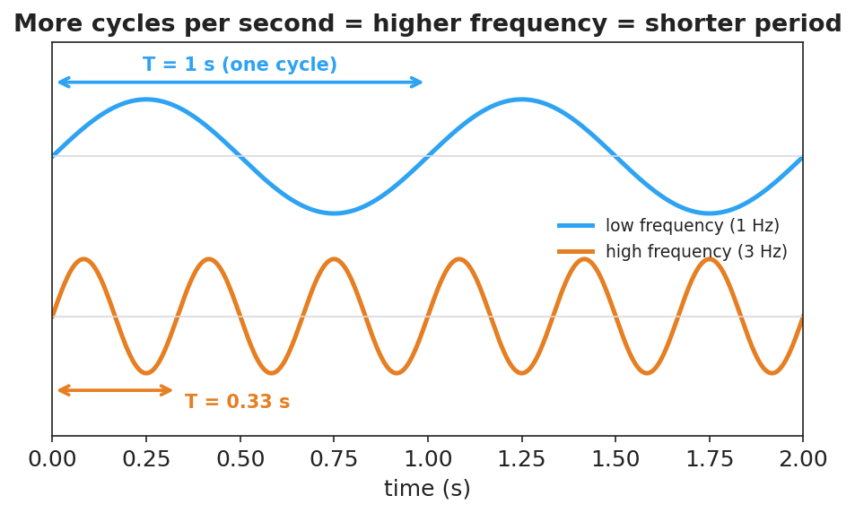

# Wave Anatomy and Characteristics — Student Notes

**Unit: Waves — Lesson 01**
Name: _______________________  Date: __________  Period: ____

---

## Learning Targets

By the end of today's 42 minutes I can:

- Label the parts of a wave: crest, trough, **amplitude**, and **wavelength**.
- Tell the difference between **frequency** (cycles per second) and period, and use T = 1/f.
- Explain that a wave transfers energy, not matter.

---

## Key Vocabulary

- **amplitude** — _______________________________________________
- **wavelength** — _______________________________________________
- **frequency** — _______________________________________________

---

## Guided Notes

**Big idea:** A wave is a __________ that carries __________ from one place to another. The matter it passes through only __________ in place — it does **not** travel with the wave.

Label the wave below:

- **Crest** — the __________ point of the wave.
- **Trough** — the __________ point of the wave.
- **Amplitude** — distance from rest to a crest; more amplitude → more __________.
- **Wavelength (λ)** — distance from one crest to the __________ crest.

**Frequency and period.**

- **Frequency (f)** = number of cycles per __________, measured in __________ (Hz).
- **Period (T)** = time for __________ complete cycle, in seconds.
- They are reciprocals:  T = 1 / __________   and   f = 1 / __________.

More cycles per second → __________ frequency → __________ period.

---

## Worked Example

**Problem.** A wave passes a dock and a seagull bobs up and down 20 times in 4 seconds. Find the frequency and the period.

**Solution.**
1. Frequency: f = cycles ÷ time = 20 ÷ 4 = __________ Hz.
2. Period: T = 1 / f = 1 / __________ = __________ s per cycle.
3. Check: 5 cycles each second × 4 seconds = __________ cycles. ✓

---

## Summary

Finish the sentence (Because / But / So):

> A wave travels across a slinky
> because __________________________________________,
> but __________________________________________,
> so __________________________________________.
