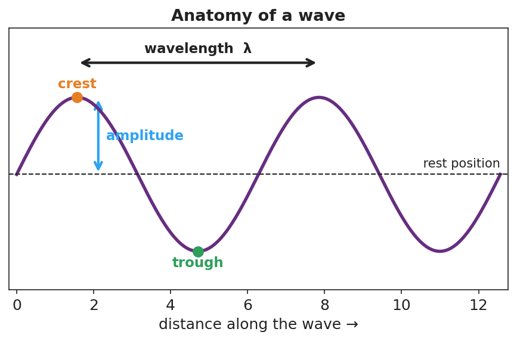

# Wave Anatomy and Characteristics — Student Worksheet

**Unit: Waves — Lesson 01**
Name: _______________________  Date: __________  Period: ____

---

## Phenomenon

A "wave" travels all the way around a packed stadium — but every single fan stays in their own seat, just raising and lowering their arms. On the front bench, a slinky pulse races from one end to the other, yet each coil only jiggles in place.

**Driving question:** When a wave travels, what actually moves — and what stays put?

---

## Notice & Wonder

| I notice… | I wonder… |
|---|---|
|  |  |
|  |  |
|  |  |

**Turn & Talk #1:** What actually traveled around the stadium, and what stayed put? Use the word *energy* in your answer.

> _______________________________________________

---

## Initial Model

Draw the slinky at one instant as a wave passes. Mark a high point and a low point. Draw one arrow for the direction the **wave** moves, and a second arrow for the direction a **single coil** moves.

> _______________________________________________
> Are the two arrows the same direction? _______________________

---

## Investigation

Open PhET *Wave on a String* and keep a slinky handy. Tie a ribbon to one slinky coil.

| Station | What I changed | What happened to the wave | What happened to the ribbon / tagged point |
|---|---|---|---|
| 1. Amplitude (oscillator height) |  |  |  |
| 2. Frequency (oscillator speed) |  |  |  |
| 3. Energy, not matter (tag one point) |  |  |  |

Use this labeled wave to name the parts you measured:

**Key question:** Did the ribbon (a piece of matter) travel down the slinky, or move in place? What does that tell you about what a wave transports?

> _______________________________________________

---

## Make It Make Sense

1. On the wave diagram above, which measurement tells you how much **energy** the wave carries? Explain.
2. A wave's frequency is 5 Hz. What is its period? Show the formula you used.
3. Two ocean waves have the same speed, but Wave A has a larger amplitude than Wave B. Which carries more energy? Does it travel faster? Explain.

---

## Vocabulary in Action

Use each term in a sentence about today's phenomenon.

- **amplitude:** _______________________________________________
- **wavelength:** _______________________________________________
- **frequency:** _______________________________________________

---

## Revise Your Model

Return to your Initial Model. Label the crest, trough, amplitude, and one wavelength. Rewrite your explanation using the words *energy*, *amplitude*, and *wavelength*.

> _______________________________________________
> _______________________________________________

---

## Exit Ticket

A buoy bobs up and down 12 times in 6 seconds as ocean waves pass.

(a) What is the frequency of the waves?

(b) What is the period?

(c) Does the water itself travel toward the shore with the wave? Explain in one sentence.
