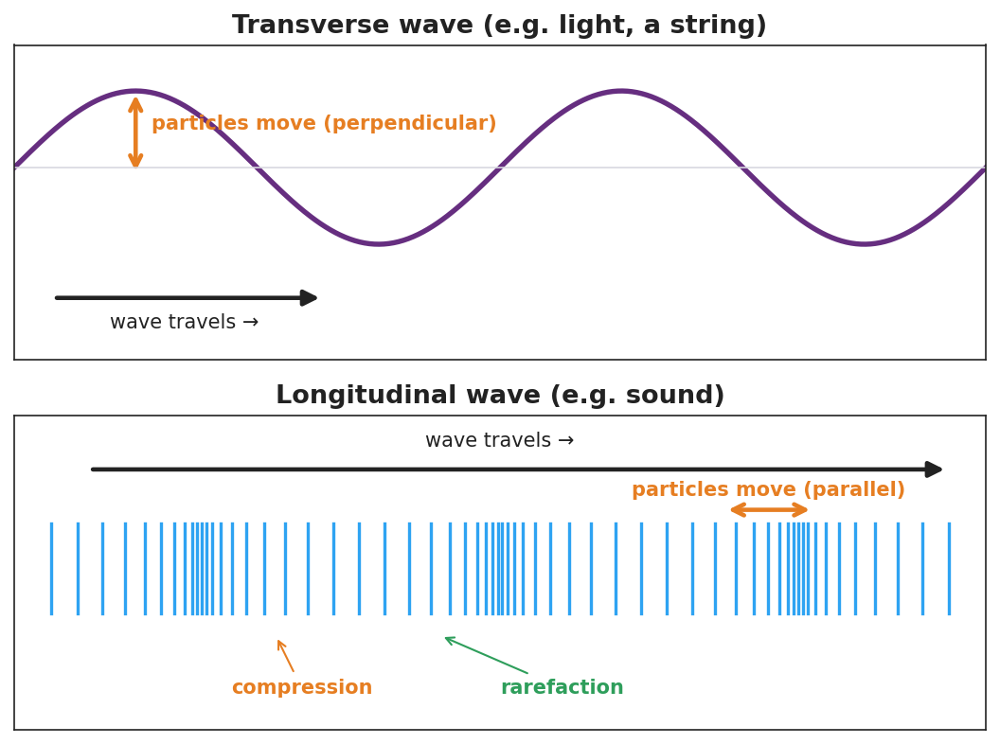

# Transverse and Longitudinal Waves — Student Worksheet

**Unit: Waves — Lesson 02**
Name: _______________________  Date: __________  Period: ____

---

## Phenomenon

Your teacher takes one slinky and makes two completely different-looking waves with it. First they shake the end **side to side** — a wiggle travels across the room. Then they **push and pull** the same end along its length — a squeeze races down the coils. Same slinky, same energy. Two different waves.

**Driving question:** What did the teacher change about *how* they moved their hand to make two different wave types?

---

## Notice & Wonder

| I notice… | I wonder… |
|---|---|
|  |  |
|  |  |
|  |  |

**Turn & Talk #1:** In each case, which way did a single coil move compared to the way the wave traveled?

> _______________________________________________

---

## Initial Model

Draw both slinky waves. For each, draw one arrow for the **wave's travel** direction and one arrow for how a **single coil** moves. Circle the case where the two arrows are perpendicular.

> _______________________________________________
> _______________________________________________

---

## Investigation

Work in a group of 4 with a slinky and the Javalab simulation. Tape a ribbon to one coil.

| Station | What I did | Did the ribbon travel or move in place? | Coil motion vs. wave travel |
|---|---|---|---|
| 1. Side-to-side slinky |  |  |  |
| 2. Push-pull slinky |  |  |  |
| 3. Human wave (step / lean) |  |  |  |
| 4. Javalab tag-a-particle |  |  |  |

Compare your two waves to this diagram:

**Key question:** Which station moved your body *across* the wave's travel, and which moved it *along* the travel? Which one is like sound?

> _______________________________________________

---

## Make It Make Sense

1. Light is a transverse wave. Describe how the wave "oscillates" compared to the direction the light travels.
2. Sound is a longitudinal wave. Why does it need a medium (air, water, or a solid) to travel?
3. A wave on a guitar string — transverse or longitudinal? Justify your answer with the direction the string moves.

---

## Vocabulary in Action

Use each term in a sentence about today's phenomenon.

- **transverse wave:** _______________________________________________
- **longitudinal wave:** _______________________________________________
- **medium:** _______________________________________________

---

## Revise Your Model

Return to your two slinky drawings. Label one *transverse* and one *longitudinal*. On the longitudinal one, mark a **compression** and a **rarefaction**. Rewrite your rule using both vocabulary words.

> _______________________________________________
> _______________________________________________

---

## Exit Ticket

A sound wave travels through air toward your ear.

(a) Is sound a transverse or longitudinal wave?

(b) Describe how the air molecules move compared to the direction the sound travels.

(c) Name the bunched-up regions and the spread-out regions of a sound wave.
