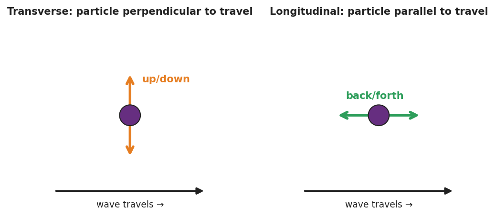

# Transverse and Longitudinal Waves — Teacher Guide

## Cover

**Unit: Waves — Lesson 02: Transverse and Longitudinal Waves**
East Meadow Schools × Valley Stream Central High School District
Strategy chips: ACTIVE LEARNING

---

## Curated Resources (from East Meadow Scope & Sequence)

### NYSSLS Standards

**HS-PS4-1.** "Use mathematical representations to support a claim regarding relationships among the frequency, wavelength, and speed of waves traveling in various media. *(Cause and Effect)*"

Sorting waves into **transverse** and **longitudinal** types lets students see that the *same* relationships (amplitude, wavelength, frequency, v = f·λ) apply to both light (transverse) and sound (longitudinal). The wave type is a property of the medium and the disturbance — a Cause-and-Effect link the unit returns to in the EM spectrum (Lesson 07) and refraction (Lesson 08).

### Phenomenon

- A long slinky shaken **side-to-side** makes a wave you can see wiggling across the room; the same slinky **pushed and pulled** along its length makes a compression pulse race down it: <https://www.youtube.com/watch?v=Rbuhdo0AZDU>

### Javalab / Labs

- Javalab *Transverse and Longitudinal Waves* — animated side-by-side particle motion: <https://javalab.org/en/transverse_longitudinal_wave_en/>

### Assessments

- Javalab "tag a particle" check: students predict whether the tagged dot moves across the screen or oscillates in place, for each wave type. Exit ticket below serves as the formative check.

---

## Lesson Overview

| | |
|---|---|
| **Duration** | 42 minutes (1 period) |
| **NYSSLS link** | HS-PS4-1 (wave types; both obey v = f·λ) |
| **CCC focus** | Cause and Effect — *how* you disturb the medium (across vs. along) *causes* the two different wave types. |
| **Strategy chips** | ACTIVE LEARNING |
| **Materials** | Long slinky (one per group of 4); tape ribbons; Javalab on devices; whiteboards. |
| **Safety** | Keep slinky ends held; never release a stretched slinky. |
| **Prior knowledge** | Lesson 01 — crest, trough, amplitude, wavelength; energy travels, matter does not. |

**Lesson objectives — students can:**

- Describe how the medium oscillates relative to the direction the wave travels.
- Classify a wave as **transverse** (oscillation perpendicular to travel) or **longitudinal** (oscillation parallel to travel) and give an example of each.
- Identify compressions and rarefactions in a longitudinal wave such as sound.

---

## Phase 1 · Engage *(0 – 12 min)*

### 0–3 min · Opening Connection (SEL)

Quick check-in: *"Show me with your hand: are you feeling more like a side-to-side day or a steady-straight-ahead day?"* One gesture each. This primes the two motions you'll formalize as transverse vs. longitudinal.

### 3–8 min · Phenomenon hook — one slinky, two waves

**Teacher actions.** Stretch a slinky across the front. First shake one end **side to side** — students see a transverse wiggle. Then **push and pull** the same end along its length — students see a compression pulse sprint down it. Same slinky, same energy idea, two very different looks.

**Sample teacher language:**

> "Same slinky, same person, same energy — but two completely different-looking waves. What did I change about *how* I moved my hand?"

**Anticipated student responses:**

- "You shook it sideways the first time, in-and-out the second." — exactly; capture the two hand motions.
- "The second one looks like it's squishing." — affirm; we'll name compressions.
- "They both still went down the slinky." — yes — energy travels both times.

### 8–12 min · Notice & Wonder + Turn-and-Talk #1

Capture two columns. Then:

> "Turn to your partner: in each case, which way did a single coil move compared to the way the wave traveled?"

Target insight: in the first wave the coil moved *across* the travel direction; in the second it moved *along* it.

### Bridge to Phase 2

Every student leaves with a one-sentence **initial model**: "The two waves were different because the coils moved ______ vs. ______ the direction the wave traveled."

---

## Phase 2 · Explore *(12 – 32 min)*

### 12–17 min · Initial Model (silent / individual)

Prompt:

> *"Draw both slinky waves. For each, draw one arrow for the wave's travel direction and one arrow for how a single coil moves. Circle the case where the two arrows are perpendicular."*

### 17–32 min · Investigation — ACTIVE LEARNING: be the wave

Groups of 4. Each group has a slinky and a device with the Javalab sim.

1. **Build a transverse wave.** Tape a ribbon to one coil. Shake side to side. Track the ribbon: does it travel along the slinky or move across, in place?
2. **Build a longitudinal wave.** Push/pull along the length. Find where coils bunch (compression) and spread (rarefaction). Track the ribbon again.
3. **Human wave (kinesthetic).** Line up shoulder-to-shoulder. For transverse, each person steps left/right as the "wave" passes; for longitudinal, each leans forward/back (toward/away from neighbors). Which one looks like sound?
4. **Javalab check.** Tag a particle in each animation. Confirm your slinky observations.

Use this figure to compare what each group is building:

This second figure isolates the single-particle motion students should track at each station — up/down (perpendicular) for transverse, back/forth (parallel) for longitudinal:

### Teacher facilitation during Explore

- **What to look for** — groups stating the *relationship* between oscillation and travel, not just "sideways" vs. "in-out."
- **What to resist** — don't supply the words transverse/longitudinal yet; let "perpendicular" and "parallel" emerge from the ribbon tracking.
- **What to redirect** — students who say the longitudinal coil "travels down the slinky" should re-tag the ribbon and watch it return.

---

## Phase 3 · Explain *(32 – 37 min)*

### 32–35 min · Turn-and-Talk #2 + class consensus

> "What is the rule that separates the two wave types?"

Target consensus:

> "If the medium oscillates *across* (perpendicular to) the direction of travel, it's one type. If it oscillates *along* (parallel to) the direction of travel, it's the other."

### 35–37 min · Vocabulary introduction (≤ 3 terms)

**Sample teacher language:**

> "When the particles move perpendicular to the wave's travel — like the sideways slinky and like light — we call it a **transverse wave**. When they move parallel to the travel — like the push-pull slinky and like sound — it's a **longitudinal wave**, with **compressions** (bunched) and **rarefactions** (spread out). The stuff the wave travels through is the **medium**."

### Discussion prompts to deploy here

- "Sound needs air, water, or a solid to travel. Which wave type is sound, and why does it need a medium?"
  - *Sample student response:* "Longitudinal — the particles have to push on the next ones, so it needs matter to push."
- "A wave on a guitar string — transverse or longitudinal?"
  - *Sample student response:* "Transverse — the string moves up and down while the wave travels along its length."

---

## Phase 4 · Elaborate *(37 – 40 min)*

### 37–39 min · Revise the model

> *"Return to your two slinky drawings. Label one *transverse* and one *longitudinal*. On the longitudinal one, mark a compression and a rarefaction. Re-write your one-sentence rule using both vocabulary words."*

### 39–40 min · Return to the phenomenon

> "If a friend asks why the side-to-side slinky and the push-pull slinky look so different, what's your one-sentence answer using *transverse* and *longitudinal*?"

Target: "They're different wave types — the side-to-side one is transverse (medium moves perpendicular to travel) and the push-pull one is longitudinal (medium moves parallel to travel)."

---

## Phase 5 · Evaluate *(40 – 42 min)*

### 40–42 min · Exit Ticket + Closing Reflection

> *"A sound wave travels through air toward your ear.
> (a) Is sound a transverse or longitudinal wave?
> (b) Describe how the air molecules move compared to the direction the sound travels.
> (c) Name the bunched-up regions and the spread-out regions of a sound wave."*

Expected: (a) longitudinal; (b) molecules move back-and-forth parallel to the travel direction; (c) compressions (bunched) and rarefactions (spread out). See `Answer_Key.docx`.

**Closing Reflection (SEL, 30 seconds):**

> "Which hands-on station made the idea click for you, and who in your group made it work?"

---

## Common Misconceptions

- **Misconception:** "In a longitudinal wave the particles travel all the way down with the wave." → **Correction:** They oscillate back and forth in place; only the compression pattern (energy) travels.
- **Misconception:** "All waves are S-shaped like the ones in pictures." → **Correction:** That picture fits transverse waves; longitudinal waves are compressions and rarefactions, often *drawn* as a sine of density but physically a push-pull.
- **Misconception:** "Sound can travel through empty space like light." → **Correction:** Sound is longitudinal and needs a medium to push through; space is a near-vacuum, so sound cannot travel there.

---

## Access & Differentiation

- **ELL/ENL supports:** Sentence frame: *"In a ______ wave the medium moves ______ to the direction the wave travels."* Word-choice box: {transverse, longitudinal, perpendicular, parallel, compression, rarefaction, medium}. Pair *perpendicular* and *parallel* with crossed-arm and aligned-arm gestures.
- **IEP/SPED supports:** Provide a two-column sort with pre-printed examples (light, sound, guitar string, slinky push-pull); students place each under "transverse" or "longitudinal." Use the human-wave station as a movement-based alternative to writing.
- **Extensions:** Earthquake waves — research P-waves (longitudinal) vs. S-waves (transverse) and explain why S-waves cannot pass through Earth's liquid outer core.

---

## Strategy Spotlight

**ACTIVE LEARNING.** Students physically *build* both wave types with a slinky and with their own bodies (the human-wave station) before any term is named. The kinesthetic memory ("I stepped sideways" vs. "I leaned forward and back") becomes the anchor for transverse vs. longitudinal. Facilitate by circulating with one question — *"Which way did your body move compared to the wave?"* — and resist naming the terms until Phase 3.

---

## NYSSLS Observation Checklist Crosswalk

| # | Checklist item | Where it appears in this lesson |
|---|---|---|
| 1 | Local/relatable phenomenon | Phase 1 — one slinky, two waves; sound in Phase 5 |
| 2 | Turn and Talk (2–3×) | Phase 1 (TT#1 — coil vs. travel direction), Phase 3 (TT#2 — the rule) |
| 3 | Students develop questions/models/procedures | Phase 1 (initial model), Phase 2 (slinky + human-wave + Javalab), Phase 4 (revise) |
| 4 | CCC defined and used | Lesson Overview · *Cause and Effect*, restated in Phase 2 |
| 5 | ENL — ≤ 3 vocab, second half | Phase 3 — vocabulary at 35–37 min (transverse / longitudinal / medium) |
| 6 | Revisit phenomenon with evidence | Phase 4 — label and explain the two slinky waves |
| 7 | ENL/SPED supports | Access & Differentiation block |
| 8 | Assessment check | Phase 5 — Exit Ticket (sound in air) |

---

## Companion Materials

- `Student_Worksheet.docx` — the 5E student investigation (hand out at start of Phase 2)
- `Student_Notes.docx` — guided note-guide for vocabulary and the worked example
- `Answer_Key.docx` — answers to "Make It Make Sense" prompts and the Exit Ticket

---

## Key Vocabulary (max 3)

- **transverse wave** — a wave in which the medium oscillates perpendicular to the direction the wave travels (e.g., light, a wave on a string)
- **longitudinal wave** — a wave in which the medium oscillates parallel to the direction the wave travels, forming compressions and rarefactions (e.g., sound)
- **medium** — the matter (solid, liquid, or gas) through which a mechanical wave travels
