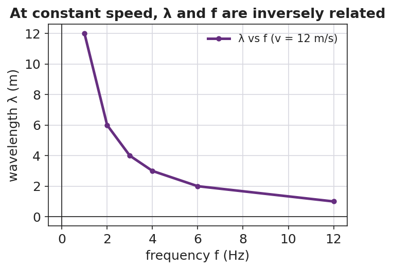
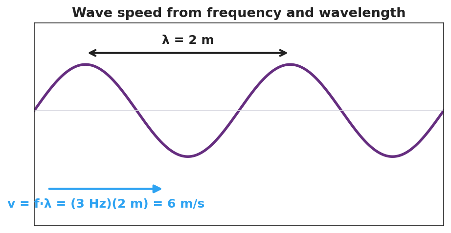

# Wave Speed, Frequency, and Wavelength — Student Notes

**Unit: Waves — Lesson 03**
Name: _______________________  Date: __________  Period: ____

---

## Learning Targets

By the end of today's 42 minutes I can:

- Use **v = f·λ** to solve for speed, frequency, or wavelength.
- Explain why, in a given medium, frequency and wavelength are inversely related.
- Convert between period and frequency with T = 1/f.

---

## Key Vocabulary

- **wave speed** — _______________________________________________
- **period** — _______________________________________________
- **hertz** — _______________________________________________

---

## Guided Notes

**The wave equation:**  v = f · λ

- v = wave __________ (m/s)
- f = __________ (Hz)
- λ = __________ (m)

**Big idea.** In a given medium the wave speed is __________ (set by the medium). So if the source raises the frequency, the wavelength must go __________ to keep the product the same.

- Higher frequency → __________ wavelength (inverse).
- The product f·λ always equals the __________.

**Period and frequency** are reciprocals:

- T = 1 / __________   and   f = 1 / __________.

---

## Worked Example

**Problem.** A wave travels at 6 m/s. Its frequency is 3 Hz. (a) Find the wavelength. (b) Find the period.

**Solution.**
1. Rearrange v = f·λ for wavelength: λ = v / f = 6 / 3 = __________ m.
2. Period: T = 1 / f = 1 / 3 = __________ s (about 0.33 s).
3. Check with v = f·λ: (3 Hz)(2 m) = __________ m/s. ✓

---

## Summary

Finish the sentence (Because / But / So):

> In one medium the wave speed stays the same
> because __________________________________________,
> but __________________________________________,
> so __________________________________________.
