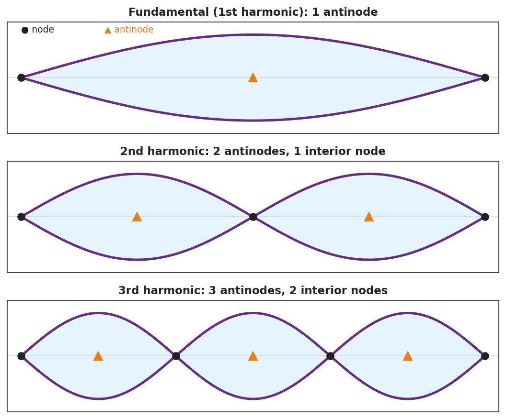
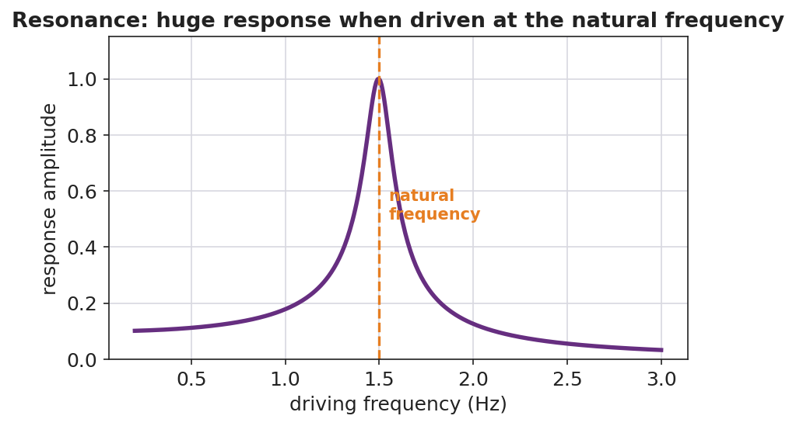

# Standing Waves and Resonance — Teacher Guide

## Cover

**Unit: Waves — Lesson 04: Standing Waves and Resonance**
East Meadow Schools × Valley Stream Central High School District
Strategy chips: ACTIVE LEARNING

---

## Curated Resources (from East Meadow Scope & Sequence)

### NYSSLS Standards

**HS-PS4-1.** "Use mathematical representations to support a claim regarding relationships among the frequency, wavelength, and speed of waves traveling in various media. *(Cause and Effect)*"

Standing waves are a direct consequence of v = f·λ on a bounded medium: only certain wavelengths (and therefore certain frequencies) "fit" between the fixed ends, producing the harmonic series. **Resonance** is the Cause-and-Effect link — driving a system at one of its natural frequencies causes a large-amplitude response.

### Phenomenon

- A standing wave on a vibrating string (Melde's experiment) and a "musical fire table" (a Rubens' tube) showing standing sound waves: <https://www.youtube.com/watch?v=PHRO_d0M5wo>
- An opera singer shattering a wine glass by matching its resonant frequency: <https://www.youtube.com/watch?v=BE827gwnnk4>

### Javalab / Labs

- Javalab *Standing Wave* — drive a fixed-end string and watch nodes and antinodes form at the natural frequencies: <https://javalab.org/en/standing_wave_en/>

### Assessments

- Javalab "find the harmonics" task: students sweep the driving frequency to locate the first three standing-wave patterns and count nodes/antinodes. Exit ticket below serves as the formative check.

---

## Lesson Overview

| | |
|---|---|
| **Duration** | 42 minutes (1 period) |
| **NYSSLS link** | HS-PS4-1 (which wavelengths "fit"; resonance) |
| **CCC focus** | Cause and Effect — driving a bounded medium at a *natural frequency* causes a large, stable standing-wave pattern. |
| **Strategy chips** | ACTIVE LEARNING |
| **Materials** | Long elastic cords or strings (one per group); a function generator/string vibrator OR a hand-shaken rope; tuning forks; a wine glass + dampened finger (demo); devices for Javalab. |
| **Safety** | Eye protection if doing a real glass-shatter demo; otherwise show the video. |
| **Prior knowledge** | Lessons 01–03 — wavelength, frequency, v = f·λ; reflection of a wave at a fixed end. |

**Lesson objectives — students can:**

- Explain that a standing wave forms when a wave interferes with its own reflection, creating fixed nodes and antinodes.
- Identify nodes (no motion) and antinodes (maximum motion) and count them for the first few harmonics.
- Explain resonance: a large response occurs when a system is driven at one of its natural frequencies.

---

## Phase 1 · Engage *(0 – 12 min)*

### 0–3 min · Opening Connection (SEL)

Quick check-in: *"Name something that 'clicks' for you when the timing is just right — a song, a sport, a routine."* One sentence each. This previews resonance: the right timing produces a big effect.

### 3–8 min · Phenomenon hook — the glass and the string

**Teacher actions.** Play the wine-glass shatter clip, then shake a rope at increasing speed until a clean standing-wave loop snaps into place. Most frequencies make a messy rope; one special frequency makes a clean, big, *standing* pattern.

**Sample teacher language:**

> "Most of the time the rope just looks chaotic. But at one special speed of my hand, it locks into this beautiful, big, still-looking pattern. What's special about *that* frequency?"

**Anticipated student responses:**

- "It looks like it's standing still." — capture *standing*; the loops stay in place.
- "You hit the right rhythm." — affirm; that's resonance in everyday words.
- "The wave bounced back and added to itself." — excellent; this is the mechanism.

### 8–12 min · Notice & Wonder + Turn-and-Talk #1

Capture columns. Then:

> "Turn to your partner: where on the rope is there no motion at all, and where is the motion biggest?"

Target: there are points that never move (future nodes) and points that swing the most (future antinodes).

### Bridge to Phase 2

Initial model sentence: "A clean, big rope pattern formed because the wave and its ______ added together at just the right ______."

---

## Phase 2 · Explore *(12 – 32 min)*

### 12–17 min · Initial Model (silent / individual)

Prompt:

> *"Sketch the rope at the special frequency. Mark with an X every point that does not move, and with a star every point that moves the most. Predict what happens to the number of loops if you shake faster."*

### 17–32 min · Investigation — ACTIVE LEARNING: hunt the harmonics

Groups of 3–4, each with a string/cord (one end fixed or held, the other shaken or driven) and Javalab open:

1. **Find the fundamental.** Shake slowly and increase frequency until **one** clean loop appears. Mark the still points and the big-swing point.
2. **Climb the series.** Keep increasing frequency. Catch the 2-loop pattern, then the 3-loop pattern. Record how many nodes and antinodes each has.
3. **Off-resonance test.** Set a frequency *between* two harmonics. What does the rope do? (Messy, small.)
4. **Javalab confirm.** Reproduce the first three harmonics in the sim; count nodes/antinodes.

Use this figure to compare each group's harmonics:

The resonance curve below explains *why* only the off-resonance test (step 3) gives a small, messy response — amplitude spikes sharply only at the natural frequency:

### Teacher facilitation during Explore

- **What to look for** — groups connecting "only certain hand-speeds work" to "only certain wavelengths fit between the ends."
- **What to resist** — don't name node/antinode/resonance yet; let "still point" and "big-swing point" and "the right speed" emerge.
- **What to redirect** — students who think the pattern travels should be asked, "do the loops move along the rope, or stay in place?"

---

## Phase 3 · Explain *(32 – 37 min)*

### 32–35 min · Turn-and-Talk #2 + class consensus

> "Why does only the *right* frequency make a clean, standing pattern?"

Target consensus:

> "The wave reflects off the fixed end and travels back. At certain frequencies the returning wave lines up with the new wave so they always add the same way, creating a pattern that stays in place with fixed still points and big-swing points."

### 35–37 min · Vocabulary introduction (≤ 3 terms)

**Sample teacher language:**

> "A pattern that stays in place from a wave interfering with its own reflection is a **standing wave**. The points that never move are **nodes**; the points of maximum motion are antinodes. And when you drive a system at one of its natural frequencies and get this big response, that's **resonance** — exactly how the opera singer shattered the glass."

### Discussion prompts to deploy here

- "How many nodes does the 3rd harmonic have between the two ends?"
  - *Sample student response:* "Two interior nodes (plus the two fixed ends)."
- "Why did the glass shatter only at one pitch?"
  - *Sample student response:* "That pitch matched the glass's natural frequency — resonance built the vibration up until it broke."

---

## Phase 4 · Elaborate *(37 – 40 min)*

### 37–39 min · Revise the model

> *"Return to your rope sketch. Re-label the X's as *nodes* and the stars as *antinodes*. Add a one-sentence definition of resonance using the word natural frequency."*

### 39–40 min · Return to the phenomenon

> "Explain to a peer, in one sentence, why pushing a swing at just the right rhythm makes it go higher — and connect it to the rope and the glass."

Target: "Pushing at the swing's natural frequency is resonance, the same reason the rope locks into a standing wave and the glass shatters — driving at the natural frequency builds a large response."

---

## Phase 5 · Evaluate *(40 – 42 min)*

### 40–42 min · Exit Ticket + Closing Reflection

> *"A standing wave on a string shows 2 full loops between the fixed ends.
> (a) How many nodes are there in total (including the ends)? How many antinodes?
> (b) Define resonance in one sentence.
> (c) A bridge can sway dangerously if wind or marching feet hit a certain frequency. Which idea from today explains this?"*

Expected: (a) 3 nodes (two ends + one middle), 2 antinodes; (b) resonance = large-amplitude response when a system is driven at its natural frequency; (c) resonance. See `Answer_Key.docx`.

**Closing Reflection (SEL, 30 seconds):**

> "When did your group hit 'resonance' today — a moment where everything clicked? What made it work?"

---

## Common Misconceptions

- **Misconception:** "A standing wave is not really moving." → **Correction:** It is two waves moving in opposite directions; the *pattern* of nodes/antinodes stays fixed while the medium still oscillates.
- **Misconception:** "Any frequency makes a standing wave." → **Correction:** Only the natural frequencies (where reflections line up) produce standing waves; other frequencies give a messy, small response.
- **Misconception:** "Resonance is just 'loud.'" → **Correction:** Resonance is a *large-amplitude* response that occurs specifically when the driving frequency matches a natural frequency.

---

## Access & Differentiation

- **ELL/ENL supports:** Sentence frame: *"A node is a point that ______; an antinode is a point that ______. Resonance happens when the driving frequency ______ a natural frequency."* Word-choice box: {never moves, moves the most, matches, standing wave}. Pair *node* with a closed fist (no motion) and *antinode* with a wide wave of the hand.
- **IEP/SPED supports:** Provide the harmonics figure with blanks; students label N (node) and A (antinode) rather than drawing. Offer the hand-shaken rope as a tactile alternative to the function generator.
- **Extensions:** For a fixed-fixed string of length L, the fundamental wavelength is 2L. Have students predict the wavelengths of the 2nd and 3rd harmonics (L and 2L/3) and use v = f·λ to relate the harmonic frequencies.

---

## Strategy Spotlight

**ACTIVE LEARNING.** Students physically sweep the driving frequency and "catch" each harmonic, marking the still points and big-swing points with their own hands before the words *node*, *antinode*, and *resonance* are introduced. The act of hunting — most frequencies fail, a few succeed — builds an intuition for natural frequencies that a lecture cannot. Facilitate with one prompt: *"What's special about the frequencies that work?"*

---

## NYSSLS Observation Checklist Crosswalk

| # | Checklist item | Where it appears in this lesson |
|---|---|---|
| 1 | Local/relatable phenomenon | Phase 1 — shattering glass, shaken rope; bridge/swing in Phase 4–5 |
| 2 | Turn and Talk (2–3×) | Phase 1 (TT#1 — still vs. big-swing points), Phase 3 (TT#2 — why only the right frequency) |
| 3 | Students develop questions/models/procedures | Phase 1 (initial model), Phase 2 (harmonic hunt + Javalab), Phase 4 (revise) |
| 4 | CCC defined and used | Lesson Overview · *Cause and Effect*, restated in Phase 2 |
| 5 | ENL — ≤ 3 vocab, second half | Phase 3 — vocabulary at 35–37 min (standing wave / node / resonance) |
| 6 | Revisit phenomenon with evidence | Phase 4 — swing/glass/rope connection |
| 7 | ENL/SPED supports | Access & Differentiation block |
| 8 | Assessment check | Phase 5 — Exit Ticket (2-loop standing wave; bridge) |

---

## Companion Materials

- `Student_Worksheet.docx` — the 5E student investigation (hand out at start of Phase 2)
- `Student_Notes.docx` — guided note-guide for vocabulary and the worked example
- `Answer_Key.docx` — answers to "Make It Make Sense" prompts and the Exit Ticket

---

## Key Vocabulary (max 3)

- **standing wave** — a fixed pattern of nodes and antinodes formed when a wave interferes with its own reflection in a bounded medium
- **node** — a point in a standing wave that stays at rest (no motion) because the two waves always cancel there
- **resonance** — the large-amplitude response that occurs when a system is driven at one of its natural frequencies
